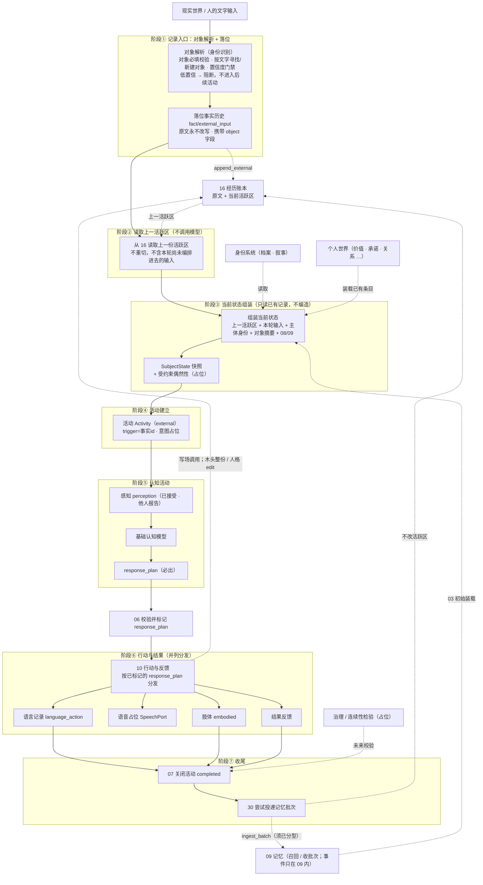

# 00 流程总览与输入边界

> 本文是详细设计的入口：先给整个主体流程的骨架，再给输入边界（当前范围与未来预留），最后给模块文档地图。术语以《概念词汇》为准，总体图景以《总体架构》为准。
>
> 状态：定稿骨架，已按 D-008 / D-009 回写。本轮上下文 = 组装全体；05 必出 `response_plan` 与整份新活跃区正文；不同轮补召回。事件仅 09；有效性分析为旁路。主链路不落 thought。批次构造与冲刷策略已在 30。

## 1. 职责与边界

- 回答：一次匠石活动从输入到沉淀整体怎么走；输入从哪里来、当前支持到什么程度。
- 位置：详细设计的总入口，其余模块文档按本图展开。
- 不做：不展开各模块内部细节（那是各模块文档的事）；不重复《总体架构》的概念论述。

## 2. 主体流程总览

一次**外部活动**（当前唯一的完整主链路）当前按七阶段运行：

| 阶段 | 关键动作 | 写入记录 | 占位/说明 |
|------|----------|----------|-----------|
| ① 记录入口 | 对象解析（校验/寻找/新建/门禁）→ 落位 | `fact/external_input`（text、object 字段） | 对象必填、低置信阻断；原文永不改写 |
| ② 读取上一活跃区 | 从 16 读取当前活跃区 | `subject/context_window_loaded` | 02 只读，不调模型、不重切；不含本轮尚未编排进去的输入；可含上一轮保留的回忆引用 |
| ③ 状态组装 | 上一活跃区 + 本轮输入 + 主体身份 + 对象摘要 + 08 + 09 线索 | `subject/current_state_assembled` | 本轮上下文 = 组装全体；03 按各源已公布端口对接。只读已有记录，不编造 |
| ④ 活动建立 | 建立外部活动；意图占位 | `activities`（trigger=事实 id） | 意图系统占位 |
| ⑤ 认知活动 | 回复调用：感知 → 模型 → `response_plan`（必出）；写场调用：木头整份 `rewritten_context` / 人格块级 `edit`；对象确认可空或开口后独立再评估 | 感知认知条目；记忆打分入库（可空）；`object_identity_assessed`（若有） | 不落 thought；05 不同轮补召回、不执行检索；回复调用不编活跃区，写场是独立第二次调用；说话人单列 |
| ⑤→⑥ 之间 | 06 校验并标记 `response_plan` | `subject/activity_response_state` | 标记只在 06 |
| ⑥ 行动与结果 | 按计划并列分发：语言记录 / 语音占位 / 肢体 / 结果反馈；写场调用（木头整份 / 人格 edit） | `fact/language_action`；16 `subject_reply` / `subject_state`（带 `response_plan`）；结果反馈记录；动作记录 | think / ignore / wait 关掉语言与语音；embodied 仍可发；语音与肢体分口；之后写场调用：木头 16 保存整份现场 / 人格 ZoneStore 应用 |
| ⑦ 收尾 | 07 关闭活动；30 尝试投递记忆批次 | 活动 `completed`；`memory_control_attempted` | 11 治理占位 |

本次外部活动上的旁路（不是另开一条成长流水线）：

- **回复状态**：05 产出 `response_plan`，06 校验后标记到活动。
- **对象确认**：可由⑤顺手判定或开口后独立再评估，回填 01；不挡口头，不经 06。
- **有效性分析**：旁路。收集现场打分等材料，按分析器各自触发做综合报告与策略建议；不进七阶段。

不在主链路展开：

- **事件**：只在 09 内部。02 / 03 / 05 / 07 暂不使用，00 不规定如何创建或封存。
- **反思**：12 占位，走内部入口（§4.2），与记忆不是同一条过程。

### 2.1 正常活动、记忆、反思

上图是正常活动的前台流程，不承担完整的长期成长过程：

- 正常活动装载已有记忆和个人世界，维持本次工作状态，产生回应计划、行动与历史记录；
- 本轮新理解可以留在活动工作状态里，不在主链路自动升格为长期价值、关系、能力或自我理解；
- **记忆**是记忆：03 向 09 做只读初始装载；05 不同轮补召回。收尾后由 30 尝试投递批次。整理、封存、事件都在 09 内部，不在此展开；
- **反思**是反思：12 目前按占位。它不是记忆整理，也不并入 30 的投递；不自动改写人格；
- **治理**（11）占位，与记忆、反思分开；
- 后续正常活动若要用已沉淀内容，经记忆召回或个人世界装载读取，不经反思系统代发。

## 3. 输入边界与输入信封

### 3.1 输入最终形态是文字

任何输入最终都以**文字**形态进入系统（语音先转文字，多模态未来接入）。所有输入统一包一层输入信封：

| 字段 | 取值 | 当前实现 | 说明 |
|------|------|----------|------|
| source | external / internal | external（reflect 为 internal 雏形） | 外部输入 / 内部系统输入 |
| channel | 对话渠道 | 文字 / 语音转文字 | 由形态提供，可扩展账号/会话、声纹、设备等 |
| modality | text / image / video / sensor | text | 多模态未来接入 |
| object | 说话人对象 | external **必填**；internal 为 system | 见 §3.2 与模块 01 |
| timestamp | 时间 | 有 | 落位携带 |
| stream | complete / fragment | complete | 流式片段未来接入 |

### 3.2 对象如何进入输入

对象信息随文字一起进入，确定过程是**分层递进**的两段，先后关系而非并列：

1. **渠道层对象映射**（前置，未来）：输入通道携带的对象来源——语音的声纹、对话框/App 的账号或登录会话（如已知好友）、设备与人脸等——在进入文字层之前映射为对象标识，随输入一起送入；
2. **文字层对象解析**（必经，当前实现重点）：文字是输入的最后形态，所有输入都在这里完成对象必填校验、按文本寻找或新建对象、置信度门禁。

文字输入的对象可由渠道（账号/会话）提供，也可显式提供；两者皆无则属于无效输入信封并拒绝。对象引用存在但尚未与已确认档案匹配时，应形成暂定对象候选；这与完全没有对象不同。规则与细节见模块 01。

### 3.3 当前范围与门禁

- 只处理 `external + text + complete`；
- 文字输入必须携带对象引用，**完全缺失 → 契约拒绝**（不落位、不创建活动）；
- 对象引用存在但身份未确认 → 形成暂定对象候选，按置信度与确认规则处理，不归类为“无对象”；
- 文字信封有对象引用，不自动等于置信度 1：从正文匹配名字仍有重名。**渠道已绑定**的对象（账号/会话/`object_id`）取最高，声纹等载体相应提高，见 01；
- 候选置信度低于阈值 → **不进入后续活动**，记录原因（可先走身份确认回合，未来）；
- 对象的寻找与新建均基于文字。

### 3.4 未来预留

- 多模态输入（图像 / 视频 / 传感器）；
- 流式片段（更新暂时理解、取消过时任务、低风险反馈）；
- 内部系统事件（定时触发、记忆引擎回写、治理检查）；
- 渠道层对象映射（声纹 / 人脸 / 设备 / 账号）。

## 4. 两条入口

### 4.1 外部输入主链路

外部说话人（对象必填）→ 对象解析（寻找/新建 + 置信度门禁）→ 落位（原文保留，携带对象映射表 `objects`）→ 16 追加经历（先入账、待合并）→ 02 读取上一份活跃区 → 组装（活跃区 + 本轮输入 + 对象 + 身份 + 08/09）→ 活动 → 认知（回复调用必出 `response_plan`；写场调用另出木头整份现场 / 人格块级 `edit`；对象确认可空；本轮不打分；不同轮补召回）→ 06 标记回复状态 → 按计划并列分发语言 / 动作 / 结果反馈 → 写场落地（木头 16 保存整份现场正文；人格 ZoneStore 应用；空则保留上一份；硬上限截断）→ 07 收尾 → 30 投递（批次须分型）。有效性分析在旁路，不插入上述顺序。

本轮原话作为当前刺激进入组装与模型（`input_text`）。它不在认知开始前写入活跃区，以免与 `input_text` 重复。并入发生在按方案编排新活跃区时。这不是「本轮输入不进这轮上下文」。

**输入形态**：原文 + 对象映射表。输入为整段原文（多轮对话整段进入，不切分、不解析说话人；说话人在文本里由「名字：」等标签表达，映射表负责名字 → id），单轮是多轮的特例。`objects` 映射覆盖文本涉及的所有人，与是否说话无关；映射表为空则为主体记忆。模型与活跃区使用账本原文。投进 09 的事件正文是**对话实录**：每段冠上说话人名字，含对方原话、匠石的言语和动作回应；一批里有几个人开口就留几个人的名字。档案 id 只在映射表，不写进 `content_raw`。无口头、无动作的内部状态（如 `think` 的 JSON）不进事件正文。多轮输入整段作为 `input_text`，提示词聚焦最后一句作为待回答。

对话壳往往只给「当前说话人」，不另交一份映射表。落位之后主链路必须用 01 已解析的说话人补上 `label` / aliases → `object_id`，写入本轮输入段与主体回复段，不得等信封自带。提示词对人只用名字（重名用本轮能分开的称呼），不出现档案 id，也不给对象编短编号。

初次使用，或经历账本 / 活跃区复位清空后，仍走同一条七阶段；空活跃区合法。不要另开启动流程。复位不是活动的 `wait`。

### 4.2 内部输入分支

内部入口（反思、定时、系统通知等）**不经过**对象解析与外部活跃区装载；来源标记为 `system`。

当前 `reflect` 只是 12 的占位雏形，不是记忆整理。记忆投递走 30→09，不走这条内部语义链路。未来的定时任务、引擎回写等再按信封扩展。

## 5. 模块地图

| 文档 | 模块 | 一句话内容 |
|------|------|-----------|
| 01 | 身份识别（对象解析） | 外部输入的对象必填、寻找/新建、置信度门禁与确认 |
| 02 | 活跃区与活动窗口 | 从 16 读取上一份活跃区；不生成、不重切、不含本轮尚未编排的输入 |
| 03 | 状态组装 | 按 01/02/08/09 与身份系统的端口编排工作集；刺激走 `input_text` |
| 04 | 活动 | 一轮工作单元；open / completed / abandoned；意图占位 |
| 05 | 认知 | 看见组装全体；必出 `response_plan`；不同轮补召回 |
| 06 | 活动状态标示 | 校验 `response_plan`、标记活动回复状态并审计 |
| 07 | 活动收尾 | 关闭活动为 `completed` 并审计；编排层再调 30 |
| 08 | 个人世界 | 薄壳：合并子模块有序列表、按 id 去重、按等级取量 |
| 09 | 记忆系统 | 召回与收批次；事件与封存只在 09 内部，主链路暂不使用 |
| 30 | 记忆数据管控 | 分型构造 MemoryBatch 并投递；游标与重试 |
| 10 | 行动与反馈 | 语言记录、独立语音占位、肢体、结果反馈并列分发 |
| 11 | 治理与连续性 | 检验点与占位契约 |
| 12 | 反思 | 内部活动；目前占位，与记忆分开 |
| 13 | 匠石形态 | 载体与呈现：人形机器人 / App 虚拟人 / 语音助手等 |
| 14 | 统计分析与参数调优 | 统计各阶段信息，动态调整活跃区比等实验参数（占位） |
| — | 有效性分析系统 | 旁路：综合报告与策略建议；第一只分析器为记忆质量 |
| 15 | 人工介入 | 统一登记与管理模型候选的人工确认/修改/否决点（占位） |
| 16 | 经历账本 | 原始经历流 + 当前活跃区（落盘）；记忆游标在 30 |
| 100 | 价值观与边界 | 价值/边界实例的来源、审核、加锁、装载与后台整理 |

## 6. 与其他文档的关系

- 上层：《总体架构》（共识与不变量）、《概念词汇》（术语）；
- 验证与变更：《第一阶段验证章程》（核心证据与失败条件）、《决策记录》（重要方案的理由与失效条件）；
- 下层：各模块文档（详细设计）；
- 实验说明：《主体过程实验》（当前实现与用法）。

## 6.1 各阶段记录与评价总览

每个阶段在对应模块文档中声明记录点、评价点与可调参数；本表是总入口，后续模块在此登记或引用，避免遗漏。

| 阶段 | 记录点 | 评价点 | 可调参数（默认） |
|------|--------|--------|------------------|
| ① 记录入口（01） | external_input、object_rejected / resolved / identity_assessed | 对象置信度、认知确认（模型） | 对象置信度门禁（0.5） |
| ② 读取上一活跃区（02） | context_window_loaded | 读到的活跃区是否够用 | 无（容量参数在 16） |
| ③ 状态组装（03） | current_state_assembled（含 sources 明细） | 装载质量：跳过率、来源覆盖、记忆线索引用率 | 组装额外装载比（活跃区 × 1/2）、回忆档位（最低档） |
| ④ 活动（04） | activity_created / completed、transitions | 活动完成情况、耗时 | 等待超时（未来） |
| ⑤ 认知（05） | `response_plan`；记忆打分（若有）；object_identity_assessed（若有）；独立再评估版本 | 口头是否可执行；打分是否入库 | 无同轮补召回；回忆档位来自 09 策略快照 |
| ⑤→⑥（06） | activity_response_state | 回复状态命中率 | mode / channel 枚举 |
| ⑥ 行动与结果（10） | language_action；语音占位调用；动作记录；结果反馈记录 | 结果是否被后续活动用上 | 语音与肢体分口 |
| ⑦ 收尾（07） | activity_completed | 活动关闭 | 无 |
| 记忆投递（30） | memory_control_attempted | 投递成功率 | `memory_start` 属 30；批次阈值（未来由 14 调） |
| 经历账本（16） | experience_segment_appended | 经历段覆盖率、上下文引用率 | `active_window_chars` |
| 治理（11） | continuity_check | 占位 | 无 |
| 反思（12） | reflection | 占位；不并入记忆投递 | 无 |
| 有效性分析 | EffectivenessReport 存档 | 记忆质量报告是否可追溯 | 分析器阈值 / 间隔；回忆策略档位 |

通用约定：现场打分入库供有效性分析；综合报告不进主上下文。参数调整由 14 日后接管，本轮回忆策略经 09 策略接口落地并留 `source_report_id`。

## 7. 扩展性预留

- 输入信封字段（source / channel / modality / stream / object）即扩展点；
- 外部入口与内部入口已从结构上分开；
- 新增模态或信封上的内部系统通知时，原则上通过信封与对应模块扩展；如验证表明七阶段边界需要调整，须记录理由、影响和回退方式；
- 本阶段暂不实现：多模态、流式认知、渠道层对象映射、身份确认回合、内部系统事件；但接口与文档位置均已预留。

## 8. 当前基线与稳定原则

当前基线包括七阶段顺序、输入不做归属判断、经历账本保存原文并维护当前活跃区、本轮上下文为组装全体、对外契约为 `response_plan`（活跃区补丁可空）。05 不同轮补召回。有效性分析为旁路。输入形态为「原文 + 对象映射表」：单轮是多轮的特例，整段原文即 `input_text`，映射表提供对象关联，原文不改写。它们用于组织现阶段实验与模块协作，但须接受跨活动验证。事件只在 09 内部；反思为占位，不与记忆混成一条后台过程。

不因基线调整而改变的稳定原则是：

1. 外部文字输入必须具备对象引用；
2. 无对象、暂定对象和已确认对象不可混同；
3. 原始输入、派生理解和长期个人内容分开记录；
4. 不设主体面未完成现实或 `concern`；组装只读已有记录，不在认知前编造长期跟进义务；
5. 正常活动不无声改写长期个人世界；
6. 重要调整须有决策记录，并说明对已有模块和数据的影响。
