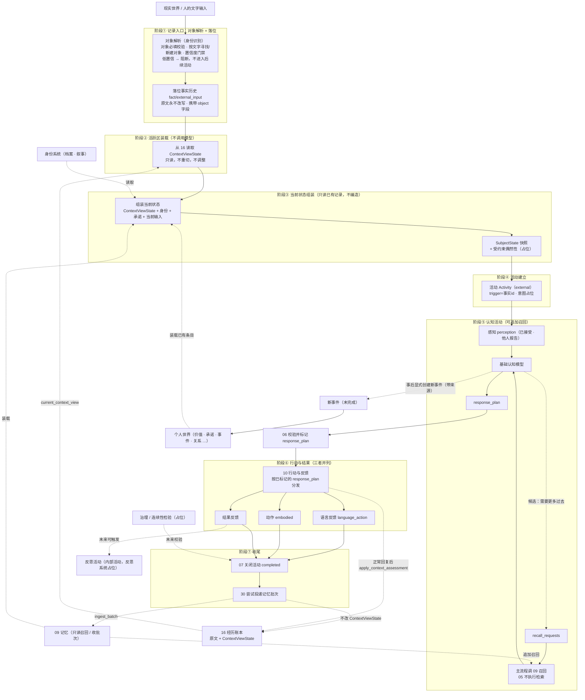

# 00 流程总览与输入边界

> 本文是详细设计的入口：先给整个主体流程的骨架，再给输入边界（当前范围与未来预留），最后给模块文档地图。术语以《概念词汇》为准，总体图景以《总体架构》为准。
>
> 状态：定稿（本轮流程骨架）。代码仍按旧活跃区与 `build_memory_batch` 实现；实现须另写方案，不在本文展开。

## 1. 职责与边界

- 回答：一次匠石活动从输入到沉淀整体怎么走；输入从哪里来、当前支持到什么程度。
- 位置：详细设计的总入口，其余模块文档（01–14）按本图展开。
- 不做：不展开各模块内部细节（那是各模块文档的事）；不重复《总体架构》的概念论述。

## 2. 主体流程总览

一次**外部活动**（当前唯一的完整主链路）当前按七阶段运行：

| 阶段 | 关键动作 | 写入记录 | 占位/说明 |
|------|----------|----------|-----------|
| ① 记录入口 | 对象解析（校验/寻找/新建/门禁）→ 落位 | `fact/external_input`（text、object 字段） | 对象必填、低置信阻断；原文永不改写 |
| ② 活跃区装载 | 从 16 读取当前 `ContextViewState` | `subject/context_window_loaded` | 不调用模型；不重切原文；本轮不按模型意见改视图 |
| ③ 状态组装 | `ContextViewState` + 身份 + 承诺 + 输入 | `subject/current_state_assembled` | 只读已有记录，不编造 |
| ④ 活动建立 | 建立外部活动；意图占位 | `activities`（trigger=事实 id） | 不挂载事件；意图系统占位 |
| ⑤ 认知活动 | 感知 → 模型 → `response_plan`；可选提出召回/缩减/聚焦候选 | `object_identity_assessed`（若有对象确认） | 05 不执行检索、不改视图；`need_trim` / `need_focus` 在正常回复后由 16 更新 `ContextViewState` |
| ⑤→⑥ 之间 | 06 校验并标记 `response_plan` | `subject/activity_response_state` | 06 不是认识状态机；标记只在 06 |
| ⑥ 行动与结果 | 按计划并列分发：语言反馈 / 动作 / 结果反馈 | `fact/language_action`；16 `subject_reply` / `subject_state`（带 `response_plan`）；结果反馈记录；动作记录 | think / ignore / wait 关掉语言通道，embodied 仍可发；结果反馈与语言同级；正常回复后 16 更新视图 |
| ⑦ 收尾 | 07 关闭活动；30 尝试投递记忆批次 | 活动 `completed`；`memory_control_attempted` | 治理/连续性检验占位 |

三条并行侧流：

- **新事件**：认知之后显式创建须带来源；事件边界与封存在 09，不在 07。
- **回复状态**：05 产出 `response_plan`，06 校验后标记到活动；原认识状态机暂缓，不由 06 执行。
- **对象确认**：由⑤中的基础认知模型判定说话人候选，回填 01 档案；不是独立外部确认系统，也不经 06。
- **反思**：无直接外部输入时的内部活动，经反思系统占位执行；不自动改写人格。

### 2.1 正常活动与后台沉淀的边界

上图是正常活动的前台流程，不承担完整的长期成长过程：

- 正常活动装载已有记忆和个人世界，维持本次活动工作状态，产生认知、行动与历史记录；
- 本轮新理解可以作为候选认知被记录，但不在主链路中自动升格为长期价值、关系、能力或自我理解；
- 记忆整理、反思、学习与治理等后台过程读取历史和候选内容，完成记忆组织、认识状态变化及个人世界升格；
- 后续正常活动再通过记忆召回和个人世界装载读取已经沉淀的结果。

同一次活动内的临时理解可以直接保留在活动工作状态中，不需要先进入长期记忆。

## 3. 输入边界与输入信封

### 3.1 输入最终形态是文字

任何输入最终都以**文字**形态进入系统（语音先转文字，多模态未来接入）。所有输入统一包一层输入信封：

| 字段 | 取值 | 当前实现 | 说明 |
|------|------|----------|------|
| source | external / internal | external（reflect 为 internal 雏形） | 外部输入 / 内部系统输入 |
| channel | 对话渠道 | 文字 / 语音转文字 | 由形态提供，可扩展账号/会话、声纹、设备等 |
| modality | text / image / video / sensor | text | 多模态未来接入 |
| object | 说话人对象 | external **必填**；internal 为 system | 见 §3.2 与模块 01 |
| timestamp | 时间 | 有 | 落位携带 |
| stream | complete / fragment | complete | 流式片段未来接入 |

### 3.2 对象如何进入输入

对象信息随文字一起进入，确定过程是**分层递进**的两段，先后关系而非并列：

1. **渠道层对象映射**（前置，未来）：输入通道携带的对象来源——语音的声纹、对话框/App 的账号或登录会话（如已知好友）、设备与人脸等——在进入文字层之前映射为对象标识，随输入一起送入；
2. **文字层对象解析**（必经，当前实现重点）：文字是输入的最后形态，所有输入都在这里完成对象必填校验、按文本寻找或新建对象、置信度门禁。

文字输入的对象可由渠道（账号/会话）提供，也可显式提供；两者皆无则属于无效输入信封并拒绝。对象引用存在但尚未与已确认档案匹配时，应形成暂定对象候选；这与完全没有对象不同。规则与细节见模块 01。

### 3.3 当前范围与门禁

- 只处理 `external + text + complete`；
- 文字输入必须携带对象引用，**完全缺失 → 契约拒绝**（不落位、不创建活动）；
- 对象引用存在但身份未确认 → 形成暂定对象候选，按置信度与确认规则处理，不归类为“无对象”；
- 文字携带对象不自动等于置信度 1：置信度由识别来源与确认状态决定；
- 候选置信度低于阈值 → **不进入后续活动**，记录原因（可先走身份确认回合，未来）；
- 对象的寻找与新建均基于文字。

### 3.4 未来预留

- 多模态输入（图像 / 视频 / 传感器）；
- 流式片段（更新暂时理解、取消过时任务、低风险反馈）；
- 内部系统事件（定时触发、记忆引擎回写、治理检查）；
- 渠道层对象映射（声纹 / 人脸 / 设备 / 账号）。

## 4. 两条入口

### 4.1 外部输入主链路

外部说话人（对象必填）→ 对象解析（寻找/新建 + 置信度门禁）→ 落位 → 16 追加经历 → 02 读取 `ContextViewState` → 组装 → 活动 → 认知（可提出召回请求）→ 06 标记回复状态 → 按计划并列分发语言 / 动作 / 结果反馈 → 16 按评估更新视图 → 07 收尾 → 30 投递。

### 4.2 内部输入分支

内在活动（反思、记忆整理）与系统事件**不经过**对象解析与活跃区装载的外部语义链路；来源标记为 `system`。当前已有 `reflect`（内部活动）作为雏形，未来扩展到定时任务、记忆引擎回写等。

## 5. 模块地图

| 文档 | 模块 | 一句话内容 |
|------|------|-----------|
| 01 | 身份识别（对象解析） | 外部输入的对象必填、寻找/新建、置信度门禁与确认 |
| 02 | 活跃区与活动窗口 | 从 16 读取 `ContextViewState`；不生成、不重切 |
| 03 | 状态组装 | `ContextViewState` + 身份/承诺/输入组装 SubjectState |
| 04 | 活动 | Activity 生命周期；不挂载事件；意图占位 |
| 05 | 认知与上下文统筹 | 感知、模型、`response_plan`、上下文评估与召回候选 |
| 06 | 活动状态标示 | 校验 `response_plan`、标记活动回复状态并审计；原认识状态机暂缓 |
| 07 | 活动收尾 | 活动最终状态、收尾审计、触发记忆数据管控 |
| 08 | 个人世界 | 条目、importance、装载预算 |
| 09 | 记忆系统 | 接口、召回、遗忘边界、REMS 可选 |
| 30 | 记忆数据管控 | 待记忆数据评估、MemoryBatch 投递、游标与重试 |
| 10 | 行动与反馈 | 语言反馈、动作、结果反馈三者并列分发 |
| 11 | 治理与连续性 | 检验点与占位契约 |
| 12 | 反思 | 内部活动与占位契约 |
| 13 | 匠石形态 | 载体与呈现：人形机器人 / App 虚拟人 / 语音助手等 |
| 14 | 统计分析与参数调优 | 统计各阶段信息，动态调整活跃区比等实验参数（占位） |
| 15 | 人工介入 | 统一登记与管理模型候选的人工确认/修改/否决点（占位） |
| 16 | 经历账本 | 原始经历流 + 持续维护 `ContextViewState`；记忆游标在 30 |
| 100 | 价值观与边界 | 价值/边界实例的来源、审核、加锁、装载与后台整理 |

## 6. 与其他文档的关系

- 上层：《总体架构》（共识与不变量）、《概念词汇》（术语）；
- 验证与变更：《第一阶段验证章程》（核心证据与失败条件）、《决策记录》（重要方案的理由与失效条件）；
- 下层：01–14 模块文档（详细设计）；
- 实验说明：《主体过程实验》（当前实现与用法）。

## 6.1 各阶段记录与评价总览

每个阶段在对应模块文档中声明记录点、评价点与可调参数；本表是总入口，后续模块在此登记或引用，避免遗漏。

| 阶段 | 记录点 | 评价点 | 可调参数（默认） |
|------|--------|--------|------------------|
| ① 记录入口（01） | external_input、object_rejected / resolved / identity_assessed | 对象置信度、认知确认（模型） | 对象置信度门禁（0.5） |
| ② 活跃区装载（02） | context_window_loaded | 读到的视图是否覆盖本轮所需经历 | 无（窗口参数在 16） |
| ③ 状态组装（03） | current_state_assembled（含 sources 明细） | 装载质量：跳过率、来源覆盖、记忆线索引用率 | 组装额外装载比（活跃区 × 1/2）、回忆档位（最低档） |
| ④ 活动（04） | activity_created / completed、transitions | 活动完成情况、耗时 | 等待超时（未来）；不统计事件挂载 |
| ⑤ 认知（05） | object_identity_assessed（若有）；召回执行与指标由主流程 / 09 记 | 模型回忆评价、引用率、耗时分层 | 追加最多一轮、片段上限（3）、回忆档位、缩减三线（1/66、1/33、一次弹性） |
| ⑤→⑥（06） | activity_response_state | 回复状态命中率 | mode / channel 枚举 |
| ⑥ 行动与结果（10） | language_action（语言通道）；动作记录；结果反馈记录 | 结果是否被后续活动用上 | 无 |
| ⑦ 收尾与沉淀（07/30/11） | activity_completed、memory_control_attempted、continuity_check | 治理发现、投递成功率 | `memory_start` 属 30；记忆批次阈值（未来由 14 调） |
| 经历账本（16） | experience_segment_appended | 经历段覆盖率、上下文引用率 | `active_window_chars` |
| 后台 / 反思（12） | reflection、intervention_summary | 反思质量（未来） | 后台触发频率（未来） |

通用约定：所有记录与评价指标进入 `subject/recall_metrics`、`subject/parameter_adjusted`、`subject/intervention_record` 等统一载体（见 05、15、I-002）；参数调整由 14 统计分析后执行并留审计。

## 7. 扩展性预留

- 输入信封字段（source / channel / modality / stream / object）即扩展点；
- 外部入口与内部入口已从结构上分开；
- 新增模态或内部事件类型时，原则上通过信封与对应模块扩展；如验证表明七阶段边界需要调整，须记录理由、影响和回退方式；
- 本阶段暂不实现：多模态、流式认知、渠道层对象映射、身份确认回合、内部系统事件；但接口与文档位置均已预留。

## 8. 当前基线与稳定原则

当前基线包括七阶段顺序、输入不做归属判断、活跃区装载与状态组装。它们用于组织现阶段实验与模块协作，但须接受跨活动验证。

不因基线调整而改变的稳定原则是：

1. 外部文字输入必须具备对象引用；
2. 无对象、暂定对象和已确认对象不可混同；
3. 原始输入、派生理解和长期个人内容分开记录；
4. 新主体面未完成现实不得在认知前凭空生成；
5. 正常活动不无声改写长期个人世界；
6. 重要调整须有决策记录，并说明对已有模块和数据的影响。
