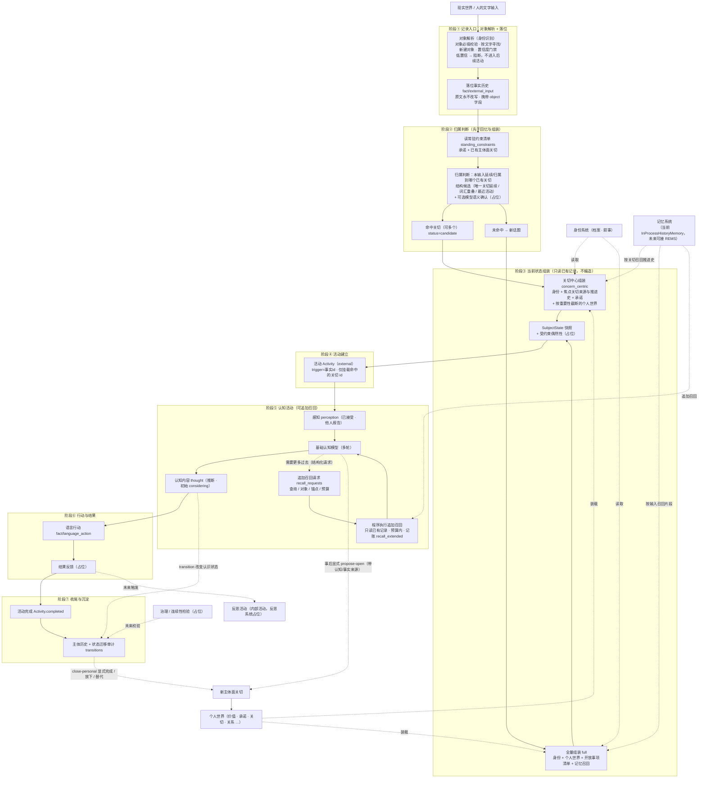

# 00 流程总览与输入边界

> 本文是详细设计的入口：先给整个主体流程的骨架，再给输入边界（当前范围与未来预留），最后给模块文档地图。术语以《概念词汇》为准，总体图景以《总体架构》为准。
>
> 状态：初稿，待讨论定稿。

## 1. 职责与边界

- 回答：一次匠石活动从输入到沉淀整体怎么走；输入从哪里来、当前支持到什么程度。
- 位置：详细设计的总入口，其余模块文档（01–13）按本图展开。
- 不做：不展开各模块内部细节（那是各模块文档的事）；不重复《总体架构》的概念论述。

## 2. 主体流程总览

一次**外部活动**（当前唯一的完整主链路）按七阶段运行：

| 阶段 | 关键动作 | 写入记录 | 占位/说明 |
|------|----------|----------|-----------|
| ① 记录入口 | 对象解析（校验/寻找/新建/门禁）→ 落位 | `fact/external_input`（text、object 字段） | 对象必填、低置信阻断；原文永不改写 |
| ② 归属判断 | 读常驻约束清单 → 判断归属 | `subject/input_attributed`（concern_ids、confidence、basis、status） | 先于回忆与组装；结果暂定可修正 |
| ③ 状态组装 | 命中→关切中心 / 未命中→全量 | `subject/current_state_assembled`（mode、attributed_concern_ids、recalled_event_ids） | 只读已有记录，不编造新关切 |
| ④ 活动建立 | 挂载命中的关切 id | `activities`（active_concern_ids） | 意图系统占位 |
| ⑤ 认知活动 | 感知 → 模型（多轮）→ 认识状态；对象确认由模型判定 | `subject/cognitive_content_appeared`；追加时 `subject/recall_extended` | 追加召回受轮次与片段上限约束；对象确认占位：不判定 |
| ⑥ 行动与结果 | 记录语言行动 → 反馈钩子 | `fact/language_action` | 结果反馈占位 |
| ⑦ 收尾沉淀 | 活动完成 + 审计 | 活动状态 completed、transitions | 治理/连续性检验占位 |

三条并行侧流：

- **新关切**：认知之后显式 `propose-open`（必须带认知/事实来源）；旧关切由 `close-personal` 显式完成/放下/替代。
- **认识状态**：thought 初始 `considering`，经 `transition` 显式迁移，每次迁移留理由并进入 transitions 审计。
- **对象确认**：说话人候选的进一步判定由**认知活动中的基础认知模型**承担（模型是匠石的内生认知基础），判定属于认知内容、默认"考虑中"，经认识状态迁移或显式记录后生效；它不是独立的外部确认系统。
- **反思**：无直接外部输入时的内部活动，经反思系统占位执行，输出仍是"考虑中"的评价，不自动改写人格。

## 3. 输入边界与输入信封

### 3.1 输入最终形态是文字

任何输入最终都以**文字**形态进入系统（语音先转文字，多模态未来接入）。所有输入统一包一层输入信封：

| 字段 | 取值 | 当前实现 | 说明 |
|------|------|----------|------|
| source | external / internal | external（reflect 为 internal 雏形） | 外部输入 / 内部系统输入 |
| channel | 对话渠道 | 文字 / 语音转文字 | 由形态提供，可扩展账号/会话、声纹、设备等 |
| modality | text / image / video / sensor | text | 多模态未来接入 |
| object | 说话人对象 | external **必填**；internal 为 system | 见 §3.2 与模块 01 |
| timestamp | 时间 | 有 | 落位携带 |
| stream | complete / fragment | complete | 流式片段未来接入 |

### 3.2 对象如何进入输入

对象信息随文字一起进入，确定过程是**分层递进**的两段，先后关系而非并列：

1. **渠道层对象映射**（前置，未来）：输入通道携带的对象来源——语音的声纹、对话框/App 的账号或登录会话（如已知好友）、设备与人脸等——在进入文字层之前映射为对象标识，随输入一起送入；
2. **文字层对象解析**（必经，当前实现重点）：文字是输入的最后形态，所有输入都在这里完成对象必填校验、按文本寻找或新建对象、置信度门禁。

文字输入的对象可由渠道（账号/会话）提供，也可显式提供；两者皆无则拒绝。规则与细节见模块 01。

### 3.3 当前范围与门禁

- 只处理 `external + text + complete`；
- 文字输入必须携带对象信息，**缺失 → 拒绝**（不落位、不创建活动）；
- 文字携带对象不自动等于置信度 1：置信度由识别来源与确认状态决定；
- 候选置信度低于阈值 → **不进入后续活动**，记录原因（可先走身份确认回合，未来）；
- 对象的寻找与新建均基于文字。

### 3.4 未来预留

- 多模态输入（图像 / 视频 / 传感器）；
- 流式片段（更新暂时理解、取消过时任务、低风险反馈）；
- 内部系统事件（定时触发、记忆引擎回写、治理检查）；
- 渠道层对象映射（声纹 / 人脸 / 设备 / 账号）。

## 4. 两条入口

### 4.1 外部输入主链路

外部说话人（对象必填）→ 对象解析（寻找/新建 + 置信度门禁）→ 落位 → 归属判断 → 组装 → 活动 → 认知（可追加召回）→ 行动 → 收尾。

### 4.2 内部输入分支

内在活动（反思、记忆整理）与系统事件**不经过**对象解析与归属判断的外部语义链路；来源标记为 `system`。当前已有 `reflect`（内部活动）作为雏形，未来扩展到定时任务、记忆引擎回写等。

## 5. 模块地图

| 文档 | 模块 | 一句话内容 |
|------|------|-----------|
| 01 | 身份识别（对象解析） | 外部输入的对象必填、寻找/新建、置信度门禁与确认 |
| 02 | 归属判断 | 输入延续/归属到哪些已有主体面关切 |
| 03 | 状态组装 | 关切中心 / 全量两条支路与 SubjectState 契约 |
| 04 | 活动 | Activity 生命周期与关切挂载 |
| 05 | 认知与追加召回 | 感知、模型多轮、追加召回契约 |
| 06 | 认识状态 | 状态机、迁移规则与审计 |
| 07 | 关切生命周期 | propose-open / close、与记忆面分离 |
| 08 | 个人世界 | 条目、importance、装载预算 |
| 09 | 记忆系统 | 接口、召回、遗忘边界、REMS 可选 |
| 10 | 行动与反馈 | language_action、结果反馈契约 |
| 11 | 治理与连续性 | 检验点与占位契约 |
| 12 | 反思 | 内部活动与占位契约 |
| 13 | 匠石形态 | 载体与呈现：人形机器人 / App 虚拟人 / 语音助手等 |

## 6. 与其他文档的关系

- 上层：《总体架构》（共识与不变量）、《概念词汇》（术语）；
- 下层：01–13 模块文档（详细设计）；
- 实验说明：《主体过程实验》（当前实现与用法）。

## 7. 扩展性预留

- 输入信封字段（source / channel / modality / stream / object）即扩展点；
- 外部入口与内部入口已从结构上分开；
- 新增模态或内部事件类型时，不改七阶段骨架，只扩展信封与对应模块；
- 本阶段暂不实现：多模态、流式认知、渠道层对象映射、身份确认回合、内部系统事件；但接口与文档位置均已预留。
