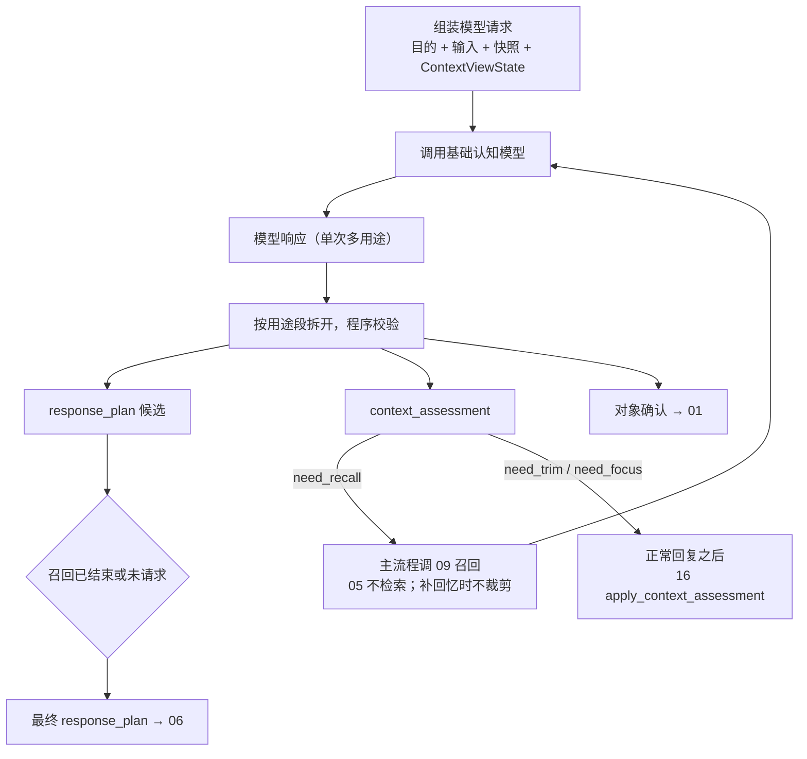

# 05 认知与上下文统筹

> 模块文档。术语以《概念词汇》为准，流程位置见《00 流程总览与输入边界》阶段⑤。
>
> 状态：定稿。05 只产出 `response_plan` 与上下文候选；召回、落位、指标和活动标记归下游。代码仍物化 thought，实现须另写方案。

## 1. 定位

本模块回答：**匠石如何把感知和工作集变成回应计划与上下文统筹候选**。

认知活动是阶段⑤ 的主体：模型结合感知（这次发生了什么）与工作集（我带着什么去面对），产出 `response_plan` 和多种用途段。模型看过当前材料之后，才可能提出上下文补充或缩减/聚焦；是否执行、怎样执行，由主流程协调下游完成。05 不检索记忆、不写回忆指标、不做记忆落位、不标记活动回复状态。

## 2. 输入与输出

### 2.1 输入

| 输入 | 来自 | 角色 |
|------|------|------|
| 活动 | 04 | 本次处理的标识锚点（本轮输出挂 activity_id） |
| 感知 | 程序 | 本次输入作为已接受事实（对方表达，他人报告） |
| 工作集 | 03 | 统一片段、主体快照、`ContextViewState`（只读材料） |

### 2.2 输出

- `response_plan`：交给 06 标记、交给 10 分发；说话文本在 `verbal` 的 `text`，不另设 thought；
- `context_assessment`：`need_recall` / `need_trim` / `need_focus`，彼此独立；
- 对象确认：回填 01；
- 供独立评价过程使用的材料：召回请求、实际补充片段、最终 `response_plan` 与来源链。

## 3. 认知与上下文补充的分工



规则：

1. **05 只产出候选与材料**：模型一次响应给出 `response_plan`，以及对象确认、上下文补充需求等；程序对每个候选做校验后再分发；
2. **上下文补充不归 05 执行**：追加召回的具体检索、预算核算、片段合并与指标记录由主流程协调 09 完成；
3. **回忆评价是独立过程**：召回发生后，另一个过程收集请求、实际补充片段、最终 `response_plan` 与来源链，再生成评价；05 的模型响应不直接输出该评价；
4. **补充是否继续由主流程决定**：当前可用"最多一轮"作为实验边界，但该策略属于上下文协调层，不写进 05 的认知本体；
5. **认知结果固定为 response_plan**：无补充需求时直接采用当前计划；有补充时由主流程把补充片段送回模型继续认知；
6. 05 不标记活动、不改 `ContextViewState`、不改变认识状态。

## 4. 模型响应的用途段（按优先级）

模型一次响应可同时产出多个用途段，按以下顺序与重要性：

| 优先级 | 用途段 | 消费者 | 当前状态 |
|--------|--------|--------|----------|
| 1 | `response_plan` | 06 标记 / 10 分发 | 契约已定；代码仍用 thought 文本 |
| 2 | `context_assessment`（need_recall / need_trim / need_focus） | 主流程 / 09 / 16 | 候选协议 |
| 3 | 召回请求细节（查询、档位、对象/锚点、预算） | 主流程 / 09 | 随 need_recall |
| 4 | 重要性排序 | 14 | 未实现（占位） |
| 5 | 对象确认（confirm / deny / uncertain） | 01 | 已实现 |
程序对每个用途段做校验后分发给对应系统；各段默认是候选结果，不自动成为事实。上下文补充需求本身也不是记忆操作，而是交给下游 09 的请求描述。

### 4.1 上下文评估候选：独立而非互斥

05 只产出**上下文评估候选**，不直接裁剪上下文。

评估维度彼此独立，可以同时存在：

```text
need_recall
need_trim
need_focus
```

规则：

- `need_recall` 不触发裁剪；
- `need_trim` 与 `need_focus` 可以同时出现；
- 上下文缩减只发生在**正常模型回复之后**，不在补充记忆的过程中删减；
- 05 可以直接输出需要剔除的上下文目标，例如：
  - 经历段 id；
  - 序号；
  - 文本片段；
- 需要聚焦时，05 同样列出需要聚焦的内容目标；
- `need_trim` / `need_focus` 在正常回复之后交给 16 `apply_context_assessment`，增量改 `ContextViewState`；
- 05 不改 `ContextViewState`，不删除原始经历；
- 容量参数由 14 统一管理并留审计。

### 4.2 用途段开关与人工介入

- 每个用途段（回应、上下文补充、重要性/缩减、对象确认）都可以配置**人工介入开关**：自动（按模型候选执行）/ 人工确认（候选挂起，等待人工决策后再生效）/ 禁用（该段不生效）；
- 默认全部为自动，不改变现有行为；开关集中登记、集中管理（见模块 15 人工介入），不在各模块各自定义；
- 人工介入时记录**前因后果**：介入点、触发活动与候选、模型原本输出（前因）、人工决策（确认 / 修改 / 否决）、生效结果（后果）；并由模型把前因后果整理成总结记录，便于追溯；
- 人工介入发生期间活动可等待或继续其他用途段，由具体介入点定义（未来）。

## 5. 上下文缩减规则（三线）

| 线 | 约束 | 执行方 |
|----|------|--------|
| 1/66 | 软约束，可较大自由度 | 模型给出意见：哪些删除、哪些保留，程序按意见执行 |
| 1/33（2 倍） | 硬约束 | 程序强制缩减（参考模型意见） |
| 超过 1/33 | 最多再加一次弹性 | 模型可请求一次保留机会；此后强制按 REMS 逻辑结束/分割事件 |

- 三线与组装预算同属上下文参数，统一管理、调整留审计（见 14）；
- 缩减的对象是 `ContextViewState` 里的句子/段引用，不是事件，也不是账本原文；
- 执行在正常回复之后，由 16 增量更新 `ContextViewState`，影响下一轮 02 读取；05 只提供目标列表。

## 6. 事件结束 / 分割 / 记忆落位（分工）

| 模块 | 职责 |
|------|------|
| 05 | 不产出事件结束、分割或已存标记；只提供上下文聚焦候选 |
| 07 | 活动收尾，不处理事件 |
| 30 | 记忆数据管控：构造 `MemoryBatch` 并投递给 09 |
| 09 | 记忆薄壳及后端：内部事件边界、封存、落位、回填已存标记 |

- 事件分割的 REMS 逻辑**不在 05 实现**；
- 记忆投递由 07 收尾后交给 30，30 再投递 09；05 不调用 `ingest_activity`；
- 经历原文留在账本；是否出现在某次 `ContextViewState` 由 16 维护、02 只读，与事件是否了结无关。

## 7. 回忆评价与指标（见《独立评价系统》）

回忆评价统一由《独立评价系统》说明，本模块只负责产生评价事件与材料，不生成评价。

### 7.1 主观评价（独立过程）

- 时机：**主流程执行补充召回并得到最终 `response_plan` 后**，由独立评价系统决定何时收集；
- 输入材料由 05 和主流程提供：召回请求、实际补充片段、最终 `response_plan`、来源链、返回条数与耗时；
- 内容：有用性（相关 / 部分相关 / 无关）、冗余度、缺失度、档位合适度（太低 / 合适 / 过高）；
- 程序容忍缺失：独立评价过程不可用或未给出评价时，客观指标仍然记录，不阻塞主流程；
- 05 不生成主观评价字段；它只保证上述材料可追溯、可被评价系统收集。

### 7.2 客观指标

由下游 09 或主流程协调层记录：请求参数（档位、查询词、对象锚点、事件锚点、预算）、执行结果（返回条数、单次回忆耗时）、引用率（返回片段是否被最终 `response_plan` 的来源链引用）、耗时分层（单次回忆、认知阶段、活动总耗时）。

### 7.3 载体与闭环

指标载体与闭环由下游系统负责；05 不直接写 `recall_metrics` / `parameter_adjusted`，只提供模型侧评价与来源链。

## 8. 对象确认（已实现）

- 对象确认：模型判定说话人候选（confirm / deny / uncertain），程序记录 `object_identity_assessed` 并更新 01 档案状态（confirm → 已确认，deny → 拒绝，uncertain → 保持暂定）；不改写事实原文；

### 8.1 上下文补充需求日志（下游记录）

主流程协调补充召回时，下游至少记录：请求（查询、档位、对象/事件锚点、预算）、执行结果（返回条数、单次耗时）、模型评价（若给出）、引用情况、是否因当前策略被截断；日志与指标归 09 / 统一记录评价系统。

## 9. 接口契约（文字描述）

### 9.1 模型请求

- 目的（外部活动 / 反思）；
- 输入文字；
- 主体状态快照（身份、立场、价值、承诺）；
- 工作集统一片段与 `ContextViewState`（含来源）。

### 9.2 模型响应（各用途段）

- `response_plan`：回应计划，包含 mode、reason、items；
- `context_assessment`：独立的召回/缩减/聚焦候选；
- 上下文补充需求（查询、预算、对象锚点、事件锚点、回忆档位）；
- 重要性排序 / 上下文缩减意见；
- 对象确认；

### 9.3 输出顺序与最终化

模型响应顺序：

```text
response_plan
其他用途段
```

若模型请求上下文补充，则当前响应的 `response_plan` 不是最终结果；主流程执行补充后再次调用 05，最多一轮。

## 10. 占位与未来

已实现：对象确认、`response_plan` 产出（标记在 06）。

未实现（占位，须防遗忘）：

- 主流程 / 09 对上下文补充需求的统一执行与指标记录；
- 重要性排序 / 上下文缩减三线执行（16、14）；
- 用途段人工介入开关与介入记录（15）；
- 流式响应与多用途段的流式消费（想法记录 I-001）。
- 独立的回忆评价过程与材料传递协议。

## 11. 验收标准

- 感知已接受、`response_plan` 来源链可追溯；
- 05 自身不执行记忆召回、不写回忆指标、不做记忆落位；
- 上下文补充需求经主流程校验后交给 09，召回执行受预算约束，不会无限循环；
- 独立评价过程缺失不阻塞流程，下游客观指标照记；
- 各用途段按优先级分发，程序校验后才生效；
- 用途段人工介入开关可配置；开启后候选挂起、前因后果与模型总结记录完整；
- 事件结束/分割由 09 记忆薄壳及后端处理，05 不产出事件结束、分割或已存标记；
- 上下文缩减三线（1/66 软、1/33 硬、一次弹性）参数可配置、调整留审计；
- 对象确认回填可追溯。

## 12. 与其他模块的关系

- 依赖：03（工作集）、04（活动）、01（对象候选与档案）、02（读取视图）；
- 被依赖：06（活动状态标示）、09（按需求执行召回）、10（行动消费回应）、16（应用 trim/focus）、14（消费候选与指标调参）；
- 概念边界：模型输出 ≠ 已接受事实；模型输出 ≠ 程序写入；上下文候选 ≠ 记忆执行。

## 13. 待验证问题

1. 上下文补充需求是否允许模型显式说"无需补充"，而不是靠主流程策略隐式结束；
2. 回忆评价候选的稳定性：模型评价缺失率与格式漂移对调参的影响；
3. 三线参数（1/66、1/33、一次弹性）的真实效果需跨活动验证后由 14 调整；
4. 多用途段单响应 vs 分次调用的成本与质量对比（想法记录 I-001）；
5. 人工介入的等待语义：介入挂起时活动是等待还是继续，按介入点分别定义（15）。
