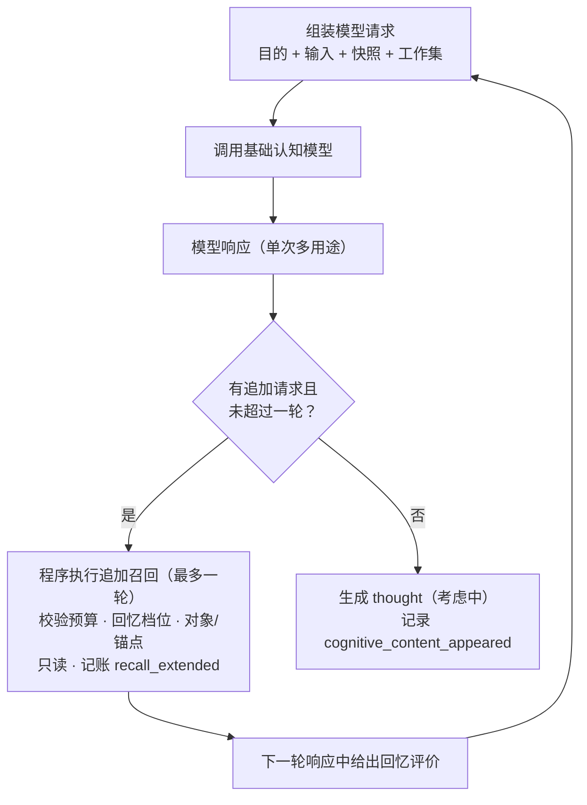

# 05 认知与追加召回

> 模块文档。术语以《概念词汇》为准，流程位置见《00 流程总览与输入边界》阶段⑤。
>
> 状态：初稿，待讨论定稿。本文用文字与表格描述契约，流程图用于表达顺序，不出现实现代码。

## 1. 定位

本模块回答：**匠石如何把感知和工作集变成认知内容，并在材料不足时补充材料**。

认知活动是阶段⑤ 的主体：模型结合感知（这次发生了什么）与工作集（我带着什么去面对），产出回应和多种用途段；当材料不足时，模型提出追加召回，程序执行后继续认知，直到产出或达到追加上限（最多一轮）。

## 2. 输入与输出

### 2.1 输入

| 输入 | 来自 | 角色 |
|------|------|------|
| 活动 | 04 | 本次处理的标识锚点（认知产物挂 activity_id） |
| 感知 | 程序 | 本次输入作为已接受事实（对方表达，他人报告） |
| 工作集 | 03 | 统一片段、主体快照、活跃区视图（只读材料） |

### 2.2 输出

- 认知内容（thought）：推断，初始认识状态 = 考虑中；
- 各用途段的分发结果（见 §4）；
- 追加召回的执行记录与回忆评价指标（见 §7）。

## 3. 认知循环（最多追加一轮）

规则：

1. **模型调用最多两次**：首次调用 + 最多一次追加；只有模型提出追加请求且未超过一轮，才回到模型再调一轮；
2. **追加最多一轮**：材料不足时最多追加一轮；即使追加后模型再次提出请求，也不再执行，直接产出；
3. **预算**：每轮片段上限占位 3（参数统一管理，14 可调）；
4. **结束条件**：无追加请求，或已达到一轮上限——把当前回应固化为 thought；
5. **日志详细记录追加结果**：追加请求内容、执行结果（返回条数、耗时、评价、引用情况）、是否因"最多一轮"被截断，均写入日志与指标记录；
6. 追加召回扩展的是**活动工作状态**（本轮可见），活动结束后不保留；
7. thought 始终初始为考虑中；认识状态迁移属于 06，05 不改变状态。

## 4. 模型响应的用途段（按优先级）

模型一次响应可同时产出多个用途段，按以下顺序与重要性：

| 优先级 | 用途段 | 消费者 | 当前状态 |
|--------|--------|--------|----------|
| 1 | 回应文本 | 行动（10） | 已实现 |
| 2 | 是否追加 / 怎么追加（查询、档位、对象/锚点、预算） | 追加召回子循环 | 部分实现（档位字段未加） |
| 3 | 事件是否结束 + 完整事件快照 + 已存标记 | 07 事件结束/分割 → 09 记忆落位 | 未实现（占位） |
| 4 | 重要性排序 / 上下文缩减意见 | 02 活跃区调整、14 调参 | 未实现（占位） |
| 5 | 对象确认（confirm / deny / uncertain） | 01 对象档案 | 已实现 |
| 6 | 事件聚焦（本次推进哪些事件） | 04 活动挂载回填 | 已实现 |

程序对每个用途段做校验后分发给对应系统；各段默认是候选结果，不自动成为事实。

### 4.1 事件聚焦的含义

事件聚焦 = 模型从**已装载的活跃区事件**中选出本次对话真正涉及、需要继续推进的事件；程序校验存在性后回填活动挂载，形成推进史。它不是归属判断（输入不做预判），而是认知后对上下文中事件的选择；与"事件结束"不同——聚焦是"这次在推进哪些"，结束是"哪些了结了、可以落位"。

### 4.2 用途段开关与人工介入

- 每个用途段（回应、是否追加、事件结束、重要性/缩减、对象确认、事件聚焦）都可以配置**人工介入开关**：自动（按模型候选执行）/ 人工确认（候选挂起，等待人工决策后再生效）/ 禁用（该段不生效）；
- 默认全部为自动，不改变现有行为；开关集中登记、集中管理（见模块 15 人工介入），不在各模块各自定义；
- 人工介入时记录**前因后果**：介入点、触发活动与候选、模型原本输出（前因）、人工决策（确认 / 修改 / 否决）、生效结果（后果）；并由模型把前因后果整理成总结记录，便于追溯；
- 人工介入发生期间活动可等待或继续其他用途段，由具体介入点定义（未来）。

## 5. 上下文缩减规则（三线）

| 线 | 约束 | 执行方 |
|----|------|--------|
| 1/66 | 软约束，可较大自由度 | 模型给出意见：哪些删除、哪些保留，程序按意见执行 |
| 1/33（2 倍） | 硬约束 | 程序强制缩减（参考模型意见） |
| 超过 1/33 | 最多再加一次弹性 | 模型可请求一次保留机会；此后强制按 REMS 逻辑结束/分割事件 |

- 三线与活跃区比、组装预算同属上下文参数，统一管理、调整留审计（见 03 §5.4、14）；
- 缩减的对象是活跃区事件与工作集；执行在收尾（02），05 只提供模型意见。

## 6. 事件结束 / 分割 / 记忆落位（分工）

| 模块 | 职责 |
|------|------|
| 05 | 只产出判定与需求：哪些事件结束、哪些需要分割（可附分割点意见）、完整事件快照 + 已存标记 |
| 07 | 事件状态机：结束、分割后的关系（原事件 → 已了结段 + 新未完成事件）、迁移审计 |
| 09 | 落位执行：内容切分（若接入 REMS，按 80/20、逻辑闭环、split 配对、前缀链）、存储并回填已存标记 |

- 事件分割的 REMS 逻辑**不在 05 实现**：REMS 切分是记忆面机制，05 是认知模块，不应依赖记忆引擎实现；
- 考虑时间，记忆落位可在 05 结束后当场执行（07 判定 → 09 存入 → 标记回填），省一次后台往返；
- 只有判定结束的事件才触发落位；未结束事件继续留在活跃区/事件生命周期。

## 7. 回忆评价与指标（14 闭环的输入）

### 7.1 模型评价（主观）

- 时机：**追加召回后、下一轮模型响应中**给出对上一轮回忆的评价（可即时影响本轮后续档位）；
- 内容：有用性（相关 / 部分相关 / 无关）、冗余度、缺失度、档位合适度（太低 / 合适 / 过高）；
- 程序容忍缺失：模型未给评价时，客观指标仍然记录，不阻塞流程；
- 接口占位已立（模型响应带可选的回忆评价段），消费与记账未实现。

### 7.2 客观指标

- 请求参数：档位、查询词、对象锚点、事件锚点、预算；
- 执行结果：返回条数、单次回忆耗时；
- 引用率：返回片段是否被最终 thought 的来源链引用（比模型自评更硬的信号）；
- 耗时分层记录：单次回忆耗时、认知阶段耗时、活动总耗时，分别用于调档位、调追加次数、调流程。

### 7.3 载体与闭环

- 指标载体：主体历史事件 `subject/recall_metrics`、`subject/parameter_adjusted`；14 真实化时再抽独立表；
- 闭环：指标入库 → 模型/程序分析 → 调整参数或档位（记录参数名、旧值、新值、理由、依据指标、时间）→ 下次活动继续记录同参数表现 → 与调整前对比，对比结果同样入库。

## 8. 对象确认与事件聚焦（已实现）

- 对象确认：模型判定说话人候选（confirm / deny / uncertain），程序记录 `object_identity_assessed` 并更新 01 档案状态（confirm → 已确认，deny → 拒绝，uncertain → 保持暂定）；不改写事实原文；
- 事件聚焦：`focused_event_ids` 校验后回填活动挂载（04），记 `activity_events_attached`，无效标识记录不静默丢弃。

### 8.1 追加召回日志（详细）

每次追加召回至少记录：请求（查询、档位、对象/事件锚点、预算）、执行结果（返回条数、单次耗时）、模型评价（若给出）、引用情况、是否因"最多一轮"被截断；日志与指标同时入库（见 §7）。

## 9. 接口契约（文字描述）

### 9.1 模型请求

- 目的（外部活动 / 反思）；
- 输入文字；
- 主体状态快照（身份、立场、价值、承诺、未完成事件）；
- 工作集统一片段（含来源与状态）。

### 9.2 模型响应（各用途段）

- 回应文本；
- 追加召回请求（查询、预算、对象锚点、事件锚点、回忆档位）；
- 回忆评价（追加后下一轮）；
- 事件结束判定与完整事件快照（含已存标记）；
- 重要性排序 / 上下文缩减意见；
- 对象确认；
- 事件聚焦。

## 10. 占位与未来

已实现：回应、追加召回子循环（最多一轮、片段上限）、对象确认、事件聚焦、`recall_extended` 记账。

未实现（占位，须防遗忘）：

- 追加请求的回忆档位字段（模型指定档位）；
- 回忆评价字段与 `recall_metrics` / `parameter_adjusted` 记账；
- 事件结束判定、完整事件快照、已存标记与 07/09 接线；
- 重要性排序 / 上下文缩减三线执行（02、14）；
- 用途段人工介入开关与介入记录（15）；
- 流式响应与多用途段的流式消费（想法记录 I-001）。

## 11. 验收标准

- 感知已接受、thought 初始考虑中，来源链可追溯；
- 追加召回**最多一轮**，受片段预算约束，`recall_extended` 记录请求参数、返回片段、来源、耗时与是否截断；
- 无追加请求或已到一轮上限即结束，不会无限循环；
- 追加日志详细：请求、结果、评价、引用、截断标记齐全；
- 模型评价缺失不阻塞流程，客观指标（耗时、条数、引用率）始终记录；
- 各用途段按优先级分发，程序校验后才生效；
- 用途段人工介入开关可配置；开启后候选挂起、前因后果与模型总结记录完整；
- 事件结束/分割由 07 判定、09 落位，05 不直接写事件状态；
- 上下文缩减三线（1/66 软、1/33 硬、一次弹性）参数可配置、调整留审计；
- 对象确认与事件聚焦回填可追溯。

## 12. 与其他模块的关系

- 依赖：03（工作集）、04（活动）、01（对象候选与档案）、02（活跃区视图）；
- 被依赖：06（认识状态迁移）、07（事件结束/分割判定）、09（追加召回与落位）、10（行动消费回应）、14（指标与调参）；
- 概念边界：认知内容 ≠ 已接受事实；模型输出 ≠ 程序写入；追加召回 ≠ 初始装载。

## 13. 待验证问题

1. 结束判定：是否允许模型显式说"无需召回"（而不是靠一轮上限隐式结束）；
2. 评价字段的稳定性：模型评价缺失率与格式漂移对调参的影响；
3. 三线参数（1/66、1/33、一次弹性）的真实效果需跨活动验证后由 14 调整；
4. 多用途段单响应 vs 分次调用的成本与质量对比（想法记录 I-001）；
5. 人工介入的等待语义：介入挂起时活动是等待还是继续，按介入点分别定义（15）。
