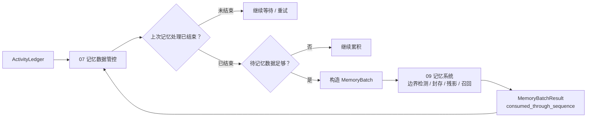

# 07 记忆数据管控

> 模块文档。术语以《概念词汇》为准；参照 REMS3 的 `REMSPipeline.ingest` 主干，但不照搬内部记忆引擎。
>
> 状态：初稿，按“07 是活动日志与 09 之间的枢纽”重校。

## 1. 定位

07 是活动流程和记忆系统之间的**数据管控层**。

它负责：

- 收集本次活动结束后的匠石回复、主体状态、静默、外部输入等数据；
- 监控上一次记忆处理是否结束；
- 判断待记忆数据是否足够；
- 决定是否触发一次新的记忆投递；
- 把数据打包成 `MemoryBatch` 交给 09；
- 管理 `memory_start`、失败重试与投递台账。

07 不做：

- 事件边界检测；
- 事件封存；
- 残影维护；
- 未完成事件库维护；
- 记忆检索；
- 抽象事件；
- 召回、摘要、遗忘、角色/对象内部处理。

这些全部属于 09 及其后端。

## 2. 为什么 07 不是“事件生命周期”

REMS3 的主干是：

```text
shadow + unclosed events
    -> recall
    -> ContextPackage
    -> recall_log
    -> metabolism（边界检测 + 封存 + 残影）
    -> role / abstraction
    -> output routing
```

其中：

- `Shadow`：所有未完成事件原文拼接；
- `UnclosedEvent`：已开启未闭环的事件；
- `BoundaryDetectionSkill`：边界检测；
- `MetabolismService`：封存、分裂、维护残影；
- `REMSPipeline.ingest`：唯一顶层编排入口。

在匠石架构里，`09 记忆系统` 承担 REMS3 的 `MetabolismService`、`BoundaryDetectionSkill`、`EventService`、`RecallService` 等内部能力。

`07` 只对应 REMS3 中“每次 ingest 前由上层决定喂什么、什么时候喂、上次喂完没有”的那层；它不复制 `REMSPipeline` 内部的任何记忆步骤。

## 3. 数据流



## 4. 输入输出

### 4.1 输入

```text
ActivityLedger
  pending segments = (memory_start, head]

活动收尾包
  activity_id
  thought_id
  action_id
  subject_state

记忆进程状态
  previous_ingest_status
  previous_ingest_error
```

### 4.2 输出

```text
MemoryTriggerDecision
  should_trigger
  reason
  from_sequence
  to_sequence

MemoryBatch
  subject_id
  external_object_id
  object_ids
  segments
  source_ids
  from_sequence
  to_sequence
```

## 5. 行为规则

1. 每次活动结束后，07 检查上一次 09 投递是否完成；
2. 上一次未完成时，不触发新投递，保留待处理数据；
3. 上一次完成后，检查待记忆数据是否达到阈值；
4. 达到阈值才生成 `MemoryBatch`；
5. 07 不读取 09 的 `Shadow`、`UnclosedEvent`、事件边界结果；
6. 07 只关心 `consumed_through_sequence` 与投递状态；
7. 09 成功接管后才推进 `memory_start`；
8. 07 不持有任何事件边界、封存状态或残影副本。

## 6. 记录、评价与参数

- 记录：`memory_batch_built`、`memory_trigger_skipped`、`memory_process_monitored`、`ingest_ledger_updated`；
- 评价：批次大小、触发频率、等待时间、重试次数、09 处理耗时；
- 参数：`memory_batch_chars`、`memory_batch_segments`、`memory_batch_max_age`、`memory_max_retry`。

## 7. 与其他模块的关系

- 依赖：16 ActivityLedger、09 MemoryBatchResult、04 活动收尾信息；
- 被依赖：09 记忆系统；
- 概念边界：07 是数据管控，09 是记忆薄壳，记忆内部代谢归 09 后端。

## 8. 验收标准

- 07 不实现边界检测、封存、残影；
- 上次 09 未结束时不会触发新批次；
- 数据不足时不会触发；
- 满足阈值后生成 `MemoryBatch`；
- 09 成功后才推进 `memory_start`；
- 失败可重试且不丢原文。
