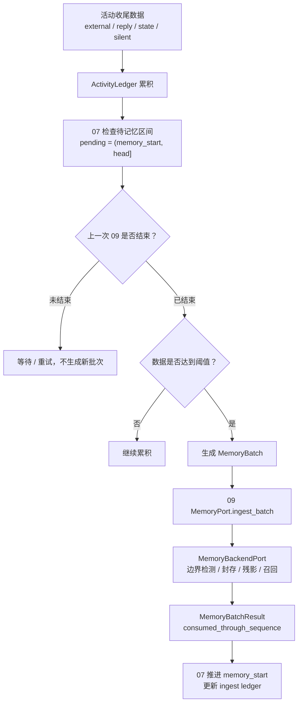

# 07 记忆数据管控

> 模块文档。术语以《概念词汇》为准；参照 REMS3 的主干，但不复制其记忆内部过程。
>
> 状态：初稿，按“07 只做数据管控，09 是记忆薄壳”重校。

## 1. 定位

07 是活动流程与 09 记忆薄壳之间的**数据管控层**。

它决定：

- 哪些活动数据进入记忆；
- 什么时候进入记忆；
- 上一次记忆处理是否已经结束；
- 当前数据是否足够；
- 游标如何推进；
- 失败如何重试、如何审计。

07 不理解记忆内容，也不处理对象和事件。

## 2. 核心职责

### 2.1 07 做什么

1. 收集本次活动结束后的数据：
   - 外部输入；
   - 匠石回复；
   - 主体状态变化；
   - 静默或内部活动；
2. 监控上一次 09 投递状态；
3. 判断待记忆数据是否达到阈值；
4. 生成 `MemoryTriggerDecision`；
5. 构造 `MemoryBatch`；
6. 调用 09 `MemoryPort.ingest_batch`；
7. 成功后推进 `memory_start`；
8. 维护 `MemoryIngestLedger`。

### 2.2 07 不做什么

- 不创建、确认或修改对象；
- 不召回记忆；
- 不检测事件边界；
- 不封存事件；
- 不维护残影；
- 不维护未完成事件；
- 不生成摘要；
- 不执行遗忘；
- 不直接读 09 的内部状态。

## 3. 与其他模块的关系

```text
ActivityLedger（16）
        |
        v
07 记忆数据管控
        |
        v
09 记忆薄壳 MemoryPort
        |
        v
MemoryBackendPort
```

对象 id 来自 01，07 只透传，不生成。

## 4. 数据流



## 5. 接口契约

### 5.1 输入

```text
ActivityLedger
  pending segments
  memory_start / head

活动收尾信息
  activity_id
  thought_id
  action_id
  subject_state

09 状态
  previous_ingest_status
  previous_ingest_error
```

### 5.2 输出

```text
MemoryTriggerDecision
  should_trigger
  reason
  from_sequence
  to_sequence

MemoryBatch
  subject_id
  external_object_id
  object_ids          # 来自 01
  from_sequence
  to_sequence
  segments
  source_ids
```

## 6. 行为规则

1. 07 只依赖稳定端口，不依赖 09 后端内部实现；
2. 上次 09 未结束时，不触发新批次；
3. 待记忆数据未达到阈值时，不触发；
4. 触发后只投递 `(memory_start, head]` 区间；
5. 09 确认接管后才推进 `memory_start`；
6. 失败时保留原文和批次，允许重试；
7. 对象 id 一律透传 01 的结果；
8. 07 不保存事件边界、残影或封存状态。

## 7. 记录、评价与参数

- 记录：
  - `memory_batch_built`
  - `memory_trigger_skipped`
  - `memory_process_monitored`
  - `ingest_ledger_updated`
- 评价：
  - 批次大小；
  - 触发频率；
  - 等待时间；
  - 重试次数；
  - 09 处理耗时。
- 参数：
  - `memory_batch_chars`
  - `memory_batch_segments`
  - `memory_batch_max_age`
  - `memory_max_retry`

## 8. 验收标准

- 07 不实现任何记忆内部逻辑；
- 07 不创建对象 id；
- 上次 09 未结束时不会触发新批次；
- 数据不足时不会触发；
- 满足阈值后生成正确的 `MemoryBatch`；
- 09 成功后才推进 `memory_start`；
- 失败可重试且不丢原文。
