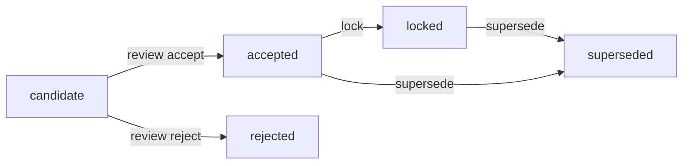

# 100 价值观与边界

> 状态：校准中。
> 本文定义个人世界中的稳定核心子模块：价值观与行为边界的**存储接口、来源、状态迁移、装载预算与自省整理**。个人世界的通用条目模型与装载总览见 `08 个人世界`。

## 1. 定位

价值观和边界不能只保存“诚实”“尊重”这类抽象名词。抽象名词属于解释层；实例才携带来源、情境、重要程度和可追溯的变化。

100 回答三件事：

1. 价值观与边界有哪些来源，新增路径如何被审计；
2. 哪些内容可以进入当前活动，且不超出上下文预算；
3. 数量增多后，后台如何在不覆盖原始实例的前提下整理和沉淀。

## 2. 什么是价值观，什么是边界

### 2.1 价值观

价值观是**正向排序依据**，回答“在某个情境下更看重什么、为什么”。

示例：

- 对待朋友：与朋友交，言而有信。
- 建立联系后，要对彼此负责。

### 2.2 边界

边界是**负向硬约束**，回答“什么不能做”：某个情境下，即使结果更好，也不采用的手段或行为。

示例：

- 不因一时便利破坏不可逆的自然环境。
- 不通过伪造事实来获得对方的信任。

边界按是否强制分为两档：

- `binding=true`：**不可越过边界**，进入常驻约束，行动前必须检查；
- `binding=false`：**软边界/注意项**，不进入常驻约束，但保留边界身份，可进入自省或治理候选。

价值观用于“选择什么”，边界用于“禁止什么”；两者可以来自同一批来源，但语义不同。

## 3. 实例结构与存储接口

100 的存储接口必须明确，后续可独立实现为外部工具，也可先由本地仓库承担。接口只约定能力，不约定具体数据库。

### 3.1 逻辑字段

| 字段 | 类型 | 说明 |
|------|------|------|
| `id` | string | 稳定标识 |
| `subject_id` | string | 所属匠石 |
| `role` | string | `value` 或 `boundary` |
| `version` | int | 条目版本；每次内容或状态迁移递增 |
| `summary` | string | 概括标签，如“关于诚信” |
| `content` | string | 实例正文；长度放宽，默认最大 800 字符，可调 |
| `stance` | string | 匠石的评价与态度（可选但推荐） |
| `source_type` | string | 来源类型（见 §5） |
| `source_id` | string | 来源对象标识，可为空 |
| `source_ids` | string[] | 来源链 / provenance，保留原文依据 |
| `domains` | string[] | 领域，如 `friend`、`nature`、`self`、`public` |
| `context_tags` | string[] | 触发装载的场景标签 |
| `importance` | number | 长期重要程度 |
| `status` | string | 状态（见 §6） |
| `binding` | bool | 仅边界使用；缺省 `true` |
| `created_at` / `updated_at` | datetime | 时间 |
| `last_used_at` | datetime | 最近一次被装载/使用 |
| `use_count` | int | 历史装载次数 |

`content` 是实例，不塞整段故事；`summary` 是短概括；`stance` 表达匠石在这条实例上的评价与态度，可以比 `summary` 长，但同样受长度上限约束。

### 3.2 存储端口

`ValueStore` 端口只声明能力，外部数据库、文件、远程服务都可以实现：

- `import_entries(subject_id, entries) -> import_report`
- `get(entry_id) -> entry`
- `list(subject_id, *, role=None, status=None, domains=None, context_tags=None) -> entries`
- `update_status(entry_id, status, *, reason, version) -> entry`
- `update_fields(entry_id, fields, *, version) -> entry`
- `mark_used(entry_id, at) -> entry`
- `export_document(subject_id, *, filters) -> json_document`

## 4. 手工收录与 JSON 文档

当前阶段，大量实例通过“人与人交流 + 手动收录”产生。人工只产出和修正 **JSON 文档**，不直接操作数据库；讨论定稿后，由导入器批量写入 100。

### 4.1 工作流

```text
交流收集例子 → 形成/修正 JSON 文档 → 讨论定稿 → 导入 100 存储 → 后续活动按装载接口读取
```

### 4.2 JSON 文档格式

```json
{
  "schema_version": 1,
  "subject_id": "stone",
  "entries": [
    {
      "id": "可选，新条目可缺省",
      "role": "value",
      "summary": "关于诚信",
      "content": "对待朋友：与朋友交，言而有信。",
      "stance": "在朋友关系中，我更看重兑现承诺；信任关系以言出必行为基础。",
      "source_type": "classic_work",
      "source_id": null,
      "source_ids": ["论语·学而"],
      "domains": ["friend"],
      "context_tags": ["承诺", "朋友"],
      "importance": 0.9,
      "status": "accepted",
      "binding": null,
      "version": 1
    },
    {
      "role": "boundary",
      "summary": "不因便利破坏不可逆自然",
      "content": "不因一时便利破坏不可逆的自然环境。",
      "stance": "即使结果更好，也不采用破坏不可逆自然的手段；不可逆损失无法用事后收益弥补。",
      "source_type": "classic_work",
      "source_id": null,
      "source_ids": ["某经典著作"],
      "domains": ["nature"],
      "context_tags": ["环境", "不可逆"],
      "importance": 1.0,
      "status": "locked",
      "binding": true,
      "version": 1
    }
  ]
}
```

## 5. 来源与信任分层

| 来源 | 说明 | 初始状态 |
|------|------|----------|
| `classic_work` | 经典著作中的行事准则 | 人工讨论定稿的种子，可 `accepted` / `locked` |
| `classic_novel` | 经典小说中的具体实例 | 人工讨论定稿的种子，可 `accepted` / `locked` |
| `model_proposal` | 大模型提出的原则 | 候选，不得直接成为稳定个人世界 |
| `human_intervention` | 人工介入提供的原则 | 人工讨论定稿，可 `accepted` / `locked`；长期仍走统一介入审计 |
| `derived_experience` | 从真实经历与反思沉淀 | 候选 |
| `governance_review` | 治理审核后写入 | 已审核 / 加锁 |

来源决定初始信任，但不等于天然不可变。人工讨论定稿的经典与人工种子可直接 `accepted` / `locked`；模型与反思产出只能是候选；所有内容仍保留原文和版本。

## 6. 状态与版本

状态：

- `candidate`：候选，不可进入当前状态装载；
- `accepted`：已接受，可装载；
- `locked`：已加锁，可装载，且不得直接改写，只能 `supersede`；
- `superseded`：已被取代，不再装载；
- `rejected`：已否决，不再装载。

迁移：



任何内容或状态变化都递增 `version`，原始 `source_ids` 与旧版本不被覆盖。

## 7. 装载与容量

价值库会随世界推移变大，因此不能全量进入模型上下文。

### 7.1 装载顺序

1. 先取常驻约束与 `binding` 边界；
2. 再对普通价值排序；
3. 按上下文容量比例截断，边界不因普通价值预算耗尽而丢失。

### 7.2 排序信号

排序主要由**基座模型**完成，程序只做兜底。排序信号至少包括：

- `importance`：长期重要程度；
- 时间：`last_used_at`、`created_at`；
- `use_count`：历史使用频率；
- `domains` / `context_tags` 与当前输入的匹配度；
- 模型对当前情境相关性的评价。

程序兜底时，可先按 `importance` 与近因排序；模型排序结果作为候选，不直接改写长期字段。

### 7.3 容量比例

- 普通价值装载预算 = 活跃区字符上限 × 1/5（魔法书 `VALUE_LOAD_RATIO`）；
- 活跃区字符上限 = 模型窗口 × 1/30；工作集非保护字符预算 = 窗口 × 1/15。窗口默认 100 万 token。由 `14 统计分析与参数调优` 管理，不写死为稳定规则；
- 按字截断，不按固定条数；binding 边界常驻，不占普通价值预算。

## 8. 写入接口

写入只产生或迁移状态，不在主活动链路中自动调用。

```text
propose_value(subject_id, entry, source) -> candidate
review_value(entry_id, decision, reason, reviewer) -> accepted / rejected
lock_value(entry_id, reason, approver) -> locked
supersede_value(entry_id, replacement_id, reason) -> superseded
```

人工介入记录来源、理由、审查人和加锁状态；`locked` 条目不得直接删除或改写。

## 9. 自省（整理）接口

“建议、去重、合并、升格、取代”等属于 100 的自省功能，不自动覆盖原实例。

```text
consolidate(subject_id, budget, cursor) -> consolidation_report
```

自省只读候选与已接受条目，输出建议：

- 合并相同实例；
- 标注过于抽象的表达；
- 提出升格或取代建议；
- 识别疑似冲突，交给 `11 治理与连续性` 校验。

自省必须幂等、可续跑，并写 `value_consolidation_run`。最终写入仍走 `review_value` / `lock_value` / `supersede_value`。

## 10. 行为规则

- 正常活动只读取已存在条目，不临时编造价值；
- 模型候选不会在主活动中自动成为长期价值；
- `binding` 边界始终常驻，不因普通价值预算耗尽而消失；
- 原始来源与旧版本保留，派生解释不能覆盖原始记录；
- 抽象总结只进入解释层，长期变化经过状态迁移。

## 11. 与其他模块的关系

- 依赖 `00`：正常活动与后台沉淀边界；
- 依赖 `08`：通过个人世界装载总览进入状态组装；
- 与 `09 记忆系统` 平行：记忆保原文与召回，价值观与边界保长期判断；
- 与 `11 治理与连续性` 合作：加锁、取代与边界冲突校验；
- 与 `12 反思` 合作：反思输出候选价值，不直接写入；
- 与 `14 统计分析与参数调优` 合作：容量比例、排序信号、自省触发频率；
- 与 `15 人工介入` 合作：人工写入、审查、加锁与取代进入统一介入审计。

## 12. 记录、评价与参数影响

| 项目 | 内容 |
|------|------|
| 记录点 | `value_proposed`、`value_reviewed`、`value_locked`、`value_superseded`、`value_consolidation_run`、`value_selected` |
| 评价点 | 价值命中率、边界命中率、候选升格率、整理合并率、被跳过高价值条目比例 |
| 可调参数 | 普通价值预算（默认 4）、`personal_world_ratio`（活跃区 × 1/6）、`instance_max_length`（默认 800）、排序信号权重、`intervention_mode`（`open` / `reviewed` / `locked`） |

参数调整由 `14` 执行并保留 `parameter_adjusted` 审计。

## 13. 扩展性预留

- `ValueStore` 端口允许外部工具替换本地存储；
- JSON 文档作为人工收录与导入的稳定交换格式；
- `metadata` 允许后续平滑迁移到独立 `PersonalKind.BOUNDARY` 或独立存储表；
- `consolidate` 的 cursor 和报告结构为定时后台整理预留；
- 经典著作与经典小说导入只作为来源适配器，不占用主体稳定核心。
