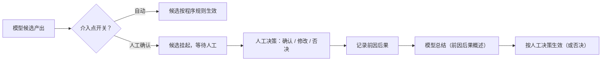

# 15 人工介入管理

> 模块文档。术语以《概念词汇》为准。
>
> 状态：占位初稿，待讨论定稿。本文只用文字与表格描述契约，不出现实现代码。

## 1. 定位

本模块回答：**模型候选生效前，哪些位置允许人工介入，以及介入的前因后果如何统一记录**。

人工介入点遍布多个模块（对象确认、是否追加召回、事件结束、重要性判定、事件聚焦、上下文缩减等）。为避免各模块各自定义开关、互不兼容，所有介入点统一由本模块登记与管理。

## 2. 人工介入点（概念）

人工介入点 = 流程中模型候选生效前，可由人工确认、修改或否决的位置。

每个介入点包含：

| 属性 | 说明 |
|------|------|
| 唯一标识 | 全局唯一，格式：模块-序号（如 05-recall） |
| 名称 | 一句话说明 |
| 所属阶段/模块 | 在哪个流程位置生效 |
| 作用对象 | 影响哪些用途段或候选（如是否追加、重要性、对象确认） |
| 开关 | 自动 / 人工确认 / 禁用 |
| 等待语义 | 介入挂起时活动等待还是继续（按介入点定义） |

## 3. 登记表（当前占位）

| 标识 | 模块 | 作用对象 | 默认开关 |
|------|------|----------|----------|
| 05-recall | 05 | 是否追加召回 | 自动 |
| 05-event-end | 05 | 事件结束判定 | 自动 |
| 05-importance | 05 | 重要性排序 / 上下文缩减意见 | 自动 |
| 05-object | 05 | 对象确认 | 自动 |
| 05-focus | 05 | 事件聚焦 | 自动 |
| 05-response | 05 | 回应文本 | 自动 |

未来模块接入时（01 身份确认回合、07 事件完成、02 活跃区剔除等）在此追加登记，不各自另起机制。

## 4. 流程

## 5. 记录要求

每次人工介入至少记录：

- 介入点标识与名称；
- 触发活动标识与时机；
- 模型原本输出（前因）；
- 人工决策内容（确认 / 修改 / 否决及理由）；
- 生效结果（后果）；
- 模型总结：把前因后果整理成一段概述，便于后续审计与回看。

记录载体：主体历史事件（如 `subject/intervention_record`、`subject/intervention_summary`）；14 真实化后可按需抽表。

## 6. 与其他模块的关系

- 被依赖：05（用途段）、01（身份确认）、07（事件完成）、02（活跃区剔除）等所有需要人工把关的位置；
- 依赖：14（开关配置与效果统计，未来）；
- 概念边界：人工介入 ≠ 模型候选的常规校验；介入点 ≠ 权限系统（未来安全边界另立）。

## 7. 占位与未来

本期全部占位：只登记约定与记录结构，不实现开关执行。未来实现：

- 开关配置存储与运行时检查；
- 人工决策入口（CLI / 界面 / 消息通道）；
- 等待语义与活动状态联动（等待中活动标记）；
- 介入效果统计与 14 闭环；
- 与权限、审计、隐私治理衔接。

## 8. 验收标准

- 每个介入点有唯一标识与登记记录；
- 开关三种状态（自动 / 人工确认 / 禁用）可配置；
- 人工介入后前因、决策、后果、模型总结完整可追溯；
- 各模块不重复定义介入机制，统一走本模块。
