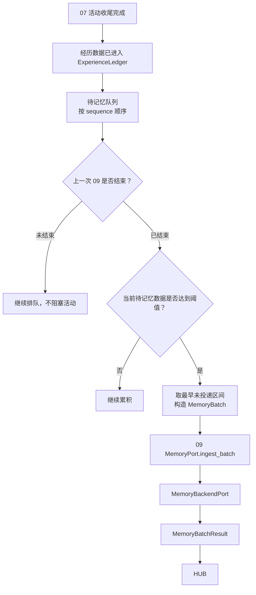

# 30 记忆数据管控

> 模块文档。参照 REMS3 的主干，但不复制记忆内部过程。
>
> 状态：初稿，从原 07 记忆投递枢纽迁入。

## 1. 定位

30 是经历流与 09 记忆薄壳之间的**数据管控层**。

它决定：

- 哪些经历数据进入记忆；
- 什么时候进入记忆；
- 上一次记忆处理是否结束；
- 当前数据是否足够；
- 游标如何推进；
- 失败如何重试、如何审计。

30 不理解记忆内容，也不处理对象和事件。

## 2.0 与活动并行

活动与记忆是两条时间线：

- 活动可以连续进行多个轮次；
- 记忆可能还在整理上一批，或尚未触发；
- 活动不等待记忆；
- 新内容持续进入 `ExperienceLedger`；
- 若上一批记忆尚未完成，新内容继续累积，形成待投递队列。

## 2. 职责

### 2.1 30 做什么

- 接收 07 的活动收尾信号；
- 收集 `ExperienceLedger` 中待记忆区间；
- 监控上一次 09 投递状态；
- 判断是否达到触发阈值；
- 构造 `MemoryBatch`；
- 调用 09 `MemoryPort.ingest_batch`；
- 成功后推进 `memory_start`；
- 维护 `MemoryIngestLedger`。

### 2.2 30 不做什么

- 不生成回复；
- 不创建对象；
- 不召回记忆；
- 不检测事件边界；
- 不封存事件；
- 不维护残影；
- 不执行遗忘；
- 不读取 09 内部状态。

## 3. 数据流



## 4. 接口

```text
MemoryControlPort.evaluate(subject_id)
    -> MemoryTriggerDecision

MemoryControlPort.run_once(subject_id)
    -> MemoryControlResult

MemoryControlPort.monitor(subject_id)
    -> MemoryProcessStatus
```

## 5. 行为规则

1. 30 只依赖稳定端口，不依赖 09 后端内部实现；
2. 上次 09 未结束时，不触发新批次；
3. 待记忆数据未达到阈值时，不触发；
4. 触发后只投递 `(memory_start, head]`；
5. 09 确认接管后才推进 `memory_start`；
6. 失败保留原文和批次，允许重试；
7. 对象 id 一律透传 01；
8. 30 不保存事件边界、残影或封存状态。
9. 若 09 仍在处理上一批，新内容继续排队，不要求活动等待；
10. 同一时刻只投递一批，待上一批结束再投下一批。

## 6. 验收标准

- 30 不实现记忆内部逻辑；
- 30 不创建对象；
- 上次 09 未结束时不会触发新批次；
- 数据不足时不会触发；
- 成功后推进 `memory_start`；
- 失败可重试且不丢原文。
- 活动连续多轮时，待记忆数据可以排队；
- 上一批未完成时，活动仍可继续；
- 记忆恢复后按 sequence 顺序处理下一批。
