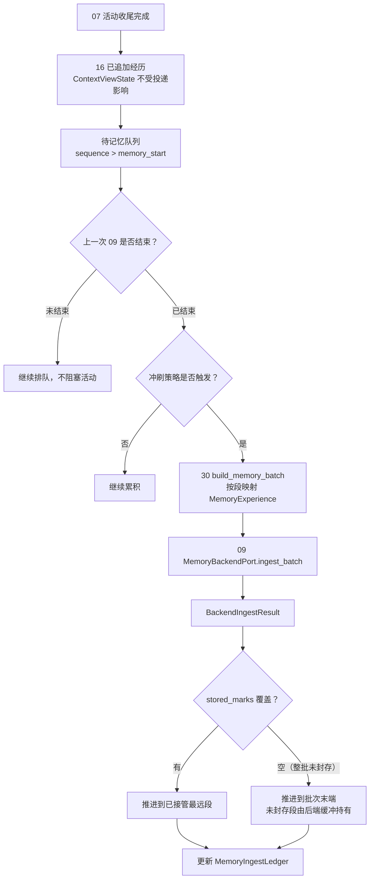

# 30 记忆数据管控

> 模块文档。术语以《概念词汇》为准，权威接口以《记忆层契约》与 Jshi_memory `design/220`（投递策略）为准。
>
> 状态：定稿骨架（2026-08-23）。批次构造从 16 迁到 30，触发策略参数化（对齐 220）；`memory_start` 只属于 30，投递不改 16 的 `ContextViewState`。

## 1. 定位

30 是经历流与 09 记忆薄壳之间的**数据管控层**。它决定：

- 哪些经历数据进入记忆；
- 什么时候进入记忆（冲刷策略，220）；
- 上一次记忆处理是否结束；
- 游标如何推进、失败如何重试、如何审计。

30 不理解记忆内容，也不处理对象和事件。

## 2.0 与活动并行

活动与记忆是两条时间线：

- 活动可以连续进行多个轮次；记忆可能还在处理上一批，或尚未触发；
- 活动不等待记忆；新内容持续进入 16 `ExperienceLedger`；
- 若上一批记忆尚未完成，新内容继续累积，形成待投递队列（`memory_start` 之后）。

## 2. 职责

### 2.1 30 做什么

- 接收 07 的活动收尾信号（编排层在 handoff 后调用 `run_async`）；
- 用自有游标 `memory_start` 收集 16 中尚未投递的经历（`list_experiences`）；
- 按**冲刷策略**（220）判断是否触发、触发到哪一批；
- 构造 `MemoryBatch`：按经历段映射 `MemoryExperience`（`text` 编成带名字的对话行，含言语与动作；`objects` / `source_ids` / `segment_id` / `origin` 按段透传）；
- 调用 09 `MemoryBackendPort.ingest_batch`；
- 09 确认接管后凭 `stored_marks`（`segment_id → 事件 id 列表`）推进 `memory_start`、更新台账；
- 支持**主体记忆**：`objects` 可为空，`object_ids` 可为空，不阻断投递；
- 维护 `MemoryIngestLedger`（register / ingesting / ingested / failed）。

### 2.2 30 不做什么

- 不生成回复；
- 不创建对象；
- 不召回记忆；
- 不检测事件边界、不封存事件、不维护残影；
- 不执行遗忘；
- 不读取 09 内部状态；
- 不维护、不改写 16 的 `ContextViewState`；
- 不把 `memory_start` 放进 16。

## 3. 冲刷策略（220）

所有参数可配置（环境变量 / 配置），默认值如下：

| 参数 | 默认 | 说明 |
|------|------|------|
| `flush_max_chars` | `active_zone_chars()`（窗口 × 1/30，默认约 33333） | 未投递段 text 总字数 ≥ 阈值 → 冲刷一批 |
| `flush_max_segments` | 20 | 段数 ≥ 阈值 → 冲刷（防长期不触发） |
| `flush_max_idle_seconds` | 600 | 距上次冲刷超过该秒数 → 冲刷（保证记忆不过期） |
| `flush_on_idle_seconds` | 1800 | 无新经历超过该秒数 → 冲刷全部未投递段 |
| `flush_night_window` | "00:00-06:00" | 处于配置时段 → 冲刷全部未投递段（深夜沉淀） |

- 空闲 / 夜间冲刷是未来 `consolidate` / `dream` 后台端口的自然挂载点（本轮占位）；
- 后端 `ingest_batch` 只负责接收（有序处理、失败重试、`stored_marks` 游标），行为不随策略变化。

## 4. 数据流



## 5. 接口

```text
MemoryControlPort.evaluate(subject_id)
    -> MemoryTriggerDecision（should_trigger / reason / from_sequence / to_sequence）

MemoryControlPort.run_once(subject_id)
    -> MemoryControlResult（decision / status / ingest_id / error）

MemoryControlPort.run_async(subject_id)   # 生产用（不阻塞活动）
    -> MemoryControlResult
MemoryControlPort.drain(subject_id)       # 冲刷全部未投递段
    -> MemoryControlResult | None

MemoryControlPort.monitor(subject_id)
    -> MemoryProcessStatus（previous_status / attempts / pending_sequences）
```

`evaluate` 的触发理由：`flush_max_chars` / `flush_max_segments` / `flush_max_idle` / `flush_on_idle` / `flush_night_window`；不满足时为 `insufficient_memory_data`。

## 6. 批次构造（30）

`build_memory_batch(subject_id)` 取 `memory_start` 之后的未投递段，构造：

```text
MemoryBatch
  batch_id / subject_id
  experiences: tuple[MemoryExperience, ...]   # 有序 = 经历先后
  from_sequence / to_sequence                 # 30 台账字段
  source_ids
```

`MemoryExperience` 映射：

- `text`：编成**对话行**。有 `text_raw` 时：`{说话人}：{原文}`（外部段用映射表里对应该 `actor_object_id` 的名字；主体段用身份显示名）。原文里已有的言语与 `（动作：…）` 都保留。仅有肢体、无口头时，用 `state_delta` 里的 embodied 写成 `{说话人}：（动作：…）`。一批常含多段、多个人，各段各自冠名后由 09 拼成整场对话。不把档案 id 写进 `text`。`think` / `wait` 等无言语无动作的 JSON 状态不进正文；
- `objects`：经历段的对象映射表（**只透传**，不编造对象）。说话人与提及对象由 16 写入（信封或落位后按 01 补齐，00 §4.1）；
- `interlocutor`：本段对话对象的 01 `object_id`。优先 `actor_object_id`（外部输入）；若空（主体回复等）则取 `objects` 中的档案 id（去重，不含主体）。用于召回按说话人约束，不是提示词里的名字；
- `source_ids` / `occurred_at` / `segment_id`：直接取自经历段；
- `origin`：`internal` 段 → `internal`；`external_input` / `subject_reply` / `subject_state` / `subject_silent` → `external`。

**批次分型**：以 `origin` 标签落地（external / internal）；「只取未投递段」保证活跃区里的回忆摘录不会再次成为新记忆（`in_context_recalls` 不是新经历段，不进批次）。05 只投递「新发生的」：新输入、新回应。

## 7. 行为规则

1. 30 只依赖稳定端口，不依赖 09 后端内部实现；
2. 上次 09 未结束时，不触发新批次；
3. 冲刷策略未触发时，不投递；
4. 触发后只投递 `(memory_start, head]`；
5. 09 确认接管（正常返回 `BackendIngestResult`）后才推进 `memory_start`；
6. 游标推进到**后端已接管的最远段**：有 `stored_marks` 时按封存段计算（未封存段内容已由后端缓冲持有，30 越过）；`stored_marks` 为空（整批未封存）时推进到批次末端，避免重复投递；
7. 失败保留原文和批次，允许重试；单次失败不影响活动完成；
8. 对象 id 一律透传 01（映射表值）；30 不创建对象；
9. 30 不保存事件边界、残影或封存状态；
10. 同一时刻只投递一批，待上一批结束再投下一批；
11. `memory_start` 只由 30 维护，用于区分哪些经历已经投递；
12. 投递成功或失败都不改 16 的原文和 `ContextViewState`；
13. 批次参数（`flush_max_*`）由 30 持有，16 不再承担批次构造。

## 8. 记录、评价与参数

- 记录：`memory_control_attempted`（编排层评价事件）、`MemoryIngestLedger`；
- 评价：投递成功率、记忆投递滞后、游标安全距离；
- 参数：`flush_max_chars` / `flush_max_segments` / `flush_max_idle_seconds` / `flush_on_idle_seconds` / `flush_night_window`（默认见 §3；由 14 调优并留审计）。

## 9. 验收标准

- 30 不实现记忆内部逻辑；
- 30 不创建对象；
- 上次 09 未结束时不会触发新批次；
- 冲刷策略未触发时不会投递；长度 / 段数 / 距上次冲刷 / 空闲 / 夜间任一触发均按参数工作；
- 成功后凭 `stored_marks` 推进 `memory_start`，台账更新；
- 失败可重试且不丢原文；
- 活动连续多轮时，待记忆数据可以排队；上一批未完成时活动仍可继续；
- 投递不改 16 的 `ContextViewState`。
