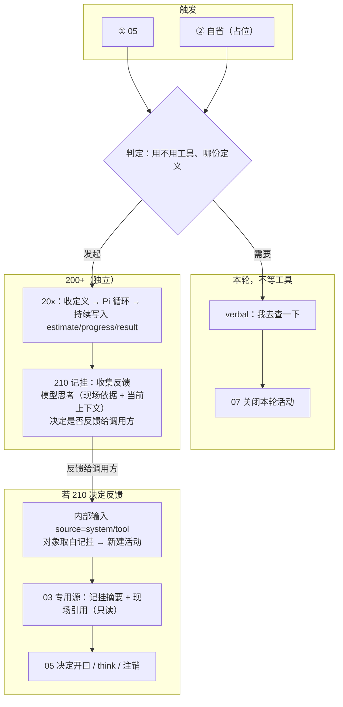

# 工具使用（设计文档）

> 模块文档。术语以《概念词汇》为准，流程位置见《00 流程总览与输入边界》。
>
> 状态：初稿。编号暂定 **200+**（20x 工具过程、**210 记挂**），待进 00 模块地图。
>
> **实现状态与设计口径分开写。** 契约字段以 `src/jshi/tool/` 为准；05 接线、210、专用装载尚未编码，下文标「未实现」。
>
> 边界原则：
> - **D-004**：能力实现只出候选与过程反馈，无长期写入权。
> - **D-007**：记挂不是 concern。不进 08、不挂起活动、不每轮全量装入工作集。

## 1. 定位

工具使用让匠石在 05 或自省判定之后，把「这次要做什么」交给独立模块落到现实，并把过程反馈收进记挂。

- **发起**：05 / 自省。只判定、选定义、发出请求。
- **执行（20x）**：独立模块。模板选用、制造、调用由模块内的 Pi 循环决定；主流程不过问。
- **记挂（210）**：收集反馈；用自己的模型调用，结合发起时的现场与当前上下文，决定是否反馈给调用方（05 / 自省）。不开口、不改活跃区。
- **开口**：仍由 05 出 `response_plan`（D-004）。10 只分发口头与肢体，与工具无关。
- **调试**：CLI `tool` 为第三条路径，不经主体过程。

现场（发起时的活跃区）是 **210 处理工具结果的依据**，不是把当时现场与结果打进当前活跃区。

## 2. 实现状态（以代码为准）

代码在 `src/jshi/tool/`；CLI 在 `src/jshi/app/cli.py` 的 `tool` 子命令；测试为 `tests/test_tool_contract.py`（只覆盖 Stub）。

| 部分 | 落点 | 现状 |
|------|------|------|
| 请求 / 反馈契约 | `contract.py` | 已实现。见 §9。 |
| 引擎端口 | `port.py`：`ToolEngine` / `ToolModule` / `ToolUseOutcome` | 已实现。`submit` 同步跑完，取反馈流里最后一条 `result` 为终态。 |
| 占位引擎 | `stub.py`：`StubEngine` | 已实现。目录固定（默认 `echo`）；反馈顺序 estimate → progress → result；`ask=propose_only` 时终态 `rejected`。 |
| Pi 引擎 | `pi_engine.py`：`PiEngine` | live 适配，单测不覆盖。RPC `prompt` + 把 `tool_execution_*` 译成反馈；`list_templates` 来自 `get_commands`。`ask` / `budget` 不约束执行；`estimate` 为合成；`timeout_s` 未接到读循环。 |
| CLI 演示 | `jshi tool` | 已实现。不构建主体运行时，不经 05 / 10 / 16。默认 stub，`--engine pi` 用 Pi。 |
| 05 判定与发起 | 认知 skill / `response_plan` | **未实现。** |
| 20x 任务账、异步、内部触发 | — | **未实现。** 当前 `execute` 阻塞到结束。 |
| 210 记挂、现场引用、按对象装载、思考 | — | **未实现。** |
| 03 专用源 | — | **未实现。** |

主链路（`subject/process.py`）未调用 `ToolModule`。因此：有契约与可替换引擎，没有「认知 → 工具 → 记挂 → 再认知」闭环。

## 3. 核心思路

1. **两面触发**：需求只来自 05 与自省。自省渠道占位。
2. **05 本轮不等工具**：提示词增加是否用工具的判定（规则另定）。需要则先口头说明（如「我去查一下，等会给你反馈」），同时发起定义；本轮活动照关。
3. **定义用模板**：每次调用填一份定义；模板可替换，侧重点可以不同。匠石管定义形状，Pi 管选、造、跑。
4. **Pi 循环在 20x 内**：选用与制造由 Pi 自决；主流程只认反馈信封。
5. **210 收反馈并过滤**：进度可以很密、终态可以隔天。210 收集后自己思考，决定要不要叫醒调用方。不是每次 progress 都开一轮 05。
6. **现场是处理依据**：记挂保存发起时活跃区的引用（及短由头）。210 思考时读这份材料 + 当前上下文，判断怎么对待这次反馈。不把旧现场写进当前活跃区。
7. **对人说仍是 05**：210 只决定是否反馈给调用方；调用方被叫醒后，05 再决定是否对对象开口。
8. **按对象装载、可注销**：防丢失靠账本；本轮工作集只装该对象、该看见的条目。
9. **升格后置**：是否成为长期能力不在本模块（D-004）。

## 4. 整体流程

CLI `tool` 不在此图内：人手构造 `ToolRequest`，打印反馈流。

## 5. 05 这一拍（设计，未接线）

1. 提示词增加选项：本轮要不要用工具。规则另定。
2. **不等待**任何工具调用。需要时：口头可带「我去查」；定义交给 20x；本轮照关。
3. 口头走既有 `response_plan` → 06 → 10。工具定义是并列产出，不是 10 的通道。
4. 已装载的、与当前对象有关的记挂摘要应让 05 看见，避免同一件事反复开任务（后补）。
5. 工具模块不得把结果写成 `verbal`。

与 D-008 一致：主路径先保证回应；不为工具在同一次认知调用里循环。

## 6. 定义与模板

每次调用填一份定义。模板规定这份定义的槽位与侧重点，不是匠石侧另建一份工具注册表。代码里目录由引擎 `list_templates()` 返回（Stub 固定名；Pi 为 `get_commands`）。

`ToolRequest` 已有的槽位（见代码）：`need`、`template`、`params`、`budget`、`permission`、`expected_result`、`ask`、`origin`、溯源 id。

`ask`：`execute`（默认）或 `propose_only`（先报价）。Stub 对后者终态为 `rejected`；Pi 目前仍执行。05 主路径未使用该字段。

## 7. 工具过程（20x）

职责：收定义、驱动引擎、把反馈写入任务账（任务账未实现；现为一次 `execute` 返回元组）。

引擎约定（已实现）：

- `list_templates() -> tuple[str, ...]`
- `execute(request) -> tuple[ToolFeedback, ...]`，含 estimate / progress / result
- 不写匠石长期状态

Pi：模块内部循环。主流程只认译出的 `ToolFeedback`。快慢由工具自身决定；代码路径目前是同步阻塞。

## 8. 记挂（210）（设计，未实现）

210 是记挂：保存在途任务，收集 20x 的反馈，用**自己的**模型调用决定是否反馈给调用方。

不是 05：不产出 `response_plan`，不重写活跃区，不对人说话。  
不是 08：不是长期个人内容，不走常驻约束那条装载。

### 8.1 账本与装载

- **落库防丢失**：任务在，除非注销。
- **本轮装载**：只装当前对象、且状态需要被看见的若干条，有上限。
- **跟对象**：张三的任务，李四说话时默认不装。内部叫醒时，对象从记挂取。
- **注销**：已反馈并处理完、取消、失败关掉、过期。须有渠道，否则无限涨。

### 8.2 现场是处理依据

发起时记下：`activity_id`、当时活跃区版本或段 id、一句由头（为何用、期望什么）、对象、模板、任务 id。

这份材料的用途：工具结果回来时，210（以及若被叫醒的 05）**依据当时现场**判断这次结果该怎么对待，避免偏离发起时的问题。

**不是**：把当时活跃区与结果打包，写进或替换当前活跃区。当前活跃区仍是「现在」的工作上下文，由 05 按风格重写、16 保存（D-009）。旧现场只读。

默认存引用，不默认存全文。16 里已有当时正文。

### 8.3 思考：是否反馈给调用方

210 收集 estimate / progress / result 后，做一次模型调用，输入为：

- **之前的上下文**：记挂里的现场（处理依据）
- **当前的上下文**：此刻的工作集 / 活跃区（对方现在在做什么）
- **本条反馈**

输出：是否把这次更新反馈给调用方（05 或自省），以及一份摘要。不输出对用户说的话。

据此：琐碎 progress 可以只记账；值得打断时才发内部输入、新建活动。终态更常反馈，仍由 210 判，不写成「有 result 就必须叫醒 05」。

被叫醒后的 05：读记挂摘要 + 现场引用（只读）+ 当前组装，再决定开口、沉默或注销。

## 9. 接口契约（对齐代码）

### 9.1 `ToolRequest`

| 字段 | 代码 | 说明 |
|------|------|------|
| `request_id` | 默认 uuid | 关联 |
| `subject_id` / `activity_id` / `turn` | 默认空 / 0 | 溯源。CLI 演示只填 `subject_id`。 |
| `origin` | `ToolOrigin` | `external_05` \| `introspection` |
| `need` | str | 为什么用 |
| `template` | str | 定义模板名 |
| `params` | mapping | 模板参数 |
| `budget` | `Budget` | `cost_cap`、`timeout_ms`、`max_steps`、`max_tools`、`max_tokens`、`resource_caps` |
| `permission` | `PermissionContext` | `allow` / `deny` / `require_confirm` / `note` |
| `expected_result` | str | 期望形态 |
| `ask` | `AskMode` | `execute` \| `propose_only` |
| `meta` | mapping | 开放 |

### 9.2 `ToolFeedback`

信封：`event_id`、`request_id`、`kind`、`at`、`version`（现为 `v1`）、`meta`；按 kind 带 `estimate` / `progress` / `result` 之一。

| kind | 载荷 | 主要字段 |
|------|------|----------|
| `estimate` | `ToolEstimate` | `cost_est`、`time_est_ms`、`resource_est`、`benefit`、`downside`、`need_confirm` |
| `progress` | `ToolProgress` | `stage`、`step`、`partial`、`cost_used`、`time_used_ms`、`resource_used`、`note` |
| `result` | `ToolResult` | `status`、`result`、`summary`、`ideal`、`ideal_note`、`cost`、`time_ms`、`resource`、`execution`、`error` |

`ToolStatus`：`ok` / `partial` / `failed` / `budget_exceeded` / `rejected` / `aborted`。

`ToolUseOutcome`：`request_id`、`feedback`、`result`；并从反馈流取出 estimate / progress / 终态 result。

### 9.3 记挂条目（设计，无对应 dataclass）

| 字段 | 说明 |
|------|------|
| `task_id` / `request_id` | 关联 |
| `subject_id` / `object_id` | 按对象装载 |
| `origin` | 调用方：05 或自省 |
| `status` | 进行中 / 已反馈 / 已注销 |
| `need` / `template` | 定义摘要 |
| `field_ref` | 现场引用：activity_id、活跃区版本或段 id |
| `note` | 短由头 |
| `last_feedback` | 最近进度或终态摘要 |
| `notify_caller` | 210 思考产物：是否反馈给调用方 |

## 10. 行为规则

1. 05 / 自省只判定与发起；制造与执行在 20x；Pi 循环不出模块。
2. 引擎与 210 不写长期个人世界、不改认识状态（D-004）。
3. 05 发起后不等工具；本轮活动不因工具未结束而挂起（04 无 `waiting`）。
4. 工具结果不是说话人输入，不走 `external + text` 信封；专用源，不受信。
5. 现场引用只作处理依据，不并入当前活跃区。
6. 210 决定是否反馈给调用方；对人开口只由 05 做。
7. 记挂按对象装载，有注销渠道，不进 08。
8. 10 不执行工具。
9. 契约字段只增不改；`version` + `meta`。
10. 预算耗尽、部分实现、失败：按模板降级并给原因。Pi 适配尚未落实预算语义。

## 11. 记录、评价与参数

- **记录**：代码现有一次请求的反馈流（CLI 打印，不落 16）。设计上：20x 任务账、210 记挂、现场引用、内部触发、210 是否叫醒调用方。
- **评价**：过程反馈供 14 旁路；210 叫醒是否过密 / 过疏（后补）。
- **参数**：模板、预算、权限；210 叫醒阈值（后补）；由 14 日后接管。
- **I-005**：评价与调参不进主流程同步等待。

## 12. 验收标准

**已能用测试核对（Stub）：**

- 请求默认 `origin=external_05`、`ask=execute`。
- 反馈顺序 estimate → progress → result。
- `propose_only` 终态 `rejected`。
- `ToolModule` 使用引擎目录。

**设计验收（未实现，不拿现有 CLI 充数）：**

- 05 判定后非阻塞口头并发起；活动照关。
- 20x 持续写三类反馈；210 按对象保存现场引用。
- 210 结合现场与当前上下文，决定是否反馈给调用方。
- 被叫醒的 05 依据现场处理结果，且当前活跃区不被旧现场替换。
- 结果走内部输入 / 专用源；10 与 08 不承担工具执行或记挂保管。

## 13. 与其他模块的关系

- **编号**：200+ 系列，与 08 的 100+ 平行。102 若装已升格能力，与在途任务不是同一种东西。
- **依赖**：16（现场引用所指向的活跃区版本）、01（对象 id）、100 / 15 / 11（权限与介入，后补）。
- **被依赖**：05 / 自省（发起与被叫醒后开口）、03（专用源，后补）、00（地图登记，后补）。
- **不依赖 10**：10 只消费已校验的口头与肢体计划。

进上下文的信封形态须专文设计（03 / 00），本文只锁：来源 `system/tool`、对象取自记挂、现场只读、不并入当前活跃区。

## 14. 扩展性预留

- `FeedbackKind` 可增 `interrupt` / `verify` / `retry`。
- 模板可替换；引擎可替换（已有 Stub / Pi）。
- 自省渠道、进度档位、注销规则后补。

## 15. 未决与后补

- 05「要不要用工具」的判定规则。
- 内部输入信封字段（03 / 00 专文）。
- 210 思考的输入裁剪、叫醒标准、失败降级。
- 现场引用粒度（整份版本 vs 段 id vs 短摘录上限）。
- 是否另建 `fact/tool_call` 等事实种类。
- Pi 适配：预算与 `ask`、超时、stderr、多工具终态。
- 长期能力升格（V5）。
- 自省渠道。

不纳入：05 同轮死等工具；把旧活跃区与结果写入当前活跃区；记挂进 08 当 concern。
