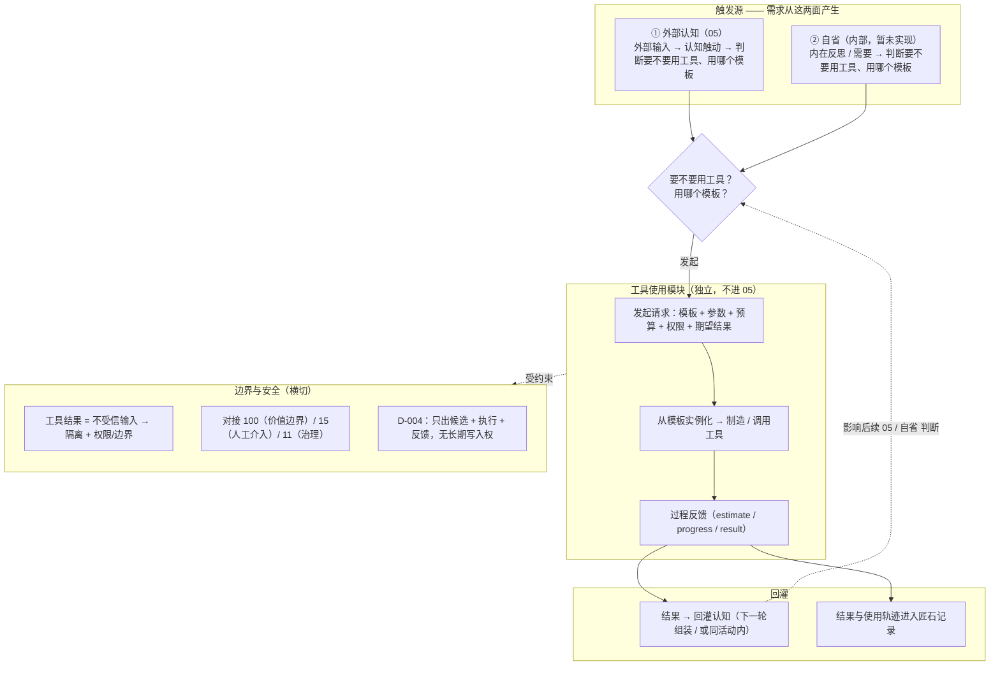

# 工具使用（设计文档）

> 模块文档。术语以《概念词汇》为准，流程位置见《00 流程总览与输入边界》。
>
> 状态：初稿（讨论稿）。模块编号暂定，待进 00 模块地图。本文只固定契约与设计方向，不规定具体实现；执行引擎可替换（如借用 Pi 等开源 harness）。
>
> 边界原则（D-004）：工具使用属于「能力实现」，负责 **定义 / 制造 / 执行 / 反馈**，只产出候选结果与过程反馈，**不拥有长期写入权**，不决定什么已成为匠石的稳定能力。

## 1. 背景与目标

匠石是一个长期伙伴，不只接收信息，还要**作用于现实**：外部输入是「认知触动」的一面，另一面是**自省**（内部活动，当前未实现）。工具使用正是让匠石「**为什么用工具、用什么工具**」的需求，从这两面产生，并通过工具模块落到现实。

目标：
> 当 05（外部认知）或自省决定用某个工具时，匠石能用「模板」**定义**这个工具，交给**独立模块**制造 / 调用，并把**整个使用过程**（使用前的代价与好处、使用中的具体情况、使用后的结果与是否达到理想）反馈回认知，让结果真实影响后续。

## 2. 核心思路

1. **两面触发**：工具需求来自 ① 外部认知（05）与 ② 自省（内部）。两者只「判断需求 + 选模板 + 发起」，不做制造 / 执行。
2. **模板定义工具**：工具不是固定函数，而是由**可替换的模板**定义——模板是「工具制造规格书」，规定接口、预算、能力范围、部分实现 / 失败降级、权限与版本。
3. **独立工具模块**：工具的制造 / 执行放在独立模块（不进 05 那一次认知调用），模块有自己的循环，与匠石主循环无关。
4. **过程反馈**：反馈覆盖工具使用的**全流程**，不只有最终结果——使用前的代价好处、使用中的情况、使用后的结果（含是否理想）。
5. **借引擎不借循环**：执行引擎可复用开源 harness（如 Pi），但只局限在模块内部，匠石的主循环与契约不变。
6. **边界与安全**：工具结果是不受信输入，需隔离 + 权限 / 边界；只出候选，无长期写入权。
7. **长期能力（后置）**：多次工具使用 + 结果 → 后台沉淀 → 能力升格，另作考虑，不在本模块做。

## 3. 整体链条

## 4. 两面触发源

| 触发源 | 说明 | 现状 |
|--------|------|------|
| ① 外部认知（05） | 外部输入 → 认知触动 → 判断要不要用工具、用哪个模板 | 已实现 |
| ② 自省（内部活动） | 内在反思 / 需要 → 判断要不要用工具、用哪个模板 | 占位，未实现 |

两者都只做「判断需求 + 选模板 + 发起」，不做「制造 / 执行」（那是工具模块的事）。

## 5. 模板（定义工具的方式，可替换）

**不同模板对这些的定义不同**——模板不只是接口，而是「工具制造规格书」：

| 方面 | 模板定义什么 |
|------|--------------|
| interface schema | 用这个工具进 / 出什么 |
| budget 语义 | 成本 / 时间 / 资源怎么算、怎么约束、超了怎么办 |
| capability 范围 | 能做 / 不能做 |
| 部分实现 / 失败降级策略 | 不能实现、只能做一半、失败时怎么处理（降级 / 部分结果 / 放弃） |
| permission 要求 | 需不需要确认、能碰什么不能碰什么 |
| version / source | 版本与来源 |
| `meta` | 开放（可扩展） |

## 6. 工具使用模块（独立）

- 从模板实例化 → 制造或调用已有工具；模块有自己的循环，与匠石主循环无关。
- 执行引擎可替换（如借用 Pi 等 harness：**skills** 定义工具、**extensions** 执行与权限、**RPC** 作为 Python 侧子进程）。
- 模块内部保留运行轨迹（Pi session / events），作为审计与适配素材。
- 模块只产出候选结果 + 过程反馈 + 记录，不写匠石长期状态。

### 6.1 复用开源 harness 的原则

- **借引擎，不借循环**：只借用执行引擎，包在匠石自己的端口后面；匠石主循环与契约（`ModelRequest` / `ModelResponse` / `response_plan` / 认识状态 / 主体归属）不变。
- Pi 的映射：
  - `prompt` → 调用方把工具请求当一次 prompt 丢给模块（让 Pi 去造 / 跑工具）。
  - `tool_execution_*` 事件 / `ToolResultMessage` → 模块内部执行轨迹，并由适配器翻译成匠石能落库 / 回灌的形式。
  - `extension_ui_request/response` → 权限确认的双向通道（走 15 人工介入，或按规则自动）。
- **不越界（D-004）**：Pi / 模块只负责制造、执行、出候选结果与反馈，不自己写匠石的长期状态、认识状态或升格。

## 7. 过程反馈与结果回灌

### 7.1 过程反馈（不只是最终结果）

反馈覆盖工具使用的**全流程**：使用前（代价好处）、使用中（具体情况）、使用后（结果与是否理想）。

统一信封：`event_id / request_id / kind / version / at / meta(开放)`。

`kind` 是开放枚举（后续可加 `interrupt` / `verify` / `retry` 等），当前三类：

| kind | 阶段 | 字段 |
|------|------|------|
| `estimate` | 使用前（报价 / 收益） | `cost_est`、`time_est`、`resource_est`、`benefit`、`downside`、`need_confirm` |
| `progress` | 使用中（具体情况） | `stage`、`step`、`partial`、`cost_used`、`time_used`、`resource_used`、`note` |
| `result` | 使用后（结果与是否理想） | `status`、`result`、`summary`、`ideal`、`cost`、`time`、`resource`、`execution`、`error` |

使用前报价有两种走法：调用方在请求里自带（05 / 自省 自己估 cost/benefit），或模块先回一条 `estimate`（工具自己报价，05 / 自省 再决定执行 / 取消）。后者更贴近「在使用前给出代价和好处（也属于这个过程）」，倾向采用。

### 7.2 结果回灌

- 结果必须回灌认知（不变量 #6：行动结果必须返回并影响未来）。
- 回灌方式保留两种：**下一轮组装读到**（默认，改动最小）与 **同活动内回灌再回应**（更像「先用工具再说话」，主流程变多步）。

## 8. 长期能力形成（V5，后置，不在本模块）

多次工具使用 + 结果 → 后台反思 / 记忆整理 → 候选能力（CANDIDATE）→ 审核 → 升格 ACTIVE → 个人世界装载 → 后续活动直接用该能力。

**本模块不做这条升格逻辑**；它最终「是否纳入长期能力」的判断、升格与写入由匠石主体框架负责（D-002 / D-004）。Pi 等引擎最多提供长期记忆的存放机制与运行素材，不承担「什么已成为匠石的稳定能力」的判断。后面单独考虑。

## 9. 接口契约

### 9.1 调用方请求 `ToolRequest`（05 / 自省 → 模块）

| 字段 | 说明 |
|------|------|
| `request_id` | 关联标识 |
| `subject_id` / `activity_id` / `turn` | 来源与溯源 |
| `origin` | `external_05` \| `introspection`（哪面触发） |
| `need` | 为什么用工具（人话） |
| `template` | 选哪个模板（模板可替换；决定「怎么定义这个工具」） |
| `params` | 模板参数 |
| `budget` | 成本上限、timeout、max_steps、max_tools、max_tokens、资源上限 |
| `permission` | 允许 / 禁止域、价值边界、是否需人工确认（对接 100 / 15 / 11） |
| `expected_result` | 期望的结果形态（结构化 + 一句话 summary） |
| `ask` | `propose_only`（先报价再决定）\| `execute`（直接执行） |
| `meta` | 开放字段（可扩展） |

### 9.2 过程反馈 `ToolFeedback`（模块 → 05 / 自省）

见 §7.1。反馈信封带 `kind` / `version` / `meta`，只增字段不改字段。

## 10. 行为规则

1. 调用方只判断需求 + 选模板 + 发起；制造 / 执行在模块内。
2. 模块只出候选结果 + 过程反馈 + 记录，不写匠石长期状态（D-004）。
3. 结果必须回灌认知（不变量 #6），经 `ResultFeedbackPort` / 经历流进入后续。
4. 工具结果是不受信输入 → 隔离 + 权限 / 边界，对接模块 15 / 11 / 100。
5. 预算耗尽 / 部分实现 / 失败 → 按模板降级策略处理，并给出原因。
6. 契约版本化 + 开放 `meta` + 字段只增不改（可向后演进，不破坏旧消费方）。
7. 主流程（05 对话认知）**不被工具改造**；工具使用是独立能力路径。

## 11. 记录、评价与参数（旁路，对齐 I-005）

- 记录：模块内部运行轨迹（Pi session / events）；匠石侧结果回灌与既有经历 / 事实机制。
- 评价：过程反馈供 14 有效性分析（旁路）；结果质量供后续后台沉淀。
- 参数：模板、预算、语言、权限档位处于可替换边界，由 14（统计分析与参数调优）日后接管。

## 12. 验收标准（草案）

- ① 外部认知（05）、② 自省 两面都能发起工具请求。
- 请求携带模板 + 参数 + 预算 + 权限 + 期望结果。
- 模块全程吐出 `estimate` / `progress` / `result` 反馈（使用前代价好处、使用中情况、使用后结果与理想程度）。
- 结果回灌认知，影响后续判断（不变量 #6）。
- 权限 / 边界生效；失败 / 降级有原因。
- 主流程（05 对话认知）不被工具改造。
- 契约可扩展（`version` + `meta` + 只增字段），不破坏旧消费方。

## 13. 与其他模块的关系

- 依赖：100（价值边界）、15（人工介入）、11（治理 / 连续性）、14（旁路分析）、`ResultFeedbackPort`。
- 被依赖：00（模块地图登记）、05 / 自省（判断与发起）。
- 概念边界：工具模块属于**能力实现**（skill / 模型 / 工具），只出候选 / 执行 / 反馈，不拥有长期写入权（D-004）。

## 14. 扩展性预留

- `kind` 开放枚举：新增阶段（`interrupt` / `verify` / `retry`）直接加新 kind。
- 模板可替换、可注册 / 打包。
- 字段只增不改 + `version` + `meta`。
- 结果回灌方式（下一轮组装 vs 同活动内）保留两种。

## 15. 未决与后续

- 是否在匠石侧另建 `fact/tool_call` / `fact/tool_result`：另行议，本设计不把它当前提。
- 自省（②）侧如何触发：单独设计。
- 长期能力形成（V5 / §8）：后面单独考虑。
- 人工介入（15）与权限（100 / 11）的具体接入：待定。
