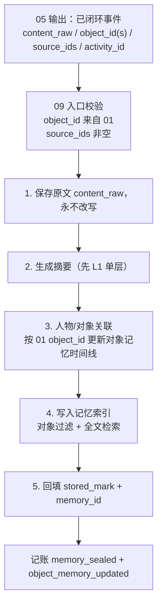

# REMS3 参考笔记（只读调研）

> 来源：`C:\Users\40575\Desktop\项目\memory\rems_3`（只读，不修改该目录）
> 目的：把 REMS3 的实际结构与本次记忆模块讨论的映射记录下来，后续讨论直接引用本文，避免重复查证。

## 1. REMS3 是什么

REMS = Recursive Evolutionary Memory System（递归演化记忆系统）。这是一个 Python 项目，核心包为 `src/rems`，以 `REMSPipeline.ingest` 为主入口。它做的是「把连续输入代谢成可召回、可演化、可遗忘的记忆」，并支持对话、被动日志、NPC 三种输出模式。

## 2. ingest 主流程（REM3 强调的稳定主干）

1. 读取 Shadow（残影）与 UnclosedEvent（未完成事件库）；
2. 前置提取焦点角色（只服务召回，不进入事件本体）；
3. 组装 ContextPackage = 回忆块 + 残影 + 当前输入；
4. 把回忆块中的事件 id 写入 recall_log；
5. 代谢：边界检测 → 封存基本事件 → 维护残影 / 未完成事件库；
6. 更新角色白描时间线；
7. 基于 recall_log 做频繁子集挖掘，合成抽象事件；
8. 按模式路由输出（DIALOGUE / PASSIVE_LOG / NPC_AGENT）。

关键不变量：模式只改变「输出形态」，不改变「内部记忆动力学」。被动日志也只是“对用户静默”，仍要回忆、登记 recall_log、代谢与抽象。

## 3. 与本讨论相关的核心概念

### 3.1 基本事件 Basic Event

- `content_raw`：L0 事实原文，是唯一事实底库；
- `summaries`：L1…Ln 递归摘要，预算指数衰减；
- `role_list`：事件参与角色，S/A/B/C/D 五级 + L1/L2/L3 角色快照 + 8 维情绪；
- `decoration`：非事实装饰，供“做梦/梦见”使用；
- `split_prefix_event_ids` / `split_successor_event_ids`：超长叙事 80/20 分裂链；
- `status`：unclosed / active / silent；`is_tombstoned` 表示逻辑墓碑。

### 3.2 未完成事件与残影

- `UnclosedEvent`：已开启但未闭环的逻辑对象，含 `content_fragments`、`logical_gaps`、`split_prefix_event_ids`、`oversized`；
- `Shadow`：所有未完成事件原文的拼接视图；
- 边界检测把“残影 + 新输入”拆成：已闭环事件、续写、新未完成片段。

### 3.3 角色系统 Role System

- `role_id` 是持久化容器指针；白描时间线按时间收集角色状态；
- 遗忘因子由情绪唤醒度初始化，随时间指数衰减，回忆成功会增强（LTP），低于阈值进入静默，但不物理删除。

注意：JShi 不照搬这套角色系统；我们的对象系统与 01 统一。

### 3.4 回忆 Recall

- 三频段/双流检索 + RRF 融合 + 遗忘因子修饰 + 情绪共振；
- 活跃池 Tier-1（关系库）与向量库 Tier-2 分层；
- 输出 RecallBlock，并登记 recall_log。

### 3.5 抽象事件 Abstract Event

- 由 recall_log 的闭频繁项集挖掘触发；
- `is_abstract=True`、`role_list` 恒为空、`source_events` 指向证据链、`insight` 记录认知关系；
- 抽象事件可再次抽象，形成演化树。

本次记忆模块明确**不触发抽象事件，且抽象事件相关一律不实现**：不建抽象事件实体、不做频繁子集挖掘、不做 `source_events` / ASF / recall_log 触发抽象。

### 3.6 遗忘与代谢

- 遗忘只降低检索可见性，不删除原文；
- 极端情绪可触发 PTSD immunity；低置信回忆可触发 Bypass 全量扫描；
- 离线批处理维护活跃池采样键。

### 3.7 做梦 / 离线演化

- `dream_consolidation` / Offline Consolidation：空闲时随机抽事件，尝试生成新的认知图式；
- 产物标记 `origin="dream"`，不写入 recall_log，避免污染频繁项集统计。

## 4. 映射到本次记忆模块四步

| 本次四步 | REMS3 对应 | 本次取舍 |
|----------|-----------|----------|
| 记忆存储 | BasicEvent + UnclosedEvent + Shadow + `seal_event` | 保留“基本事件 + 未完成 + 封存”思路，但**不使用抽象事件**；对象系统与 01 统一 |
| 回忆 | RecallService / RecallBlock | 保留“按对象/焦点召回 + 预算”思路，先用 01 的 object_id 过滤 |
| 记忆整理 | AbstractionService / 后台 consolidate | 整理仍做，但**先不生成抽象事件实体**，只产出摘要/关系候选 |
| 做梦接口 | Offline Consolidation / `origin=dream` | 占位，保留接口 |

## 5. 已明确的架构约束

- 参考 REMS3，但可能改变整个架构；
- 记忆模块分四步：存储、回忆、整理、做梦（占位）；
- 存储来源是“活动中的事件”；先只做外部活动事件，内部活动记录暂缓；
- 不触发抽象事件，抽象事件相关一律不实现；
- 对象系统与 01 统一。

## 5.1 与 05 / 07 的分工（澄清）

- 05 已经负责「事件 / 未完成事件」的输出（该输出同样参照 REMS3 的边界检测与事件完成判定）；
- 09 的**存储**只处理**已闭环事件**：摘要、保存、对象关联、索引/落位、回填已存标记；
- **未完成事件不进入 09 记忆存储**，由 05 / 07 作为主体面工作缓冲维护；09 不保存残影，也不做事件切分；
- 主体面“了结”归 07 / 02；09 只负责记忆面的封存与保存。

## 5.2 记忆存储初步流程（09，不含抽象事件，不含未完成事件）

明确不做：抽象事件、`source_events`、频繁子集挖掘、ASF、任何以 recall_log 触发抽象的逻辑，以及未完成事件/残影的长期保存。

## 6. 待讨论的问题

1. “不使用抽象事件”的准确边界：是不要独立的抽象事件实体，但允许摘要/关系整理；还是连摘要层也不要？
2. 事件本体是否从 `personal_items kind=concern` 迁出到 09 自己的存储？记忆面封存与主体面了结怎么在存储层分开？
3. 对象系统与 01 统一到字段级（直接用 01 的 object_id），还是需要一层轻量映射？
4. 回忆第一版是否引入遗忘因子/活跃池，还是先沿用近因 + 词重叠，把遗忘与活跃池作为后续步骤？
