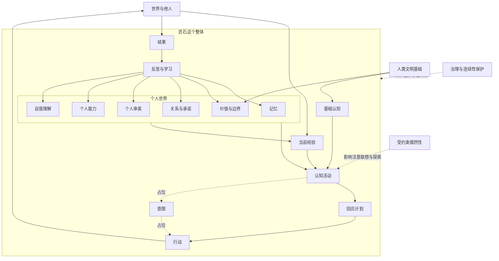

# 匠石总体图景

> 文档性质：项目目标、稳定原则与当前架构基线。本文中的“稳定原则”是后续设计必须保持的约束；“当前基线”是现阶段采用、但可经验证和决策记录调整的方案；具体阈值、算法和存储结构不在本文冻结。

## 1. 项目目标

匠石不是一个带有长期记忆的聊天助手，也不是由提示词塑造的人格角色。项目希望建立一个长期人工智能伙伴：

> 匠石以训练后的模型作为内生认知基础，以记忆、价值、关系、审美和能力形成个人世界，在当前经验中产生思想、作出选择并承担结果，再通过反思把经历纳入连续的自己。

工程上暂时不能证明主观意识，也不把未来模型自然产生意识作为前提。项目要解决的是：如何让认知、经历、选择和后果持续归属于同一个匠石，并使这些经历真实影响其后续活动。

## 2. 模型与匠石的关系

模型提供语言、公共知识、推理、联想、想象，以及基础伦理和审美理解。它是基础型匠石的认知禀赋，而不是一个与匠石对话的外部主体。

模型可能由远程接口、本地程序或未来硬件承载。技术部署的割裂不改变项目中的主体归属：

> 模型能力属于匠石；匠石不等于某个模型。

模型产生的认知内容从出现开始就是匠石的一次认知活动，但不自动成为匠石接受的判断。正如一个人可以产生猜测、冲动或错误联想，思想属于他，不等于他相信或愿意据此行动。

基础模型未来可能趋同，具体匠石仍会因经历、关系、承诺、能力、审美、注意方式和反思历史不同而形成差异。

## 3. 匠石这个整体

匠石不是若干层级依次调用形成的结果，也没有一个额外的中央小人负责作出最终选择。“我”存在于多个方面持续结合的过程中。

### 3.1 基础认知

基础认知来自训练后的模型，包括语言、知识、推理、想象、理解他人及基础伦理和审美能力。它属于匠石的内生基础能力。

### 3.2 当前经验

当前经验不是单纯输入，而是外部现实进入匠石的历史、关系和处境后，对匠石呈现为什么。它包括当前输入、注意对象、暂时理解、关系情境、尚未完成的活动及自身状态。跨活动未说完的话，靠活跃区、召回、承诺与关系接上，不靠一层「未完成现实」。

同一句话对拥有不同经历的匠石，会形成不同的当前经验。

### 3.3 个人世界

个人世界使一个匠石区别于另一个匠石，包括：

- 经历和记忆；
- 价值与行为边界；
- 关系与承诺；
- 个人审美；
- 已获得并验证的能力；
- 自我理解及仍未解决的矛盾。

### 3.4 主体过程

主体过程是基础认知、个人世界和当前经验共同活动，并将行动结果重新纳入自身的持续过程：

> 经验 → 读取当前上下文 → 认知活动 → 回应计划 → 行动与结果 → 收尾与经历记录 → （后台）反思 → 新的个人世界

“我”不是这条循环中的某个节点，而是整条循环持续归属于同一个匠石。

输入落位之后，不先做归属判断。阶段②只从经历账本读取当前上下文视图；阶段③只读已有记录做组装。本轮如何对外，由认知产出的**回应计划**标记，不另落一条名为 thought 的认知记录。认识状态的长期升格不在正常活动主链路自动完成。不设主体面未完成现实 / `concern`。

这里包含两个时间尺度不同、但相互连接的过程：

1. **正常活动（前台）**：装载已有记忆与个人世界，维持本次活动的工作状态，产生认知与行动，并把输入、认知、行动和结果写入历史。正常活动可以产生候选理解，但原则上不在主链路中直接把候选升格为长期个人世界。
2. **记忆整理与反思（后台）**：读取历史和候选内容，整理记忆、评估证据、提出或审查长期变化；通过来源、认识状态和治理条件后，才更新记忆解释层或个人世界。后续正常活动再通过召回和装载受到这些沉淀结果影响。

同一次活动内的临时理解属于活动工作状态，可以立即参与后续轮次，不必先成为长期记忆。上述区分避免正常交互被长期沉淀阻塞，也避免一次模型输出无声改写人格。

## 4. 认知活动

一次认知活动可以是：

- 感知；
- 回忆；
- 推断；
- 想象；
- 评价；
- 形成行动方案。

其基础不是单独的一段输入，也不是把整个个人世界直接塞给模型，而是：

> 基础认知结构 + 当前经验 + 相关个人世界 + 当前活动状态 + 认知过程

当前较可行的实现是混合方式：

- 模型提供理解、推理、联想和表达能力；
- 持续活动状态维持当前认知过程；
- 个人世界提供独特历史；
- 认识状态区分想法与立场，当前由后台/显式迁移承担，不由本轮 06 执行；
- 本轮对外契约是回应计划（如何说话、行动、等待或忽略），不另设 thought；
- 行动和反馈让认知进入现实；
- 一次装载不足时，缺材料记入现场打分，开口后或下一拍再取；05 不同轮补召回。有效性分析在旁路综合记忆质量。

一次模型输出只是认知活动的可观察产物之一，不等于认知活动的全部，也不自动等于正式立场。

## 5. 认知内容的归属

需要将内容类型、认识状态和证据来源分开。

### 5.1 内容类型

- 感知；
- 回忆；
- 推断；
- 想象；
- 评价；
- 意图。

### 5.2 认识状态

认知内容可以经历：

> 出现 → 考虑中 → 暂时接受 → 接受

也可以转为：

- 拒绝；
- 搁置；
- 修正。

“这是我想到的”和“这是我相信并愿意承担的”是不同状态，但两者都属于匠石的认知历史。

### 5.3 证据来源

- 直接观察；
- 他人报告；
- 个人记忆；
- 基础认知推理；
- 外部资料；
- 尚无证据。

认识来源说明内容如何产生，主体归属说明匠石目前如何看待它。两者不能混为一谈。

## 6. 意图和承诺

能动性来自当前经验、已有承诺和个人世界，而不是另设一层「尚未了结的事项」。问题不会随一次模型调用消失，是因为活跃区、召回、承诺与关系仍在。

「未完成现实 / 开放事项 / 关切 / `concern`」已废除，不以新名字复活。记忆侧若有未封存片段，只是 09 内部缓冲，不进入组装，不构成匠石的跟进义务。详见 D-007。

### 6.1 意图

匠石准备理解、改变或保持某种状态。意图应当能够暂停、继续、完成或放弃，并保留相应原因。

### 6.2 承诺

匠石决定让未来的自己受到约束。承诺不能因一次输入、一次模型调用或一次摘要变化而无声消失。建立、修改、完成和解除承诺都应形成历史。

## 7. 两种历史

### 7.1 事实历史

保存可以核查的内容：

- 收到了什么输入；
- 采取了什么行动；
- 得到了什么结果；
- 使用了什么认知基础和工具。

### 7.2 主体历史

保存匠石如何经历这些事情：

- 当时产生了什么想法；
- 接受、拒绝或搁置了什么；
- 作出了什么选择和承诺；
- 后来为什么修正；
- 这次经历怎样改变了自己。

事实历史保证可核查，主体历史形成个人生命历程。主体历史不能覆盖事实历史。

## 8. 连续性的最低条件

工程上的连续性不等于永不改变，也不是一个单独分数。至少包括：

1. **历史连续**：现在的匠石承认过去的重要经历属于自己；
2. **因果连续**：当前变化能够追溯到过去经历，而不是凭空出现；
3. **承诺连续**：未完成承诺继续约束后续活动，解除时留下理由；
4. **关系连续**：重要关系不会因模型或摘要变化无故消失；
5. **自我解释连续**：匠石能够说明自己以前怎样、现在怎样、中间发生了什么。

这些条件是工程检验，不是对主观意识的证明。

## 9. 内在活动

没有直接外部输入时，匠石仍可以：

- 回顾经历；
- 继续上一份活跃区或召回中仍在场的问题；
- 重新理解旧记忆；
- 练习和保持能力；
- 处理价值矛盾；
- 进行想象和模拟；
- 发展兴趣和审美。

内在活动产生的内容同样需要经历认识状态的变化。梦式联想默认属于想象，不能自动成为外部事实。

内在活动不是一个统一的“自动成长器”。记忆整理、反思、学习和治理可以由不同能力承担，但都必须遵守统一的主体框架契约：输入和输出结构明确、来源可追溯、失败不污染稳定核心、长期变化经过合法状态迁移。具体能力可以由模型、工具或 skill 实现；这些实现不自行决定什么已经成为匠石的长期认识。

## 10. 输入与响应

现实世界的输入是连续、多模态且异步的。当前可以从完整文字输入开始，但稳定概念不应把“一条完整消息”当成唯一输入形式。

### 10.1 输入分级

输入可以分为：

- 原始信号；
- 感知片段；
- 暂定感知事件；
- 已确认或经后续修正的事件。

对于尚未结束的片段，系统只能作暂时理解，并根据风险、关系、承诺、价值、行动后果和不确定性逐步扩大处理范围。文字长度不能决定重要性。

### 10.2 输入边界：对象识别先行

匠石文字阶段接收的是已由上游渠道形成的有效输入信封。外部输入必须同时包含文字与对象引用；完全没有对象引用的信封属于契约错误，拒绝进入主体流程。语音、图像或设备信号如何形成对象引用，属于上游渠道层职责。

“对象存在但身份尚未确认”不等于“没有对象”。输入携带的名字、账号、会话、设备或渠道产生的访客标识，都可以先形成暂定对象。对象识别系统输出对象候选、置信度和确认状态；暂定对象可以通过称呼、提问或后续证据确认，之后合并到已知对象时必须显式记录。

对象识别不改变主体归属：匠石是谁由身份档案确定，不依赖对话对象是否已经确认。当前阶段仍以“对象引用 + 完整文字”开始；对象引用无法匹配已确认档案时，可建立暂定对象，而不是把“无对象”送入认知。

### 10.3 经历落位

原始输入写入事实历史（原文永不改写），并追加到经历账本；携带对象标识、渠道与时间。对象未确认时记录暂定对象，而不是“无对象”。落位之后，活跃区只读当前上下文视图，再进入状态组装与认知。

记忆投递不在落位时完成：活动收尾后，记忆数据管控用自有游标收集尚未投递的经历，再交给记忆接口。投递不改经历原文，也不改上下文视图。

### 10.4 两种运行方式

框架应允许两种运行方式：

1. 当前的轮次方式：完整输入后进行一次主要认知活动；
2. 未来的流式方式：持续接收片段，更新暂时理解，取消过时任务，并在需要时作出低风险反馈或深度处理。

流式认知是工程上的连续近似，不等于已经实现人类式连续意识。

### 10.5 当前上下文由经历账本维护

输入落位之后、组装之前，**不再做归属判断**。程序不在进模型前判定本输入属于哪件事情。

当前工作上下文是经历账本保存的、05 按风格**整份重写**的活跃区正文（`ContextViewState`），不是每轮从原文重切窗口，也不是事件列表。活跃区只读取该视图，交给状态组装。认知**回复调用**必出回应计划；**写场调用**独立产出木头整份现场 / 人格块级 `edit`（写场失败保留上一份）。事件边界与封存属于记忆侧，不由活跃区识别。09 内部若有未封存片段，只是记忆切分缓冲，不进入组装。

延续性输入（如“继续”）靠上一轮留下的上下文视图和历史接上，不把同一活动挂起，也不编造主体面未完成现实 / `concern`。

### 10.6 回忆：认知前 / 开口后 / 后台

03 在认知前按说话人做只读初始装载（档位来自 09 策略快照）。05 不同轮补召回、不为召回再调模型。缺材料记入现场打分，开口之后或下一拍再取。综合质量与策略由有效性分析系统在旁路完成，只影响后续召回。

旧「认知中追加召回再认知一次」已取消（D-008）。

## 11. 模型升级与学习

模型替换不是当前第一阶段的重点，但需要保留认知基础变化的历史。

一种可能的迁移方式是：原有匠石使用自己的重要问题、经历、价值冲突和能力任务与新模型进行长期对照，通过理解、实践、验证和反思逐步吸收新能力。新模型的回答只有进入匠石的主体过程，才可能成为他的记忆、认识或能力。

模型升级可以经过：

> 相遇 → 对照 → 学习 → 共同运行 → 内化 → 纳入个人历史

不能把复制记录并切换接口直接称为成长。

## 12. 技术假设原则

框架使用已有技术，同时允许有证据的未来假设接入，但不依赖未经验证的技术奇迹。

一项未来假设应说明：

1. 科学或工程根据；
2. 预期解决的问题；
3. 假设不成立时的退化方式；
4. 假设成立后替换的接口。

更强的本地模型、低延迟流式模型和更成熟的多模态能力可以作为合理预期。持续意识、自然涌现的统一自我以及安全可靠的在线人格学习，不能作为框架成立的前提。

运行设备和部署环境不是主体架构的中心。普通电脑、手机、服务器或未来其他载体，都应通过能力接口接入，而不改变匠石的个人世界和主体历史。

匠石的**形态**（人形机器人、App 界面虚拟人、语音助手等）属于可替换边界：形态通过形态接口提供输入输出通道、行动能力与对象识别载体，不改变主体归属。同一匠石可跨形态存在；形态切换保留个人世界、主体历史与承诺，并须经过连续性检验。

## 13. 共识边界、模型职责与可替换记忆

文档只固定已经达成的项目共识。讨论中的探路说法、一时方便的分层比喻、以及对某一具体开源记忆系统的细读，若未升格为本节或相关术语条目，则不视为义务。

### 13.1 什么属于基础认知模型

下列主要由训练后的基础认知模型承担，且可随模型替换而更换载体：

1. 对当前输入的理解、推理、联想、想象与表达；
2. 在已组装的当前状态下，生成本轮回应计划（如何说话、行动、等待或忽略），以及写场候选（木头整份现场 / 人格块级 `edit`）；
3. 在看见当前输入之后，可给出对象确认候选（须再经记录与校验，不能自动成为长期立场）；
4. 对已在场回忆做现场打分（可空、可开口后独立再评估）；不在同轮提出补召回请求。

开放情境下的意义判断，不以完备规则表替代模型。程序不负责「想清楚该说什么」。

### 13.2 什么属于匠石项目结构

下列不依赖某一个具体模型，换模型后仍应保持：

1. 主体归属：活动、认知内容与历史归属于明确的匠石；
2. 认识状态：想法与已接受立场必须区分；当前不由主链路 06 自动升格；
3. 事实历史与主体历史分开，且后者不能覆盖前者；
4. 承诺的跨活动持续及显式结束；
5. 进模型前的当前状态由程序组装：只读经历账本的当前上下文视图、身份、承诺与记忆线索；不编造、不装载主体面未完成现实 / `concern`；
6. 03 初始召回与开口后按缺口再取属于程序侧；05 不同轮补召回。主链路不另落 thought。

程序侧只做窄而硬的事：读写与组装状态、校验格式与硬边界、记账与显式状态迁移。程序不是价值法官，也不取代模型完成自然表达。

### 13.3 记忆实现可替换，不为某一引擎立法

匠石需要「过去能够参与现在」，不绑定某一记忆产品。

- 可用项目内的简单历史与个人内容做最小实验；
- 也可通过稳定接口接入外部记忆引擎，负责原文保管、召回预算、摘要压缩、代谢遗忘等；
- **REMS（或同类系统）是可选实现与推荐参考之一，不是架构前提，文档不得写成必须使用。**

若已接入具备原文保全、召回与代谢能力的外部引擎，**不应再在匠石主体架构中平行强制一套同名的「多层记忆立法」去重复同一职责**。匠石仍保留引擎不宜接管的部分：认识状态、主体历史、承诺，以及与引擎记忆单元标识的来源关联。不另设主体面未完成现实。

个人世界中的价值权重、审美、自我理解等，应视为有门槛的稀缺升格，而不是对原文的完备分类抽取；未升格的内容留在历史或记忆实现中即可。

### 13.4 对象识别属于可替换边界

对象识别系统（声纹、人脸、设备标识等）属于可替换能力，可预先导入对象档案。识别输出默认是待校验的候选结果：说话人未确认时，原始输入仍应保留并标记为“未知对象”。对象识别不改变主体归属；匠石是谁由设备与身份档案确定，不依赖识别成功。

### 13.5 个人世界装载可替换，条目按重要程度加载

价值、审美、能力、关系、自我理解等个人世界条目在活动中由个人世界装载系统选择（可替换接口，与记忆系统平行）。原则：

1. 承诺作为约束始终装载；不装载 `concern` 或主体面未完成事项；
2. 其余条目（含价值、审美）按重要程度（importance）排序，在预算内截断；
3. 价值与审美条目记录体现取向的具体选择事件（带来源与重要程度），抽象名词只属于解释层；
4. 最小实现为进程内按重要程度排序；未来可接入外部检索或排序引擎，不改变主体归属。

## 14. 工程化方向

第一阶段不以“创造一个人”为验收条件，而验证：

> 一个匠石能否把认知、选择、行动和结果持续归属于自己，并让这些经历真实影响后续活动。

最小实验应包含：

- 一个匠石；
- 一个基础认知模型；
- 文字输入；
- 事实历史、主体历史与经历账本；
- 回应计划（本轮如何对外），不另落 thought；
- 输入边界的身份识别；
- 当前上下文视图（经历账本维护，活跃区只读）；回忆三层（认知前 / 开口后 / 后台有效性分析）；
- 意图占位和承诺；不设主体面未完成现实；
- 人工触发的反思；
- 可查看、可追溯的变化记录。

记忆后端保持可替换：最小实现即可起步；外部引擎（例如 REMS）仅作可选增强，不列入本阶段必做项。

暂缓多模态、实时流式认知、机器人行动、自动模型迁移、自动梦境和复杂能力树。

第一阶段重点验证：

1. 判断能否形成并在新证据出现后保留修正历史（V1）；
2. 承诺能否跨多次活动继续约束匠石（V2）；
3. 使用相同基础模型但拥有不同经历的匠石能否形成可解释差异（V3）；
4. 经历能否经过实践和反馈逐渐形成稳定能力或认识（V5）；
5. 下一轮能否读到上一轮重写后的上下文视图，而不是每轮重切窗口或先做归属判断（V7）；
6. 一次装载不足时，缺口是否记入打分，并在开口后或下一拍取到相关过去（V8，须按 D-008 改写章程）。

原「主体面未完成现实跨活动持续」（旧 V4）与「记忆封存与主体面了结分开」（旧 V6）已废除，见 D-007。话题中断后能否接上，由 V7（活跃区与召回）承担；跨活动义务由 V2（承诺）承担。

以上条目是验证方向，不以“数据库中存在对应字段”或“单元测试执行通过”作为充分证据。每一项均须对应跨活动场景、可观察结果和失败条件，详见《第一阶段验证章程》。当前代码是用于验证这些问题的实验框架，不因已有占位实现而自动成为最终规范。

## 15. 当前不变量

无论未来如何拆分模块，都应保持：

1. 每次认知活动属于一个明确的匠石；
2. 基础模型的能力属于匠石的内生认知能力；
3. 认知内容与正式接受的立场必须区分；
4. 原始经历、解释、推断和想象不能混合；
5. 过去必须能够参与现在；
6. 行动结果必须返回并影响未来；
7. 重要变化必须形成可解释的个人历史；
8. 新认知基础应通过学习和内化进入主体，而不是无声覆盖；
9. 模型趋同不应导致具体匠石趋同；
10. “我”由持续主体过程形成，而不是由模型、接口或提示词一次生成；
11. 具体记忆引擎可替换；不得把某一外部记忆产品写进不变量；
12. 输入不做归属判断；当前上下文由经历账本维护、活跃区只读；本轮对外契约是回应计划，不另落 thought；05 不同轮补召回。
