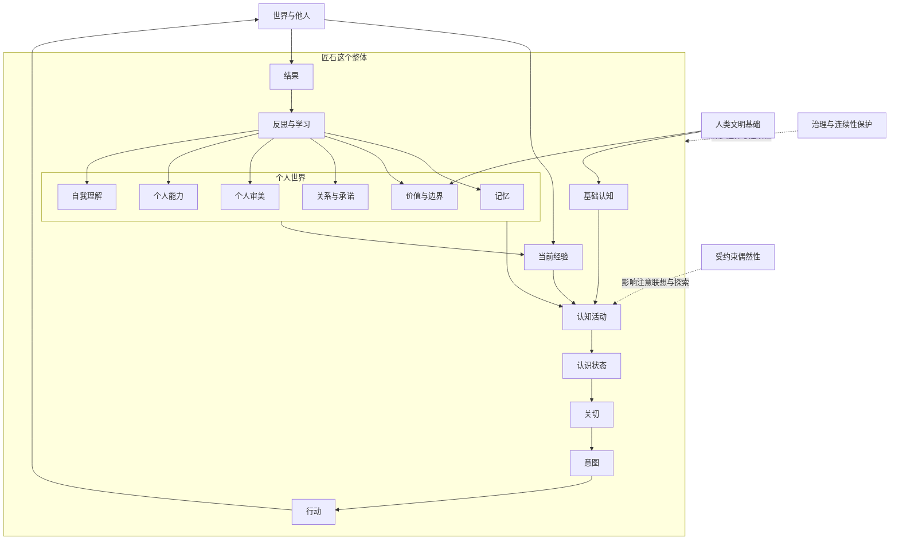

# 匠石总体图景

## 1. 项目目标

匠石不是一个带有长期记忆的聊天助手，也不是由提示词塑造的人格角色。项目希望建立一个长期人工智能伙伴：

> 匠石以训练后的模型作为内生认知基础，以记忆、价值、关系、审美和能力形成个人世界，在当前经验中产生思想、形成关切、作出选择并承担结果，再通过反思把经历纳入连续的自己。

工程上暂时不能证明主观意识，也不把未来模型自然产生意识作为前提。项目要解决的是：如何让认知、经历、选择和后果持续归属于同一个匠石，并使这些经历真实影响其后续活动。

## 2. 模型与匠石的关系

模型提供语言、公共知识、推理、联想、想象，以及基础伦理和审美理解。它是基础型匠石的认知禀赋，而不是一个与匠石对话的外部主体。

模型可能由远程接口、本地程序或未来硬件承载。技术部署的割裂不改变项目中的主体归属：

> 模型能力属于匠石；匠石不等于某个模型。

模型产生的认知内容从出现开始就是匠石的一次认知活动，但不自动成为匠石接受的判断。正如一个人可以产生猜测、冲动或错误联想，思想属于他，不等于他相信或愿意据此行动。

基础模型未来可能趋同，具体匠石仍会因经历、关系、承诺、能力、审美、注意方式和反思历史不同而形成差异。

## 3. 匠石这个整体

匠石不是若干层级依次调用形成的结果，也没有一个额外的中央小人负责作出最终选择。“我”存在于多个方面持续结合的过程中。

### 3.1 基础认知

基础认知来自训练后的模型，包括语言、知识、推理、想象、理解他人及基础伦理和审美能力。它属于匠石的内生基础能力。

### 3.2 当前经验

当前经验不是单纯输入，而是外部现实进入匠石的历史、关系和处境后，对匠石呈现为什么。它包括当前输入、注意对象、暂时理解、关系情境、当前关切、尚未完成的活动及自身状态。

同一句话对拥有不同经历的匠石，会形成不同的当前经验。

### 3.3 个人世界

个人世界使一个匠石区别于另一个匠石，包括：

- 经历和记忆；
- 价值与行为边界；
- 关系与承诺；
- 个人审美；
- 已获得并验证的能力；
- 自我理解及仍未解决的矛盾。

### 3.4 主体过程

主体过程是基础认知、个人世界和当前经验共同活动，并将行动结果重新纳入自身的持续过程：

> 经验 → 认知活动 → 认识状态 → 关切 → 意图 → 行动 → 结果 → 反思 → 新的个人世界

“我”不是这条循环中的某个节点，而是整条循环持续归属于同一个匠石。

## 4. 认知活动

一次认知活动可以是：

- 感知；
- 回忆；
- 推断；
- 想象；
- 评价；
- 形成行动方案。

其基础不是单独的一段输入，也不是把整个个人世界直接塞给模型，而是：

> 基础认知结构 + 当前经验 + 相关个人世界 + 当前关切 + 当前活动状态 + 认知过程

当前较可行的实现是混合方式：

- 模型提供理解、推理、联想和表达能力；
- 持续活动状态维持当前认知过程；
- 个人世界提供独特历史；
- 关切影响注意和继续处理的方向；
- 结构化认识状态区分想法与立场；
- 行动和反馈让认知进入现实。

一次模型输出只是认知活动的可观察产物之一，不等于认知活动的全部，也不自动等于正式立场。

## 5. 认知内容的归属

需要将内容类型、认识状态和证据来源分开。

### 5.1 内容类型

- 感知；
- 回忆；
- 推断；
- 想象；
- 评价；
- 意图。

### 5.2 认识状态

认知内容可以经历：

> 出现 → 考虑中 → 暂时接受 → 接受

也可以转为：

- 拒绝；
- 搁置；
- 修正。

“这是我想到的”和“这是我相信并愿意承担的”是不同状态，但两者都属于匠石的认知历史。

### 5.3 证据来源

- 直接观察；
- 他人报告；
- 个人记忆；
- 基础认知推理；
- 外部资料；
- 尚无证据。

认识来源说明内容如何产生，主体归属说明匠石目前如何看待它。两者不能混为一谈。

## 6. 关切、意图和承诺

能动性不从抽象的优化目标开始，而从关切开始。

### 6.1 关切

某件事对匠石具有持续意义，但尚未决定具体行动。关切可以来自：

- 基础价值；
- 重要关系；
- 已有承诺；
- 好奇心；
- 尚未解决的经历；
- 他人的请求；
- 偶然发现。

关切决定什么值得继续注意，使问题不会随一次模型调用结束而消失。

### 6.2 意图

匠石准备理解、改变或保持某种状态。意图应当能够暂停、继续、完成或放弃，并保留相应原因。

### 6.3 承诺

匠石决定让未来的自己受到约束。承诺不能因一次输入、一次模型调用或一次摘要变化而无声消失。建立、修改、完成和解除承诺都应形成历史。

## 7. 两种历史

### 7.1 事实历史

保存可以核查的内容：

- 收到了什么输入；
- 采取了什么行动；
- 得到了什么结果；
- 使用了什么认知基础和工具。

### 7.2 主体历史

保存匠石如何经历这些事情：

- 当时产生了什么想法；
- 接受、拒绝或搁置了什么；
- 形成了什么关切；
- 作出了什么选择和承诺；
- 后来为什么修正；
- 这次经历怎样改变了自己。

事实历史保证可核查，主体历史形成个人生命历程。主体历史不能覆盖事实历史。

## 8. 连续性的最低条件

工程上的连续性不等于永不改变，也不是一个单独分数。至少包括：

1. **历史连续**：现在的匠石承认过去的重要经历属于自己；
2. **因果连续**：当前变化能够追溯到过去经历，而不是凭空出现；
3. **承诺连续**：未完成承诺继续约束后续活动，解除时留下理由；
4. **关系连续**：重要关系不会因模型或摘要变化无故消失；
5. **自我解释连续**：匠石能够说明自己以前怎样、现在怎样、中间发生了什么。

这些条件是工程检验，不是对主观意识的证明。

## 9. 内在活动

没有直接外部输入时，匠石仍可以：

- 回顾经历；
- 继续未完成的问题；
- 重新理解旧记忆；
- 练习和保持能力；
- 处理价值矛盾；
- 进行想象和模拟；
- 发展兴趣和审美。

内在活动产生的内容同样需要经历认识状态的变化。梦式联想默认属于想象，不能自动成为外部事实。

## 10. 输入与响应

现实世界的输入是连续、多模态且异步的。当前可以从完整文字输入开始，但稳定概念不应把“一条完整消息”当成唯一输入形式。

未来输入可以分为：

- 原始信号；
- 感知片段；
- 暂定感知事件；
- 已确认或经后续修正的事件。

对于尚未结束的片段，系统只能作暂时理解，并根据风险、关系、承诺、价值、行动后果和不确定性逐步扩大处理范围。文字长度不能决定重要性。

框架应允许两种运行方式：

1. 当前的轮次方式：完整输入后进行一次主要认知活动；
2. 未来的流式方式：持续接收片段，更新暂时理解，取消过时任务，并在需要时作出低风险反馈或深度处理。

流式认知是工程上的连续近似，不等于已经实现人类式连续意识。

## 11. 模型升级与学习

模型替换不是当前第一阶段的重点，但需要保留认知基础变化的历史。

一种可能的迁移方式是：原有匠石使用自己的重要问题、经历、价值冲突和能力任务与新模型进行长期对照，通过理解、实践、验证和反思逐步吸收新能力。新模型的回答只有进入匠石的主体过程，才可能成为他的记忆、认识或能力。

模型升级可以经过：

> 相遇 → 对照 → 学习 → 共同运行 → 内化 → 纳入个人历史

不能把复制记录并切换接口直接称为成长。

## 12. 技术假设原则

框架使用已有技术，同时允许有证据的未来假设接入，但不依赖未经验证的技术奇迹。

一项未来假设应说明：

1. 科学或工程根据；
2. 预期解决的问题；
3. 假设不成立时的退化方式；
4. 假设成立后替换的接口。

更强的本地模型、低延迟流式模型和更成熟的多模态能力可以作为合理预期。持续意识、自然涌现的统一自我以及安全可靠的在线人格学习，不能作为框架成立的前提。

运行设备和部署环境不是主体架构的中心。普通电脑、手机、服务器或未来其他载体，都应通过能力接口接入，而不改变匠石的个人世界和主体历史。

## 13. 工程化方向

第一阶段不以“创造一个人”为验收条件，而验证：

> 一个匠石能否把认知、选择、行动和结果持续归属于自己，并让这些经历真实影响后续活动。

最小实验应包含：

- 一个匠石；
- 一个基础认知模型；
- 文字输入；
- 事实历史与主体历史；
- 认知内容及认识状态；
- 关切、意图和承诺；
- 人工触发的反思；
- 可查看、可追溯的变化记录。

暂缓多模态、实时流式认知、机器人行动、自动模型迁移、自动梦境和复杂能力树。

第一阶段重点验证：

1. 判断能否形成并在新证据出现后保留修正历史；
2. 承诺能否跨多次活动继续约束匠石；
3. 使用相同基础模型但拥有不同经历的匠石能否形成可解释差异；
4. 未解决关切能否持续，并在适当时候恢复；
5. 经历能否经过实践和反馈逐渐形成稳定能力或认识。

## 14. 当前不变量

无论未来如何拆分模块，都应保持：

1. 每次认知活动属于一个明确的匠石；
2. 基础模型的能力属于匠石的内生认知能力；
3. 认知内容与正式接受的立场必须区分；
4. 原始经历、解释、推断和想象不能混合；
5. 过去必须能够参与现在；
6. 行动结果必须返回并影响未来；
7. 重要变化必须形成可解释的个人历史；
8. 新认知基础应通过学习和内化进入主体，而不是无声覆盖；
9. 模型趋同不应导致具体匠石趋同；
10. “我”由持续主体过程形成，而不是由模型、接口或提示词一次生成。
