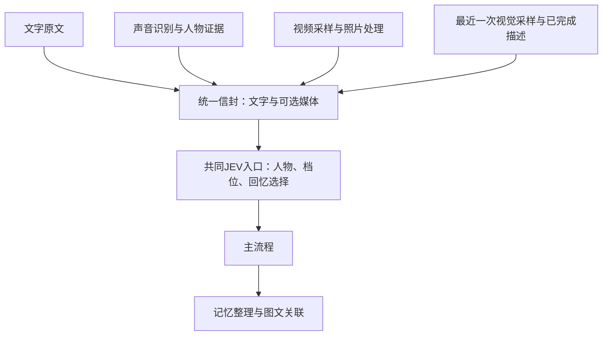

# 视觉输入与环境观察

2026-10-09：按统一输入与交互模式要求修订，位于 `codex/vision-cognition` 分支。回忆反馈、做梦和记忆价值评估不属于本次改动。

## 启动

在项目目录安装视觉依赖：

```powershell
python -m pip install -e ".[vision-yolo]"
```

在本机 `.env` 中配置视觉凭据和本地检测器。项目提供 `.env.example`；不要把真实凭据提交到仓库。

```dotenv
JSHI_VISION_API_KEY=你的视觉接口密钥
JSHI_VISION_MODEL=deepseek-flash
JSHI_VISION_DETECTOR=yolo
JSHI_VISION_WEIGHTS=yolo11n.pt
```

也可复用已有的 `JSHI_API_DEEPSEEK_API_KEY`。视觉请求独立使用图像输入；线上接口与模型名可通过 `JSHI_VISION_ENDPOINT`、`JSHI_VISION_MODEL` 调整。接口格式参见 [DeepSeek 视觉文档](https://api-docs.deepseek.com/guides/vision/)。第一次运行 YOLO 时可能下载权重；也可以把权重配置成本机文件路径。

使用匠石实例的主体ID启动，不是发言人物的ID。当前项目的匠石主体是 `stone`，可在数据目录的 `identities.json` 查看主体列表：

```powershell
jshi --data-dir .jshi vision stone --asr local --port 8765
```

打开 `http://127.0.0.1:8765/`。文字模式始终可以打字；选择语音模式会开启语音并保留文字；选择视觉模式会先开启语音，再显示环境观察页面，可开始摄像头采样或选择照片。语音服务未就绪时，视觉上传会拒绝执行。改回语音模式会停止画面采样；结束语音或改回文字模式会同时停止视觉。权限由浏览器提示。

视觉启动入口现在复用完整语音服务初始化。默认本地语音识别需要已有本地语音依赖与模型；也可使用 `--asr online` 并配置语音服务凭据。YOLO不替代语音识别模型。

已有语音入口也可以启用 `JSHI_VISION_ENABLED=true`，在同一服务的 `/vision` 打开视觉页面。页面关闭或停止采样后，已有环境描述仍保留观察时间，不应当作实时画面。当前入口绑定本机回环地址，手机远程接入与具体硬件驱动留待实际部署。

不安装 YOLO 时可安装 `.[vision]`，使用默认 `JSHI_VISION_DETECTOR=change`。这个轻量模式只比较画面变化，无法识别人或物体；需要靠线上模型解释变化。

## 实际处理路径

1. 画面通过独立媒介信封接收，保留来源、采集时间、接收时间、原始时钟及校准误差。首次画面请求线上模型描述人员位置、空间布局、主要物体与特殊情况。
2. 本地采样与线上理解分别运行。线上提示包含本次图片、此前环境描述、观察问题，以及有可用语音会话时的最近JEV片场；片场只作参考，不证明图片人物身份。线上请求尚未完成时，继续本地检测与定时照片存档；等待队列只保留最新待处理画面。
3. YOLO 提供类别、置信度、归一化位置和跟踪编号。同一批物体的位置变化可以先更新本地信息；新增或消失的跟踪目标、低置信度等情况请求线上重新描述。跟踪编号不代表人物身份，也不证明跨镜头是同一个人。
4. 四种来源先统一封装为“文字＋可选媒体＋来源、时间及人物证据”，再进入同一个既有JEV入口，沿用人物终审、主认知档位和回忆选择规则。不再有独立的环境JEV及其 `enter_main` 判断。原有后台JEV片场整理仍保留职责。
5. 普通输入需要视觉材料时，直接关联最近一次已采到的照片，不等待这张照片完成线上理解。此前已完成的描述可以同时保留，但明确描述依据时间和来源照片。该信封固定版本，后续主流程及记忆关联使用同一份，不换成后台后来更新的画面。
6. 每轮主流程关联所用环境版本与原素材。进入现有记忆整理时，环境文字与照片引用随来源关联保存；相同描述避免重复追加，不增加每轮都要选择“保存环境”的提示词步骤。后台采样本身不逐帧写入语义记忆。
7. 召回经历时返回可用照片引用。已有动作中的“查看”“观察”和“回看照片 <照片ID>：问题”可以重新解读照片；历史结果标注为历史材料，不能覆盖当前环境。转头、转向、移动镜头等物理动作当前跳过，保留后续执行入口。

视觉媒体关联使用持久化旁表，兼容现有本地与 REMS 记忆接口。文字事件与照片可按来源及外部事件 ID 对应，不要求改造外部记忆服务。现有片场仍承担人物与交互背景；环境信息从独立上下文接入。

## 统一入口与可选图片



默认JEV收到文字、环境材料及图片引用。若JEV配置的模型支持图片，可启用 `JSHI_VISION_JEV_IMAGES=true`，通过同一模型请求发送真实图像内容块。使用文字模型时保持false：图片可选为空，引用仍供照片保存与后续取回；不能声称JEV仅凭引用已经看过图片。这项设置只控制JEV实际图片输入，独立的线上视觉理解始终使用图片。

## 留图、容量与成本

默认值均可通过 `.env.example` 中的 `JSHI_VISION_*` 配置调整：

| 项目 | 默认值 |
| --- | --- |
| 页面采样 | 2 秒 |
| 普通照片存档间隔 | 10 秒 |
| 同来源线上调用冷却 | 15 秒 |
| 定期重新理解 | 300 秒 |
| 每主体线上调用上限 | 每小时 120 次，失败请求也计入 |
| 普通照片预算及期限 | 256 MiB、24 小时 |
| 经历照片保留预算 | 512 MiB |
| 单张上传上限 | 8 MiB |

照片自动纠正方向、压缩为最长边不超过 1600 像素的 JPEG，质量 82；相同压缩内容去重。普通照片按期限和预算滚动清理；当前环境、正在处理的照片和预算内的经历引用受到保护。照片预算指压缩媒体内容，数据库记录与索引还有额外开销。

经历照片预算满时，继续保存文字关联并记录提示；不能保留的照片以后可能清理。页面明确显示照片不可用，不用失效引用冒充仍有图片。文字环境记忆可以继续召回。线上模型处理过的普通照片不会因此自动永久保存。

浏览器与服务端用往返请求估算时钟偏移及误差，适合当前本机入口；这不是精密多设备时钟同步。所有采样、描述和记忆关联保留时间信息，供后续跨媒介整理使用。

## 验证与边界

- 已覆盖：异步采样、迟到结果、新变化保留、切换来源、JEV 判断、正常主流程环境上下文、语音工作队列、记忆关联与召回、图片清理、主体隔离、调用预算和历史照片重新理解。
- 已用真实 YOLO 权重在公开测试样本上执行 CPU 检测与跟踪，得到人、车辆及跟踪编号；浏览器页面已检查显示与控制台错误。
- 全项目回归已通过；最终数量记录在提交说明中。测试中的线上模型使用可控替身，并验证实际请求包含图像数据。
- 本机尚未配置视觉接口凭据，因此没有进行 DeepSeek 线上实测。真实摄像头环境、描述质量、持续运行成本和照片压缩后的细节保留仍需配置后验证。真实 REMS 服务的图文联合召回也未进行线上实测。
- 第一版不会识别人脸身份、理解任意物理动作或精确重建三维空间。人物与主要物体的位置优先描述；YOLO 的检测框只能提供图像中的粗略位置。
