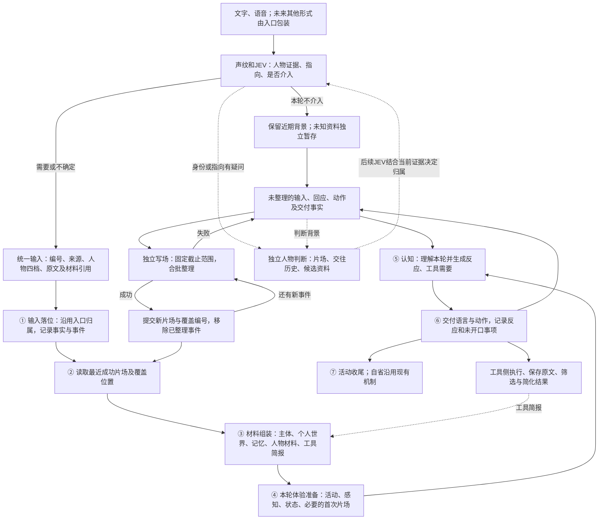

# 输入、JEV 与主流程：当前实现

2026-10-05 更新。主流程负责当下认知与统一反应；入口负责包装材料和应用人物归属；写场、工具执行分别独立处理。

## 主要流程与五波职责

第一至第五波统一用①至⑤表示；⑥和⑦是交付与收尾。保留现有主流程阶段；有疑问时另外运行独立人物判断，主认知不等待。

③负责装载已有材料，不承担新增的人物识别或工具摘要模型。④负责准备本轮活动和体验；首次片场机制仍保留。⑤负责理解和反应，也可提出召回、工具需求；人物核对由独立流程处理；工具执行和写场不在此等待。

## 统一输入与人物权限

`input_items` 使用同一结构：`input_id`、内部对象编号、显示称呼、内容来源、原文、人物档位与依据、材料引用。原始信封保留在入口和记录里，主流程读取整理后的内容。音频、图片等只带引用，不把媒体二进制塞进提示词；视觉解析仍由未来入口实现。

| 输入 | 主流程表达 |
|---|---|
| 未知人语音 | 临时编号＋转写；人物“不确定”；音频引用 |
| 未知人文字 | 独立输入/对象编号＋原文；人物“不确定” |
| 确定人文字 | 已有对象编号＋原文；人物“确定”及入口依据 |
| 候选或冲突 | “可能”或“不太可能”，附简短依据；不写百分比 |

语音合批保留本批编号。例如N1被入口剔除后，N2仍是N2，不因重新渲染变成N1。`input_id`继续作为全局反馈对位编号。

入口声纹提供物理证据，JEV结合现场和独立人物判断建议，决定当前输入归属。主认知不再输出人物判断；独立判断的建议只供后续JEV评估。建议不直接修改本轮信封、档案、声纹或历史。已有明确声纹及人工关联受保护；模型不能以一个猜测覆盖它们。

自报姓名可用于礼貌称呼，仍保留原内部编号，先记录线索；声音明显冲突时保留冲突。未知身份不阻挡交流，也不以名字猜测装载熟人的个人安排。合适时询问称呼，遵循礼仪，不因一次识别波动反复追问。

未知文字与语音记录单独保存在`unknown_inputs.sqlite3`，保留输入编号、临时对象、文字、会话和时间；不复制原声。独立资料区新增记录按500MiB上限控制，接近上限停止扩容，不自动删除已有资料；语音页面会提示。现有原声短期缓冲仍有16MiB/128条限制，临时声纹沿用独立的到期机制。人工关联只为选中的input_id记录映射，不因同名把所有未知资料迁到熟人档案。

人工选中并关联的旧输入通过只读材料源`manual_history`按该人物读取，保留原input_id和关联依据；未选中的记录不参与。它使用已有记忆材料预算，主流程以U短编号引用，不增加摘要模型，也不重写既有记忆或声纹档案。

### 人物确认的暂定与后续方向

2026-10-05本次补充：名称统一为JEV。身份及指向有疑问时，由独立人物判断流程查看更多背景；主认知只接收信封本批新发言。正式登记和人工选择的历史关联仍沿用现行方式。匠石结合情境、交往历史主动核对身份是后续发展方向，不把一次模型答复等同于正式登记。

## 本轮输入与历史边界

信封给主流程的`current_utterances`、`input_items`只包含本批新发言；入口的姓名档位、简短依据、对话指向和材料引用是标注，不是新增发言。历史录音、此前JEV未介入的原话、人物核对材料不再拼进下一轮【本轮】或【此时的输入】。保留本批原编号，主提示词不复制原始入口旁注。刚记录的当前输入也不再作为额外回忆重复装载。

JEV不触发回应或剔除的观察，以input_id记录一次到`pending_scene.json`，标记“入口观察、未触发回应”；通过最近成功片场和尚未整理事件延续环境，不另作一次新输入。旧的“5分钟/2000字符背景重新投递”规则由本段替代。未知资料独立存储仍保留，不因进入片场变成已确认人物记忆。

## 独立人物判断与反馈

`voice/person_review.py`有专用提示词和`voice_person_review`调用。查看当前待核对原文、输入编号、原声纹证据和JEV初判，同时补充最近片场（最多12000字符）、未整理事件（最多16000字符）、近期交往、已播出事实、实际问题状态，以及最多6个候选人物的肖像、相处经验和人工关联旧资料。摘录有截断标记；候选资料不是当前身份已确认的证明。资料读取及模型调用在单独工作线程，主流程和JEV不等待其返回。

结果按input_id、本批N编号和允许的P候选对位，保留独立声音和语义依据。冲突未解释时不能“确定”；候选越界、超过2分钟的结果、晚到的人工关联冲突不采用。返回不修改本轮输入、历史或档案，只暂存最近2份建议。下一批JEV使用输入收到时间之前已经完成的建议；以后才完成的结果不回填到早先收到的发言中。

JEV提示词将这些建议标为`person_review`，明确为模型建议、非人物原话、非新增声纹证据；JEV结合本轮新证据作最终输入归属判断。正式声纹与人工关联保护规则仍生效。建议不是必须采纳的命令，不可反复引用同一猜测提高确定度。

独立待处理队列最多8批，单线程逐批处理；等待或运行超过2分钟的建议不用，队列满时跳过本次核对。失败记录`person_review_failed`，正常交流继续；不会以失败或队列满为由阻挡输入。关闭会话后结果不再应用。该上限针对人物核对工作，不改变写场合批方式。

CLI通过`SkillConfigStore.profile('person_review')`建立独立模型端口，可使用`JSHI_SKILL_PERSON_REVIEW_MODEL`和`JSHI_SKILL_PERSON_REVIEW_THINKING`设置，缺省沿用全局模型配置。沿用兼容字段`needs_main_review`，其含义改为“请求独立人物判断”，不再向主认知附加人物证据。独立调用提示词按review_id记录在step_inputs，主流程提示词不含它。

## 写场与连续交往

交互式文字及语音主流程不等待正常写场，也不因写场失败停在下一轮。低层`experience`仍支持显式同步调用，交互宿主使用独立写场调度。

认知读取最近成功片场，加上全部尚未整理的输入与匠石回应。暂存材料标记“尚未整理”，不占既定片场正文额度；准备说、实际播出、动作和未开口事项分别标明。

写场开始时固定本次截止范围。运行期间新事件继续保存。成功提交片场和覆盖编号后，清除该范围，再将积累的若干轮作为一批整理；不逐轮补写。失败保留全部材料，下一次从最近成功覆盖位置重新合批生成，不依赖模型半段输出续写。

`pending_scene.json`使用临时文件替换落盘。人格片场的覆盖编号随`zone.json`一起保存；木头现场的覆盖编号与现场正文一起保存。重启后按成功覆盖编号清理重复暂存，避免“片场已保存，暂存尚未清理”造成重复追加。晚到的播放器反馈另记为事件，不把准备说自动当成说过。

不增加积压阈值、暂停认知或临时摘要模型。该做法能否长期追上输入仍需真实使用观察，不能仅凭合批机制证明。

## 工具、多模式与计时

工具触发与执行框架保持。工具侧通过规则去重、简化重复说明、控制长文本；任务原文仍保留。主流程使用T1等短编号，结果处理在程序中还原真实任务ID，保留状态、失败原因、未交付事项和原文对应关系。不增加摘要模型调用。

`processing_modes`允许重叠，主流程仍统一产生反应；目前只有接口，没有新增模式检测器、并行认知路径或协调模型。实际播放反馈和自省保留，知识沉淀未扩展。

已有入口排队、收集停顿、声纹候选、JEV、⑤认知、写场和合成计时继续保留。新增`speech_to_reaction_ms`：音频结束至认知反应计划生成；没有可靠录音时钟则留空，不伪造。`received_to_reaction_ms`另记收到输入后的时间，不能当作完整语音耗时。`write_barrier_ms`为0，写场耗时单独记录。真实麦克风准确率与耗时尚未实测。

## 临时声音与提示词查看

一次未匹配不建立新人。先形成“待定声音”观察组，用简短代号正常交流，尚不创建人物肖像或持久声纹。观察组最多32组，每组保留20段样本，闲置15分钟后清除；同一片段重复或重叠不增加计数，少于1.5秒的样本不进入统计，不把转写轨迹编号当作身份依据。

至少十段有效发言、累计15秒后检查分布：样本对中心的相似度中位数至少0.75、下四分位至少0.65，样本两两相似度中位数至少0.65。数量达到但不一致的，仍存疑。统计量是工程参考，不是已校准的身份概率或统计置信区间。

姓名库与临时声音完全分开。旧临时访客声纹也不进入姓名排名、领先差值或JEV的姓名候选。每次输入立即与各人的有效参考声音比较，质量加权平均相似度为主分数；参考数量不加分，不取最高分，不按方差最小选择人物。参考波动使用标准差，只有一段时为空，另标材料有限。旧单声纹按一段参考兼容；旧多条登记按人物一起评分，不在启动时合并改写原库。

清晰的单句需达到用户门槛与0.65中较高者且满足领先差值，才直接识别已有姓名。不要求每轮等满十段；两段以上一致输入可继续核对已有姓名，尚未形成稳定组时不降低匹配要求。达到稳定组要求后，多段输入使用平均匹配分、至少80%的样本支持和领先差值核对，平均分及支持样本需达到用户门槛与0.58中较高者。上述沿用工程试用要求，并非新校准的最佳门槛；待定样本不因此直接训练已有姓名声纹。

多段一致但姓名无法确认，只建立稳定的临时声音组，其短期声纹仍隔离于姓名竞争之外；重新遇到时也先收集多段再与临时声音库比较。短期保存沿用到期机制，默认7天，可通过 `JSHI_VOICE_ANONYMOUS_DAYS` 调整。自我介绍先记为称呼线索，人工登记可确认档案；手动确认清理对应观察组及重复临时声纹，不合并或迁移人物记忆。它不保证所有陌生声音都能区分，电视声音也可能形成临时分组。

轮次信息的模型调用选择“JEV 初判”，再点PROMPT，可看该轮关联的实际system/user；合并、复判及此前未触发主流程的JEV调用按次显示。规则处理没有模型提示词，旧版未记录的轮次不伪造补录。相处经验只显示名字或P短代号，写场的回应对象也用P短代号；真实对象ID保留在程序内部。

## 等待时间怎么定位

原计时里的 `queue_wait_ms` 是收下文本到主流程开始的总等待。19.2秒中扣掉JEV和设定停顿后，不能直接把剩余全部归因于声纹；可能还有入口积压、人物处理、主流程排队和上一轮写场等待。

现在另记入口排队（`input_worker_wait_ms`）、收集停顿（`speech_collection_ms`）、人物处理（`identity_ms`）、候选比较（`candidate_ms`）、写场等待（`write_barrier_ms`）和进入就绪队列后的等待（`ready_queue_wait_ms`）。这些是分段观察值，整批各句的等待可能重叠，不能全部直接相加。`speech_group_wait_ms` 同时包含入口排队和收集过程。ASR延迟仍单列。

已经做过声纹比较的候选直接复用，不为JEV再算一次。需要补算时最长等待默认1.2秒（`JSHI_VOICE_CANDIDATE_TIMEOUT_MS=1200`）；超时仍继续交给JEV与主流程，不把未知人物挡在入口。较短音频不做无效补算，使用近期人物参考；前一次补算还在运行时不再积压任务。这限制的是补充候选的等待，不保证整条语音在1.2秒内完成。

候选比较的PCM输入已改成归一化的音频采样值。真实声纹准确率和整轮延迟还需要重启服务后用麦克风验证。

已预留 `request_emergency_interrupt(reason, expected_epoch=...)`，外部可以在主流程运行时调用。它停止当前播放、清理待播与待处理轮次，抑制旧回应及尚未发出的动作、工具指示；旧事件不能中断新轮次。程序没有实现危险识别。同步模型请求会自然结束，已有动作不能撤销，上一轮写场仍须完成。

验证使用模拟转写、模型返回和音频，运行真实的队列、主流程、写场与播放编排；不代表已经做过真人麦克风实测。

## 多段参考、交流采样与JEV反馈（本轮新增）

每人最多10段有效正式参考，保存特征、来源输入编号、会话、时间和质量代理。登记长录音先按窗口核对内部一致性，再按每个选中片段形成参考，不能把一段录音切成多段冒充独立交流。当前质量权重以有效长度（最多6秒）作为代理，不宣称已经测量信噪比。极近似参考去重，重复数量不提高分数；库满时停止自动追加，不自动删除或覆盖正式参考。

交流中的新声音自动进入隔离候选区，使用`.candidates.sqlite3`旁路文件，仅存特征和来源，不复制音频。每个对象最多20条，最多32个对象，数据库16MiB，7天有效期；达到容量/数量限制停止增加，过期清理仅针对本轮新候选缓存，不清理既有未知历史、正式声纹或原录音。少于1.5秒、重叠发言、重复编号和重叠录音区间不作为新候选。后台串行采样/复核最多32个待处理工作，满时跳过采样；正常JEV与认知不等待登记工作。

陌生人保持临时编号，通常需不同次交流证据支持，当前不自动正式登记或关联档案；人工明确标注仍是当前登记入口。候选跨次记录不代表已确认人物。熟人自动增补仅限已有永久声纹人物：入口原始声音已识别，JEV独立语义与声音支持一致，且至少两个会话的合格候选再次通过原参考库匹配及领先差值核对；使用当前匹配门槛与登记一致性门槛中较高者作为保守要求。主流程猜测、自报、一次匹配或临时访客不会单独触发增补。保存失败回退参考并保留候选可重试；门槛仍需真实录音实测。

独立人物判断可提供待核对事项；主流程不再产出人物短评。播放器完整播出后才记录实际问题、回应目标、回复/片段/来源输入编号和时间；最多8个问题，实际交往状态2分钟有效期。JEV收到等待回答、可能收到回答、主流程已处理回答候选等状态；这些状态不证明问题已解决或姓名已确认。按输入收到时间筛掉未来事实，其他人的发言不擅自作为目标人物的回答。准备说、部分播放和未播出的问题不记为已问。匠石决定是否礼貌询问或继续观察，模型不修改声纹数值门槛，也不直接改正式档案。
