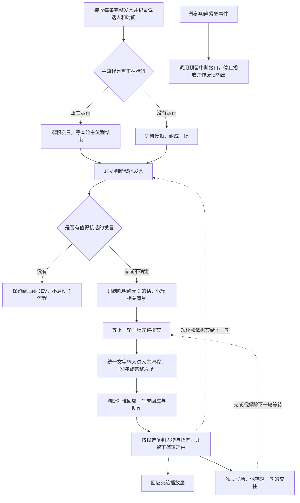

# 输入、JEV 与主流程：当前实现

2026-10-04 根据讨论更新。这里描述程序已经采用的规则。

所有来源先整理成文字，再进入统一的“此时的输入”。声音分人、声纹候选、转写和 JEV 都在主流程之前处理。主流程看到的是谁说了什么、发言顺序与必要的初判提示。

## 什么话交给主流程

JEV 对每句话分别判断两个问题：是不是在对匠石说，以及它对理解这一批交往有没有用。分数只是参考，并非校准过的概率。

|情况|程序处理|
|---|---|
|整批都没有接话必要|不进入主流程，原话、说话人和时间仍保留|
|部分话需要接话|保留这些话，以及相关背景、条件、补充、纠正和关系不确定的话|
|明确无关的话|从本次主流程输入中剔除，仍保留给后续 JEV|
|全部值得接话|整批进入，主流程决定回应谁|

例如，“下午博物馆关门”虽然可能是对旁人说的，但会影响“匠石，那我们下午去哪”的回答，应一起交给主流程。“你的快递在楼下”如果与当前交往明确无关，可以剔除。

空闲时默认等约 2.5 秒停顿形成一批，这不是固定每 2.5 秒调用一次。明显未说完的句子会继续等。主流程运行时继续接收、累积发言；主流程结束后统一判断。写场在后台运行时，接收发言和 JEV 可以继续，但下一轮主流程必须等写场成功。

## 前后两轮如何衔接

1. 第一轮：记录原话和说话人；JEV 初筛；主流程⑤读取完整片场，生成回应。播放与写场分别进行。
2. 第二轮到达：原话照常记录。若第一轮主流程仍忙，先累积；若只剩写场在运行，JEV 可以先判断。JEV 可以参考上一轮原话、说话人和交付情况，包括之前没有进入主流程的旁人发言。
3. 第二轮装载：等第一轮写场成功，读取更新后的完整片场。等待期间又来了几批，会合并后重新判断，避免不同批次的编号混用。
4. 对匠石的前文：播放器确认已播出的内容与准备说的内容分开。延迟判断时，不把新发言到达之后才播放的内容当成对方此前已经听见的话。

写场失败时不以“旧片场加上一轮原话”代替完整写场。后续发言保留，页面显示“重试写场”；重试成功后才继续。JEV 提示不作为人的原话写进记忆，写入片场与记忆时把 P1、P2 还原为姓名。

## 人物判断与紧急接口

声纹没有达到识别要求时，仍可提供候选，让 JEV 结合上下文比较候选、未知和新人。短语音拿不到声纹候选时，提供最近出现的不同人物，不伪造声纹分数。JEV 认为“确定”的归属用于本次发言，并标为上下文推测；不覆盖已经确认的声纹或人工身份，不自动登记新人或训练声纹。

主流程再判断一次人物和交往对象。【此时的输入】是新内容的唯一入口，包含本批发言及必要的候选、声音证据和JEV标注。过往交往通过已经写好的片场和回忆读取，不再另附原始前文、上轮回应或工作评价。没有足够证据就保留未知。人物复判在回应分发与写场前应用，仍标明“上下文推测”，不变成声纹确认。

主流程输出 `speaker_judgments`（按N编号给出归属、指向和简短依据）、`reply_targets`（要回应的P或可靠S代号）、`next_jev_note`（最多120字的下一轮评价）。短评与对应原话、声音代号一起交给后续JEV，保留最近两次且最多两分钟；它不是人物原话，也不作为unsaid写进片场。后来的证据仍可以纠正它。JEV可用 `needs_main_review` 请求主流程复判相关但无人直接向匠石说的材料，主流程仍可不出声。

一个人的名字、旧名、昵称放在人物肖像的称呼行里；这个人怎么叫匠石、别人怎么叫此人也一并保留。候选肖像明确只是候选参考。不同人物同名时保留各自P代号，不自动合并；已知声音自报新的名字保留同一人物，若名字与另一个已有对象冲突，先保留原证据等待核对。

## JEV与主流程的权限边界

- `needs_main_review`是整批请求；主流程重点核对影响交往的冲突、未定归属与指向，不要求每条重复判人。false也不禁止主流程在发现反证时修正。
- `to_jiangshi`的yes/maybe/no都是初判，主流程可根据完整上下文修正；证据不足仍可保留maybe。最终要不要开口由mode和回应对象决定。
- 主流程有效的人物复判用于本轮处置；修改JEV的上下文猜测须说明依据。主流程撤回或不再确定JEV暂定归属时，程序恢复入口证据。声纹、自我介绍及人工关联不能被纯文本猜测自动覆盖；主流程也不是对真实身份的无条件终审。
- 本批只剔除同时满足 `to_jiangshi=no` 和 `relevance=unrelated` 的条目。直接请求即使与此前话题无关，也不能仅凭unrelated删除。JEV可以参考入口历史；主流程需要延续的过往以写好的片场为准。
- JEV的n对应当前批次的N编号，P代号共用人物映射。S只表示可靠声音连续性，主流程和后续JEV反馈都可能使用，不是主流程专属身份。合批重新编号，上轮N编号不能直接指向本批。

两层在人与指向判断上有必要的重复核对，分工在于上下文范围和决策权限；反馈帮助后续理解，不是自动训练模型或证明准确率已提高。

## 声音与语义共同判断人物

程序把本句物理声音证据作为 `voice_evidence` 交给JEV，标明偏向的人物、声音支持是否明确、分数及候选间差距；使用当前声纹模块的门限，不另造一套概率门限。近期人物名单、自我介绍和上一轮模型猜测不当作新的物理声音证据。

JEV单独给出 `semantic_pick` 和 `semantic_reason`（语义支持谁、简短依据），再给综合人物、可信度和理由。`evidence_relation` 表示两边一致、主要靠声音、主要靠语义、存在冲突或都不足。声音弱时可以主要采用明确的语义；两边支持同一人时可提高综合可信度。综合可信度由现有模型调用产生，不额外调用模型，也不机械相乘分数。

明确的声音支持与语义指向不同人时，程序记录冲突，不能直接确定新归属；相关材料交给主流程复判。主流程继续看到两类证据，保留简短评价供下一轮接续。兼容旧返回字段；旧返回没有分开证据时，不伪造它曾做过两类综合判断。

## 临时声音与提示词查看

一次未匹配不建立新人。先形成“待定声音”观察组，用简短代号正常交流，尚不创建人物肖像或持久声纹。观察组最多32组，每组保留20段样本，闲置15分钟后清除；同一片段重复或重叠不增加计数，少于1.5秒的样本不进入统计，不把转写轨迹编号当作身份依据。

至少十段有效发言、累计15秒后检查分布：样本对中心的相似度中位数至少0.75、下四分位至少0.65，样本两两相似度中位数至少0.65。数量达到但不一致的，仍存疑。统计量是工程参考，不是已校准的身份概率或统计置信区间。

姓名库与临时声音完全分开。旧临时访客声纹也不进入姓名排名、领先差值或JEV的姓名候选。清晰的单句需达到用户门槛与0.65中较高者且满足领先差值，才直接识别已有姓名；较弱声音积累后，用对已有姓名的多段相似度中位数、至少80%的样本支持和领先差值核对，中位数及支持样本需达到用户门槛与0.58中较高者。待定样本不会自动训练或覆盖已有姓名声纹。

多段一致但姓名无法确认，只建立稳定的临时声音组，其短期声纹仍隔离于姓名竞争之外；重新遇到时也先收集多段再与临时声音库比较。短期保存沿用到期机制，默认7天，可通过 `JSHI_VOICE_ANONYMOUS_DAYS` 调整。明确自我介绍或手动登记仍可确认姓名；手动确认清理对应观察组及重复临时声纹，不合并或迁移人物记忆。它不保证所有陌生声音都能区分，电视声音也可能形成临时分组。

轮次信息的模型调用选择“JEV 初判”，再点PROMPT，可看该轮关联的实际system/user；合并、复判及此前未触发主流程的JEV调用按次显示。规则处理没有模型提示词，旧版未记录的轮次不伪造补录。相处经验只显示名字或P短代号，写场的回应对象也用P短代号；真实对象ID保留在程序内部。

## 等待时间怎么定位

原计时里的 `queue_wait_ms` 是收下文本到主流程开始的总等待。19.2秒中扣掉JEV和设定停顿后，不能直接把剩余全部归因于声纹；可能还有入口积压、人物处理、主流程排队和上一轮写场等待。

现在另记入口排队（`input_worker_wait_ms`）、收集停顿（`speech_collection_ms`）、人物处理（`identity_ms`）、候选比较（`candidate_ms`）、写场等待（`write_barrier_ms`）和进入就绪队列后的等待（`ready_queue_wait_ms`）。这些是分段观察值，整批各句的等待可能重叠，不能全部直接相加。`speech_group_wait_ms` 同时包含入口排队和收集过程。ASR延迟仍单列。

已经做过声纹比较的候选直接复用，不为JEV再算一次。需要补算时最长等待默认1.2秒（`JSHI_VOICE_CANDIDATE_TIMEOUT_MS=1200`）；超时仍继续交给JEV与主流程，不把未知人物挡在入口。较短音频不做无效补算，使用近期人物参考；前一次补算还在运行时不再积压任务。这限制的是补充候选的等待，不保证整条语音在1.2秒内完成。

候选比较的PCM输入已改成归一化的音频采样值。真实声纹准确率和整轮延迟还需要重启服务后用麦克风验证。

已预留 `request_emergency_interrupt(reason, expected_epoch=...)`，外部可以在主流程运行时调用。它停止当前播放、清理待播与待处理轮次，抑制旧回应及尚未发出的动作、工具指示；旧事件不能中断新轮次。程序没有实现危险识别。同步模型请求会自然结束，已有动作不能撤销，上一轮写场仍须完成。

验证使用模拟转写、模型返回和音频，运行真实的队列、主流程、写场与播放编排；不代表已经做过真人麦克风实测。
