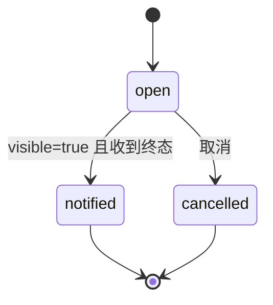
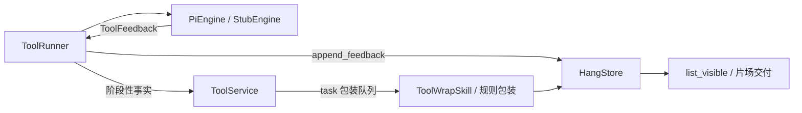

# 206 / 210 执行与记挂——完善方案

> 状态：已按本方案编码第一版；仍有未决项见 §11。
> 范围：只做「一次工具请求的执行与记挂」，不做「一条 need 拆多个工具」的编排。多工具编排另见 I-019，暂不实现。

## 0. 目标

让 206（引擎适配）与 210（记挂账本）成为可靠的执行底座：

1. 每次工具使用、每次创建工具，事件都完整、有序地进入对应记挂。
2. 多本记挂并发时互不阻塞、互不串账。
3. 任何执行路径最终都落到唯一终态，不留永远 `open` 的账。
4. Pi 启动失败、列目录失败、执行失败、超时、取消，都能被看见并给出正确原因。
5. 现有「使用 / 创建 / 报价」三类记挂都能被审计和调试。

## 1. 非目标

- 不实现一条 need 拆多个工具请求。
- 不实现多工具之间的依赖编排。
- 不改 Pi 内核。
- 不做真实预算闸门。
- 不把 Pi 改成默认引擎；默认仍 Stub，Pi 由配置切换。

## 2. 现状基线

已经具备：

- `ToolService.intake` 每次开独立策划线程，不阻塞主流程。
- 一个 `ToolRequest` 对应一本 210 记挂。
- `ToolRunner` 每本记挂一个执行线程。
- 每个 task 有独立包装队列，总包装并发为 2。
- `PiEngine` 能启动、读事件、超时、取消、杀进程树。
- `HangRecord` 已有 `command` / `kind`，能区分 use / create / propose。
- `ToolResult` 已能携带 time / cost / resource / usage。
- 创建工具也进记挂。
- 使用工具的实测均值会写回 `tool.json`。

尚缺或需补强的部分见下文。

## 3. 设计原则

- 206 只翻译，不决策。
- 210 只记账，不包装、不策划。
- 事件顺序不可丢。
- 终态唯一。
- 失败不静默。
- 一本记挂一个生命周期，不跨对象、不跨 task 复用。

## 4. 206 引擎适配

### 4.1 事件契约

只翻译以下 Pi 事件：

| Pi 事件 | 206 输出 |
|---|---|
| `tool_execution_start` | `ToolFeedback(progress, stage=start)` |
| `tool_execution_update` | `ToolFeedback(progress, stage=running, partial=文本)` |
| `tool_execution_end` | `ToolFeedback(result, status=ok/failed)` |

其余事件，包括思维链类，一律丢弃，不进入记挂。

### 4.2 多工具调用追踪

Pi 一次 prompt 可能触发多个 `toolCallId`。206 不假设单工具：

```text
active_calls    开始但尚未结束的 toolCallId 集合
completed_calls 已收到 tool_execution_end 的 toolCallId 集合
```

终态判定：

- 所有 `active_calls` 都已结束：正常完成。
- 部分结束、部分未结束：`PARTIAL`，并说明「部分工具未完成」。
- 没有任何工具结束：按超时 / 取消 / 无结果分别落 `FAILED` 或 `ABORTED`。

这为后续「一条 need 拆多个工具」保留扩展点。

### 4.3 终态保证

任何执行路径必须产出且只产出一条 `RESULT`：

| 路径 | 终态 |
|---|---|
| 所有工具正常结束 | 最后一个 `tool_execution_end` 翻译成 `RESULT` |
| 超时 | `FAILED`，error=工具执行超时 |
| 取消 | `ABORTED`，error=已取消 |
| Pi 未产出工具结果 | `FAILED`，error=Pi 会话未产出工具结果 |
| 部分完成 | `PARTIAL`，error=部分工具未完成 |

### 4.4 watchdog 收敛

现在 `iter_execute` 和 `_iter_events` 各有一个 watchdog。方案要求收成一个：

- `iter_execute` 只负责计时、取消、终态兜底。
- `_iter_events` 只负责读行、按 deadline 返回。
- 结束原因统一记录在 `_last_stop`：`timeout` / `cancelled` / 空。

### 4.5 usage / time 映射

以最后一条累计 usage 为准：

```text
message_update.usage
tool_execution_end.result.usage
```

映射到：

```text
ToolProgress:
  time_used_ms
  cost_used
  resource_used

ToolResult:
  time_ms
  cost
  resource
  execution[0].usage
```

### 4.6 列目录失败要透出

`PiEngine.list_commands()` 失败不能只返回空目录。方案：

- 保留 `_spawn_error`。
- 在 `catalog.engine_tools()` 或 `SkillPlanner._resolve_tools()` 中，把「引擎不可用」与「目录为空」区分开。
- 当引擎启动失败时，205 的失败句应表达为：

```text
我这边现在连不上工具引擎，暂时没法判断或执行。
```

而不是：

```text
我这边没有能完成该需求的工具。
```

## 5. 210 记挂账本

### 5.1 一本记挂是什么

```text
一本 210 = 一次 ToolRequest 的完整账本
```

包含：

```text
need
template
command
kind          # use | create | propose
field_ref
estimate      # 一开始有且仅有一条
feedback      # progress / result，按时间顺序
visible
summary
responses     # 05 回写，只增
delivered_at
```

### 5.2 状态机



说明：

- `open` 且 `visible=true`：有阶段性进度可见，但尚未终态。
- `notified`：终态且包装后可见。
- `cancelled`：注销；之后不再追加 feedback，也不再交付。

`list_open` 降级为测试辅助，不作为生产「在途工具」正式视图。

### 5.3 feedback 顺序与终态锁定

- feedback 只追加，不重排、不覆盖。
- `estimate` 只有第一条，由 200 写入。
- 终态后拒绝继续追加 feedback。
- 无内容的 start 心跳不触发包装。
- 思维链不进入 feedback。

### 5.4 持久化

- 保持 jsonl 追加快照：每次变化写一整条 `HangRecord`。
- 崩溃时最后一条完整行可读，进行中的子进程允许丢失，但账本不留「假完成」。
- 后续若长会话导致文件过大，再做轮转或紧凑，本轮不自动压缩。

### 5.5 并发与锁

- `HangStore` 用窄锁保护单本记录的读写。
- 不同 task 之间不互相阻塞。
- 包装队列按 task 隔离；总并发由信号量限制。
- Runner 线程按 task 隔离。

### 5.6 取消

`cancel(item_id)` 要覆盖：

```text
执行中工具
propose_only 待批准请求
创建中工具
策划失败句对应的 intake
```

取消后：

- Runner 停止对应引擎会话。
- HangStore 标记 `cancelled`。
- 待批准请求从内存清理。
- 创建中的 `_create_tasks` 清理。
- 不再包装、不再交付。

## 6. 206 与 210 的衔接



规则：

- 每个 `ToolFeedback` 必须立刻 `append_feedback`。
- 只有 `is_stage_fact` 的 feedback 才通知包装。
- 每个 task 只进自己的包装队列。
- 包装结果写回同一本记挂，不写别的本。

## 7. 实测统计与工具定义

206/210 现在还要承担一个职责：把工具真实运行数据反向补回工具定义。

```text
use 类记挂的结果
→ ToolMetricsStore 按 command 累计
→ 写回 tool.json 的 observed
→ 下一轮 205 用 observed 填 estimate
```

创建工具时，`CreateToolSpec.feedback_plan` 会写进 `tool.json` 和 `SKILL.md`：

```json
{
  "stages": ["search", "rank", "book"],
  "result_fields": ["flight_no", "price"]
}
```

后续包装可以据此判断哪些 `progress.partial` 是关键阶段，哪些只是噪声。

## 8. 失败与异常

| 场景 | 206 | 210 |
|---|---|---|
| Pi 无法启动 | 记录 `_spawn_error` | 无新记挂，或失败句进可见 |
| Pi 列目录失败 | 空目录 + 错误原因透出 | 无 |
| Pi 执行超时 | `FAILED(timeout)` | 终态 result |
| Pi 取消 | `ABORTED` | `cancelled` |
| Pi 部分完成 | `PARTIAL` | 终态 result |
| Runner 抛异常 | 写 `FAILED` | 终态 result |

## 9. 测试计划

新增或补强：

1. Pi 录制事件：多个 `tool_execution_start/end`，断言 active/completed 追踪正确。
2. 多工具部分完成：开始两个工具，只结束一个，断言 `PARTIAL`。
3. 超时：断言只有一条 `FAILED` result。
4. 取消：取消后不再追加 feedback，状态为 `cancelled`。
5. 列目录失败：断言错误原因可被读取，不被当成空目录。
6. 多本记挂并发：两本同时跑，各自 feedback 不串。
7. 创建工具进入记挂：`kind=create`，且不污染 use 类实测均值。
8. propose_only 进入记挂：`kind=propose`，批准前不执行。
9. usage/time 映射：`ToolResult.time_ms/cost/resource/usage` 正确。
10. 包装终态：终态后 summary 长度受限，且不重复。

## 10. 编码顺序

1. 收敛 PiEngine watchdog 与终态兜底。
2. 多工具 active/completed 追踪。
3. 列目录失败透出到 205。
4. 210 状态机与终态锁定。
5. 取消路径补全。
6. 测试补齐。

## 11. 未决

- `list_open`：已删除，不再作为在途工具正式视图。
- 列目录失败：已决定直接失败，不回退匠石目录。
- 包装并发：已参数化，默认 2，可用 `JSHI_TOOL_WRAP_CONCURRENCY` 覆盖。
- `HangStore` 追加快照何时需要紧凑。
